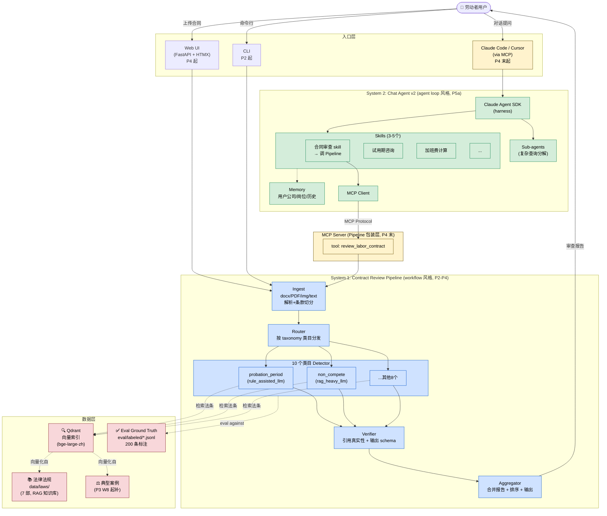
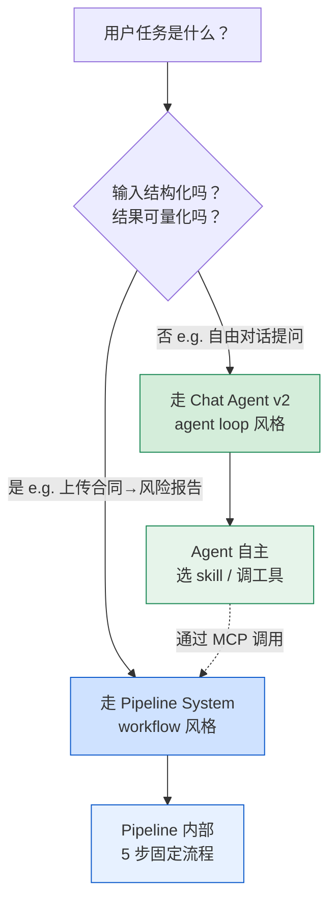
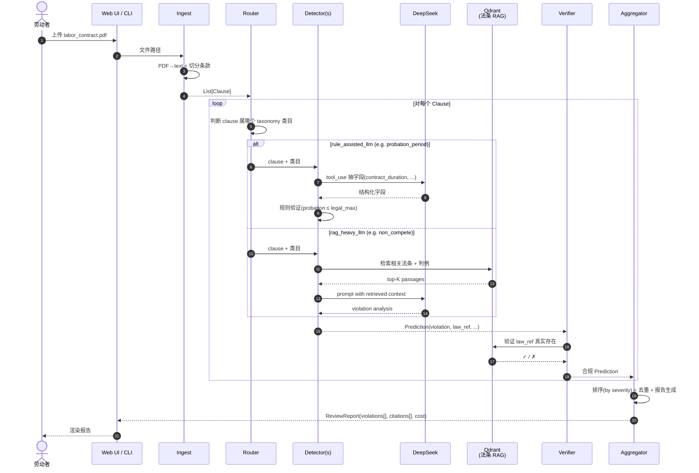
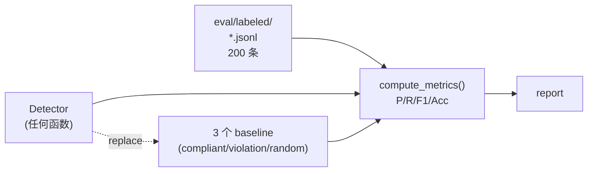
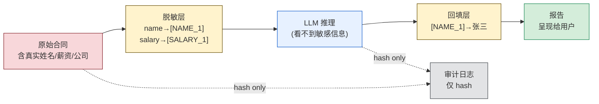
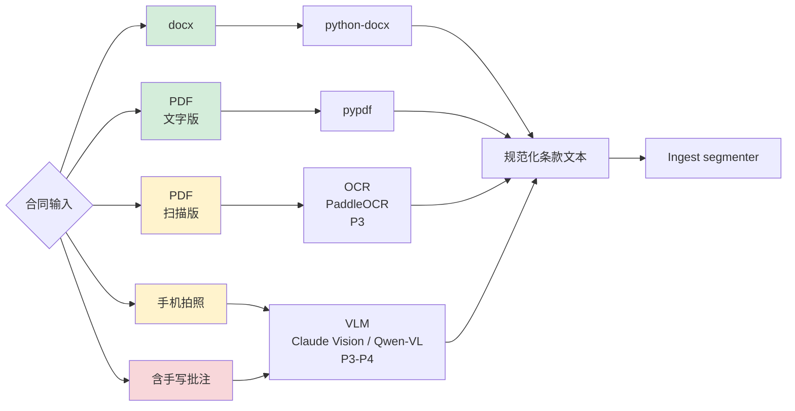
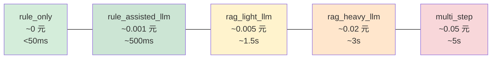
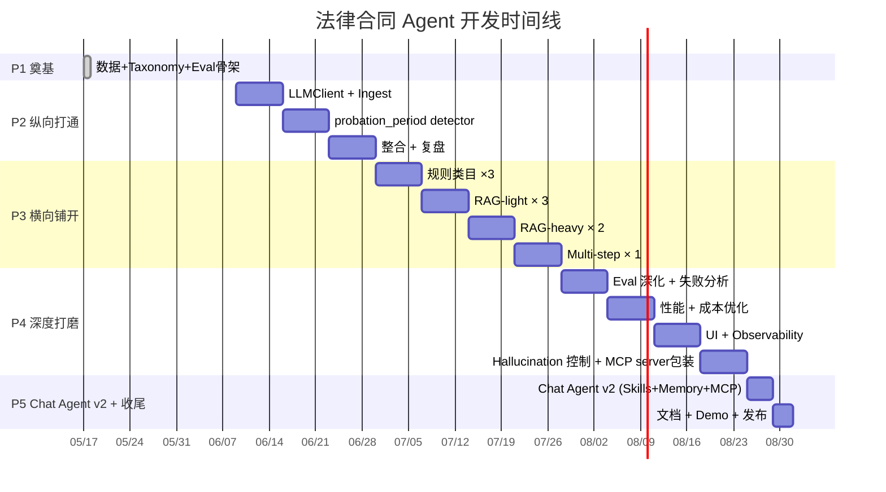

# 架构总览 — 中国劳动合同审查 Agent

> **目的**：让任何看到这份文档的人在 10 分钟内理解项目要做什么、如何做、组件如何协作。
> 如果读完仍有模糊处，说明文档有 bug，**直接报 issue 或修改本文档**。
> 
> 配套：`docs/EVAL_GUIDE.md`（评测）/ `docs/adr/`（决策记录）/ `docs/taxonomy.yaml`（10 类目源真理）

---

## 1. 一句话定位

> 一个面向**劳动者**的中国劳动合同审查 AI agent，识别合同中违反《劳动合同法》《劳动法》等的不利/违法条款，给出法条引用 + 修改建议。

**不是**：律所内部审查工具、通用法律咨询（chat agent v2 仅限我们 10 类目相关问题）。

---

## 2. 系统全景图（双系统 + MCP 集成）



**三种颜色三种角色**：蓝色 = Pipeline 系统、绿色 = Chat Agent 系统、黄色 = MCP 集成层、红色 = 数据层。

---

## 3. 两个系统、两种风格 — 为什么这么分？

### 决策树



### System 1: Pipeline（workflow 风格）

适合**确定性、结构化、可评测**的任务：
- 输入：一份合同
- 输出：风险条款列表（结构化 JSON）
- 流程：固定的 ingest → router → detector → verifier → aggregator 五步
- 评测：每个类目都有 P/R/F1，eval ground truth 在 `eval/labeled/`
- LLM 用作**组件**（抽字段、检索、生成解释），不让它决定流程

### System 2: Chat Agent v2（agent loop 风格）

适合**开放、对话、灵活**的任务（P5a 才动）：
- 输入：用户自然语言提问
- 输出：流式对话回复，可调用工具
- 流程：LLM 自主决定调哪个 skill、需要哪些上下文、什么时候停止
- 评测：开放式 Q&A 难评，但**限定在 10 taxonomy 类目相关问题**所以可控
- LLM **决定流程**，工具是它手脚

### 为什么不合一？

确定性 pipeline 强行做成 agent loop，eval 信号会被 LLM 自主选择破坏（同一份合同两次审查可能走不同路径，eval 失真）。
开放对话强行做成 pipeline，灵活度归零，每个用户问题都要写一个 detector。

**两个最优架构 + MCP 集成 > 一个折中架构**。

### 为什么不分两个独立项目？

**MCP 是关键纽带**。Chat agent v2 通过 MCP client 调 pipeline MCP server，复用 pipeline 的 detection + 法条引用能力。这样：
- Chat agent 不用重写合同审查逻辑
- Pipeline 也能被 Claude Code / Cursor 等外部客户端调用
- 形成"一个产品两个入口" — 不是两个产品

---

## 4. 数据流：一份合同从输入到报告



每个步骤的实现文件（P2 起）：

| 步骤 | 文件 | 状态 |
|------|------|------|
| Ingest | `src/ingest/parser.py` + `src/ingest/segmenter.py` | P2 W4 |
| Router | `src/orchestration/router.py` | P2 W4 |
| Detector (per category) | `src/detection/{category}.py` | P2 W5 + P3 |
| Verifier | `src/verifier/citation.py` + `src/verifier/schema.py` | P2 W5 |
| Aggregator | `src/orchestration/aggregator.py` | P2 W6 |
| LLM client | `src/llm/client.py` | P2 W4 |
| Qdrant retrieval | `src/rag/retriever.py` | P3 W7 |

---

## 5. 仓库目录结构

```
legal-contract-agent/
├── README.md                   # 第一印象 + 导航
├── LICENSE                     # Apache 2.0
├── .gitignore
├── requirements.txt            # Python 依赖
│
├── docs/
│   ├── ARCHITECTURE.md         # 本文件
│   ├── EVAL_GUIDE.md           # eval 体系详解
│   ├── DISCLAIMER.md           # 免责声明（法律 AI 必备）
│   ├── taxonomy.yaml           # 10 类目源真理
│   └── adr/                    # 架构决策记录
│       ├── README.md           # ADR 模板 + 索引
│       ├── ADR-0001-llm-selection.md
│       ├── ADR-0002-vector-db-embedding.md
│       ├── ADR-0003-orchestration.md
│       ├── ADR-0004-frontend.md
│       ├── ADR-0005-rag-strategy.md
│       ├── ADR-0006-dual-system-architecture.md
│       ├── ADR-0007-confidentiality.md         # 待写
│       ├── ADR-0008-multimodal-input.md        # 待写
│       └── ADR-0009-mcp-integration.md         # 待写
│
├── data/                       # 数据层
│   ├── INVENTORY.md            # 数据资产清单
│   ├── laws/                   # 法律法规（RAG 知识库源）
│   │   ├── national/           # 国家级法律 6 部
│   │   ├── judicial/           # 司法解释
│   │   └── local/              # 地方法规（暂空）
│   ├── contracts/              # 合同样本
│   │   ├── tier_a_official/    # 官方范本
│   │   ├── tier_b_template/    # 网络模板
│   │   └── tier_c_anonymized/  # 脱敏真实合同 (gitignored)
│   └── judgments/              # 裁判文书（P3 起）
│
├── eval/                       # 评测层
│   ├── README.md
│   └── labeled/                # 200 条标注 ground truth
│       ├── probation_period.jsonl
│       ├── ... 其他 9 个类目
│
├── src/                        # 业务代码（P2 起填充）
│   ├── llm/                    # LLM client 抽象
│   ├── ingest/                 # 合同解析 + 条款切分
│   ├── orchestration/          # router + aggregator
│   ├── detection/              # 10 类目 detector
│   ├── verifier/               # 防幻觉 + schema 验证
│   ├── rag/                    # 法条检索
│   └── eval/                   # 评测 harness
│       └── harness.py
│
├── scripts/                    # 工具脚本
│   ├── run_eval.py             # CLI 跑 eval
│   └── apply_corrections_*.py  # 历史修正脚本（审计痕迹）
│
└── mcp_server/                 # MCP server 包装（P4 末）
```

---

## 6. 三个跨切面（Cross-cutting Concerns）

### 6.1 Eval — 怎么知道做对了

**完整文档见 `docs/EVAL_GUIDE.md`**。简版数据流：



- **Detector 是 callable**（任何 `Callable[[str], Prediction]` 都能跑），P2 起替换 stub 为真实 LLM detector
- **3 个 baseline** 作下限对照（恒说合规 / 恒说违法 / 随机），真 detector 必须显著超过 baseline
- **指标**：Precision (准不准) / Recall (全不全) / F1 (调和均值) / Accuracy

每个类目有目标阈值（见 `docs/taxonomy.yaml` 的 `eval.target_precision` / `target_recall`）。

### 6.2 Confidentiality（设计中，见 ADR-0007 待写）

法律合同含隐私（姓名、薪资、单位）。**不能裸送 LLM**。



设计要点（P2-P4 逐步引入）：

| 措施 | 接入时机 |
|------|---------|
| 审计日志（每次推理记录 hash + 时间） | P2 |
| 字段脱敏（薪资数字、人名 → 占位符再送 LLM） | P3 |
| Qdrant per-tenant collection | P4 |
| 本地 LLM 选项（DeepSeek 自部署）| P4 |
| 三种部署模式（cloud / VPC / on-prem）文档 | P5 |

完整方案 → ADR-0007（待写）。

### 6.3 Multimodal Input（设计中，见 ADR-0008 待写）

真实合同 80% 是非文本：



绿色 = 已支持（P1 法律处理已用）
黄色 = P3 加入
红色 = P4 加入

候选技术：
- **OCR**: PaddleOCR（开源，中文强）/ tesseract（轻）/ 阿里云 OCR API
- **VLM**: Claude Vision / Qwen-VL（国内）

完整方案 → ADR-0008（待写）。

---

## 7. ADR 落点（每个决策对应到哪个组件）

| ADR | 状态 | 影响的组件 |
|-----|------|-----------|
| [ADR-0001](adr/ADR-0001-llm-selection.md) | ✅ Accepted | `src/llm/client.py` |
| [ADR-0002](adr/ADR-0002-vector-db-embedding.md) | 📝 Draft | `src/rag/` + Qdrant container |
| [ADR-0003](adr/ADR-0003-orchestration.md) | 📝 Draft | `src/orchestration/` |
| [ADR-0004](adr/ADR-0004-frontend.md) | 📝 Draft | `web/` 或 `cli/` |
| [ADR-0005](adr/ADR-0005-rag-strategy.md) | 📝 Draft (defer to P3) | `src/rag/retriever.py` |
| [ADR-0006](adr/ADR-0006-dual-system-architecture.md) | 📝 Proposed | 整体架构 |
| ADR-0007 Confidentiality | ⏳ 待写 | `src/redact/` + `src/audit/` + 部署 |
| ADR-0008 Multimodal Input | ⏳ 待写 | `src/ingest/` 扩展 OCR/VLM |
| ADR-0009 MCP Integration | ⏳ 待写 | `mcp_server/` + chat agent 的 MCP client |

---

## 8. 10 类目快览（完整定义见 `docs/taxonomy.yaml`）

| ID | 中文 | 检测策略 | 严重度 |
|----|------|---------|-------|
| `probation_period` | 试用期合规性 | rule_assisted_llm | high |
| `penalty_clause` | 违约金条款合法性 | rule_assisted_llm | high |
| `service_period` | 服务期与培训违约金 | rule_assisted_llm | medium |
| `working_hours` | 工时与加班条款 | rag_light_llm | medium |
| `social_insurance` | 社保与公积金 | rag_light_llm | high |
| `job_change_rights` | 工作内容/地点变更权 | rag_light_llm | medium |
| `non_compete` | 竞业限制条款 | rag_heavy_llm | high |
| `confidentiality_ip` | 保密与知识产权 | rag_heavy_llm | medium |
| `termination` | 解除与终止条款 | rag_heavy_llm | high |
| `wage_composition` | 工资构成与计算基数 | multi_step_reasoning | high |

策略分层让简单类目用便宜模型、复杂类目用贵模型，整体并行执行。

### 策略与成本对照



成本从左到右递增 50 倍，延迟递增 100 倍。**80% 类目走中低成本路径**才是产品级架构。

---

## 9. 时间线



---

## 10. 常见问题（FAQ）

**Q: 为什么不用 LangChain？**
A: 见 ADR-0003。简言之：项目规模小、自研更可解释、避免 framework breaking change。LangChain 的 retrieval 部分我们用 LlamaIndex 替代（更聚焦）。

**Q: DeepSeek 跑路了怎么办？**
A: `LLMClient` 抽象层一行配置切到 Qwen / Claude / GPT。见 ADR-0001。

**Q: 这个 agent 能上线给真实劳动者用吗？**
A: **不能**。这是研究/学习 grade 项目。生产部署需要：（a）法律免责声明 + 律师人工复核；（b）confidential 设计完整（ADR-0007）；（c）大规模 eval（律师参与标注）；（d）合规认证。详见 `docs/DISCLAIMER.md`。

**Q: 为什么时间安排是 3.5 个月？**
A: 项目开发周期与作者个人时间安排一致。3.5 个月对单人 + 可投入时间是合理的 ship-to-completion 区间。

**Q: 为什么 chat agent 放到最后做？**
A: Pipeline 是核心价值（确定性 detection），稳定后通过 MCP 暴露能力，chat agent 才有可调用的"工具"。先 chat agent 后 pipeline 等于在沙上盖楼。

---

## 11. 如何贡献 / 反馈

- 文档不清 → 直接改本文件 + PR
- 架构疑问 → 开 issue，title 加 `[arch]`
- Bug → 开 issue，附 reproduction
- 新类目建议 → 提案，附 5 条候选 eval 样本

文档不是写完就不动的。每个 phase 末都要回来更新本文件。
