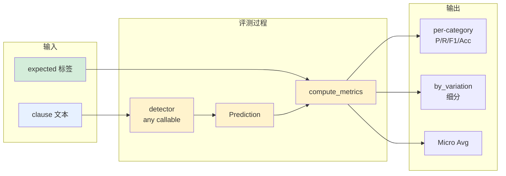
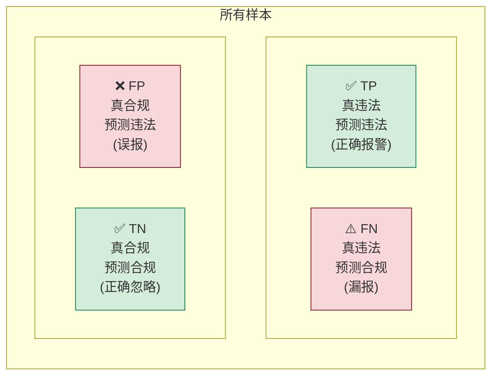
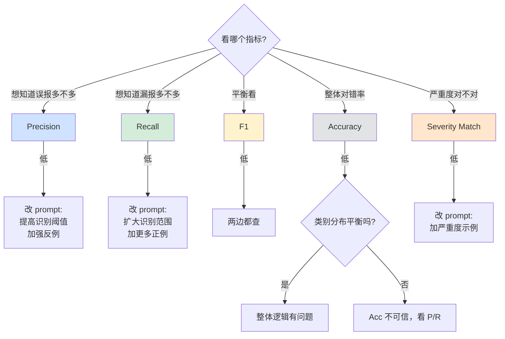
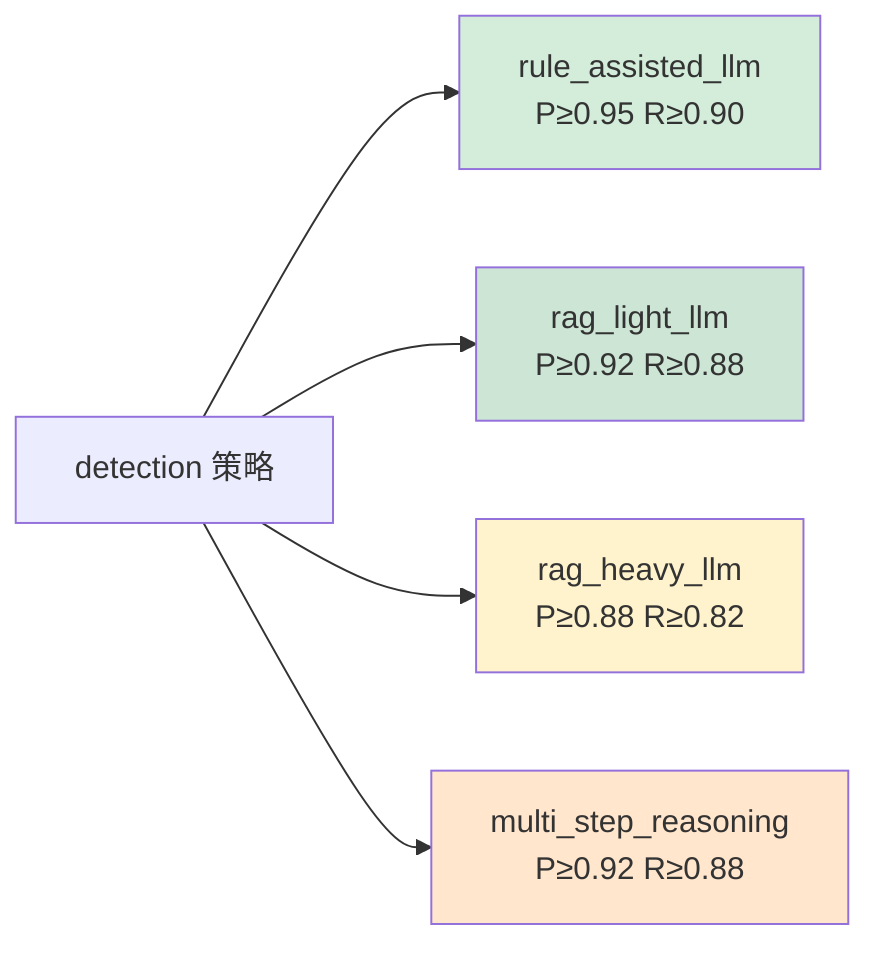
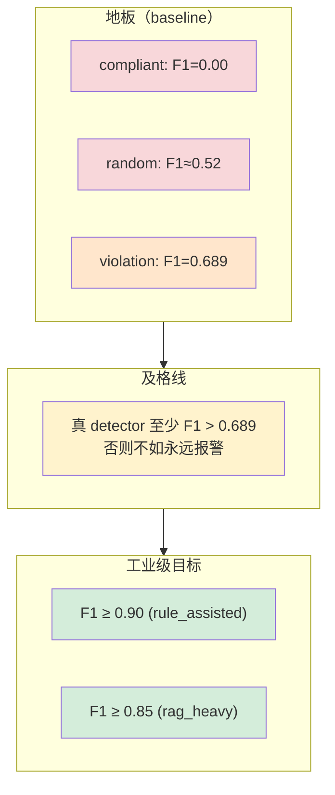
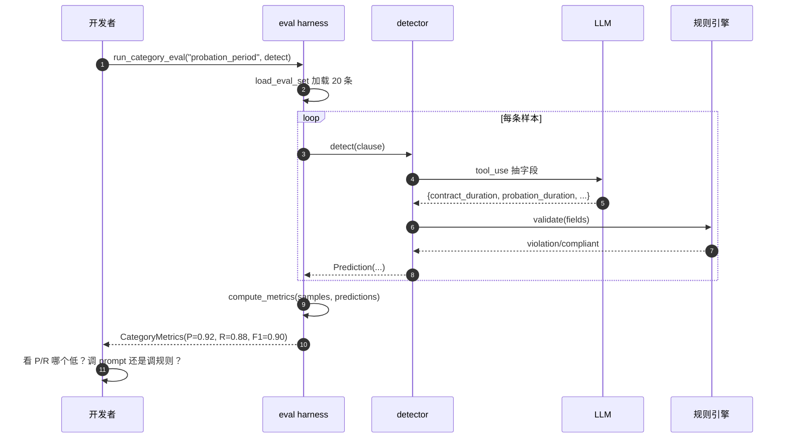
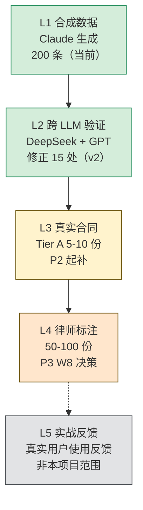

# Evaluation Guide — 法律合同 Agent

> ⚠️ **本文档已被 [EVAL_QA.md](EVAL_QA.md) 取代**（标注规范 + 评测集 + 方法论合一，且更大白话）。本文件暂时保留、以后删除。
>
> **目的**：让你（开发者 / reviewer）能 5 分钟看懂这个项目的评测体系。
> 配套：`src/eval/harness.py`（实现）、`scripts/run_eval.py`（CLI）、`eval/labeled/*.jsonl`（数据）、`docs/taxonomy.yaml`（每类目阈值）

---

## 1. 我们在评什么？

**核心问题**：给定一条合同条款，agent 能否正确判断"是否违法 + 违反什么法 + 严重程度 + 怎么改"？

这是一个 **结构化 + 可量化** 的评测任务，不是开放式 Q&A。

### 一个样本长什么样

```python
# 输入
clause = "甲方与乙方约定本合同期限为1年，其中试用期为4个月。"

# Ground truth（人工 + LLM cross-checked，存在 eval/labeled/probation_period.jsonl）
expected = {
    "violation": True,                                    # 是否违法
    "category": "probation_period",                       # 属哪个 taxonomy 类目
    "violated_law": ["劳动合同法第19条第1款"],            # 引用法条
    "severity": "high",                                   # 严重度
    "reason": "合同期 1 年，试用期不得超过 1 个月...",     # 解释
    "suggestion": "将试用期缩短至不超过 1 个月",          # 建议
}

# Agent 的预测
prediction = detector(clause)  # → Prediction(...)

# 评测：比对 prediction vs expected
```

### 评测数据流图



---

## 2. 五个指标 — 每个都有"什么算好"的判断

### 2.1 混淆矩阵（先看清这个再谈指标）



**对劳动合同审查**：
- **FN（漏报）= 用户最痛**：agent 没说有问题，用户签了，吃亏。**Recall 要高**
- **FP（误报）= 用户烦躁**：每条都标，用户失去信任。**Precision 也要高**
- 但二选一时，**Recall 优先于 Precision**（错过违法 > 多报几个让人复核）

### 2.2 Precision（精度 / 准不准）

```
P = TP / (TP + FP) = 预测违法且真违法的 / 所有预测违法的
```

**含义**：模型说"违法"时，有百分之几确实违法？

| P 值 | 意义 |
|------|------|
| 1.0 | 报警全准（但可能漏报） |
| 0.95+ | 工业级 — 实际部署可接受 |
| 0.85+ | 可演示，但用户会遇到误报 |
| 0.70 | 不太能用，用户对每个报警都得自己复核 |
| 0.50 | 还不如永远报警（base rate） |
| 0.0 | 永远不报警，没意义 |

### 2.3 Recall（召回 / 全不全）

```
R = TP / (TP + FN) = 预测违法且真违法的 / 所有真违法的
```

**含义**：所有真实违法的条款里，模型找出了百分之几？

| R 值 | 意义 |
|------|------|
| 1.0 | 全找到（但可能误报多） |
| 0.90+ | 工业级 |
| 0.80+ | 可演示 |
| 0.50 | 漏了一半，用户会错过半数违法 |
| 0.0 | 一个都没找到 |

### 2.4 F1（调和均值）

```
F1 = 2 * P * R / (P + R)
```

**含义**：P 和 R 的平衡。两者都高 F1 才高，任一极端 F1 就低。

适合在不知道该优先 P 还是 R 时用。在我们的产品里，**R 比 P 更重要**，所以单看 F1 可能误导（F1 把两者等权）。**优先看 R + 各类目设置自己的 P/R 目标**。

### 2.5 Accuracy（整体对错率）

```
Acc = (TP + TN) / Total = 整体猜对的 / 全部
```

**含义**：所有样本中，分类（违法/合规）正确的比例。

**陷阱**：当数据集类别不平衡时，Acc 会骗人。
- 比如 90% 样本是合规的，永远说"合规"也能拿到 0.90 Acc
- 我们数据集大概 52.5% 违法、47.5% 合规，相对平衡，所以 Acc 是有效次要指标

### 2.6 Severity Match Rate（严重度匹配）

```
sev_match = #(predicted_severity == expected_severity) / Total
```

**含义**：在判对"是否违法"之外，**严重度（high/medium/low/none）也能猜对**的比例。

这是次要指标，但有产品意义：把 medium 错报成 high 比把 high 错报成 medium 影响小（用户多警惕一点 OK，少警惕就出事了）。当前 Stub 实现没区分 high/medium，所以这个指标在 P2 起才真正有意义。

### 指标决策流



---

## 3. 各类目的目标阈值（来源：`docs/taxonomy.yaml`）

| Category | 检测策略 | 目标 P | 目标 R | 为什么这个阈值 |
|----------|---------|--------|--------|--------------|
| probation_period | rule_assisted_llm | 0.95 | 0.90 | 规则极明确（条文有数字），高标准 |
| penalty_clause | rule_assisted_llm | 0.95 | 0.90 | 同上 |
| service_period | rule_assisted_llm | 0.90 | 0.85 | 规则明确但概念稍多 |
| working_hours | rag_light_llm | 0.92 | 0.88 | 涉及计算 + 综合工时审批等场景 |
| social_insurance | rag_light_llm | 0.95 | 0.92 | 法条清楚，影响金额大 |
| job_change_rights | rag_light_llm | 0.88 | 0.85 | 协商一致的判断有灰度 |
| non_compete | rag_heavy_llm | 0.90 | 0.85 | 主体认定 + 合理性判断难 |
| confidentiality_ip | rag_heavy_llm | 0.88 | 0.82 | 与竞业限制有交叉、IP 概念多 |
| termination | rag_heavy_llm | 0.92 | 0.88 | 条款多、禁止情形要逐一比对 |
| wage_composition | multi_step_reasoning | 0.92 | 0.88 | 跨条款关联（基本工资+加班费基数等） |

**规则越明确 → 阈值越高**（rule_assisted 类目通常 P/R ≥ 0.9）。
**判断越主观 → 阈值越低但仍可用**（rag_heavy 通常 P/R ≥ 0.85）。

### 阈值与策略的关系



策略越简单（规则越明确） → 阈值要求越高。
策略越复杂（开放推理） → 阈值适当下调但仍要可用。

---

## 4. Baseline — 为什么有 3 个 stub detector

代码里 3 个**故意做错**的 detector，作为"下限对照"。任何真实 detector 必须显著超过它们，否则等于没做。

```python
# 永远说合规
def stub_compliant_detector(clause):  return Prediction(violation=False, ...)

# 永远说违法
def stub_violation_detector(clause):  return Prediction(violation=True, ...)

# 50/50 随机
def stub_random_detector(clause):     return Prediction(violation=random>0.5, ...)
```

**当前 baseline 跑出的数字**（v2 corrections 后）：

| Detector | P | R | F1 | Acc | 解读 |
|----------|---|---|----|----|------|
| compliant | 0.000 | 0.000 | 0.000 | 0.475 | 永远不报警 → R=0 (一个违法都没找到)。Acc=0.475 因为 47.5% 样本本就是合规 |
| violation | 0.525 | 1.000 | 0.689 | 0.525 | 永远报警 → R=1 (全找到了但全是误报)。P=0.525 = 数据集违法率 |
| random | ~0.52 | ~0.52 | ~0.52 | ~0.50 | 完全无信号 |

### Baseline 性能与目标对照



**P2 起，真 detector 必须明显超过 0.689 baseline**，否则等于没做。工业级目标见上表。

---

## 5. 怎么跑 eval — 实操命令

```bash
# 进 venv
source .venv/bin/activate

# 全 detector × 全类目（看完整 baseline 对比）
python scripts/run_eval.py

# 只跑 violation 这个 detector，看一眼基础率
python scripts/run_eval.py --detector violation

# 只跑某一个类目（开发时聚焦）
python scripts/run_eval.py --category probation_period --detector random
```

输出长这样（节选）：

```
DETECTOR: violation
==========================================================================================
Category                  N      P      R     F1    Acc  SevMatch  TP/FP/FN/TN
------------------------------------------------------------------------------------------
probation_period         20 0.550 1.000 0.710 0.550 0.500      11/  9/  0/  0
...
MICRO AVG               200 0.525 1.000 0.689 0.525     -      105/ 95/  0/  0
```

读法：
- `N` 该类目样本总数（恒为 20）
- `TP/FP/FN/TN` 原始计数（**P2 调试时最有用** — 看是 P 还是 R 拖累）
- `Micro Avg` 是把 10 类目的所有 TP/FP/FN/TN 加起来再算 — 对应"业务真实"（每份合同里所有类目混在一起）

---

## 6. 怎么接入你的 detector（P2 起会用到）

写个函数符合 `Callable[[str], Prediction]` 签名，传给 `run_category_eval` 即可：

```python
# src/detection/probation_period.py
from src.llm.client import LLMClient
from src.eval.harness import Prediction

def detect_probation_period(clause: str) -> Prediction:
    # 1. LLM tool_use 抽字段
    fields = LLMClient().extract_with_schema(
        clause, schema=PROBATION_FIELDS_SCHEMA
    )
    # 2. 规则验证
    if fields["probation_months"] > max_allowed(fields["contract_months"]):
        return Prediction(
            violation=True,
            category="probation_period",
            severity="high",
            violated_law=["劳动合同法第19条第1款"],
            reason=f"合同期 {fields['contract_months']} 月，试用期上限...",
            confidence=0.95,
        )
    return Prediction(violation=False, severity="none")

# 跑 eval
from src.eval.harness import run_category_eval, format_metrics_table
metrics = run_category_eval("probation_period", detect_probation_period)
print(format_metrics_table([metrics]))
```

### 一个 detector 的生命周期



---

## 7. Eval 数据的局限性（必须诚实）

- ✅ **200 条合成样本**：覆盖 10 类目，每类目 20 条
- ✅ **跨 LLM 验证过**：DeepSeek + GPT 抽查，发现 15 处错误已修正（v2）
- ✅ **变体分布**：violation_clear / compliant / borderline / violation_subtle 四种
- ⚠️ **生成者**：Claude Opus 4.7。eval 与生产 LLM（DeepSeek）**故意不一样**，避免 self-eval bias
- ⚠️ **真实合同未覆盖**：合成数据≠真实合同。P2 W6 要跑 5-10 份真实合同看 OOD（out-of-distribution）效果
- ❌ **律师未参与标注**：所有标注都是 LLM 出的，没有专业律师 ground truth。**生产前必须补**

> **P3 W8 末要决策**：是否找 1-2 位律师付费标 50-100 份核心类目作高质量 ground truth？这是真正"过律所大门"的必要条件。

### 数据质量层级



L1 和 L2 已完成。L3 进行中。L4 P3 W8 决策。L5 超出本项目范围。

---

## 8. 长期演进 — eval 框架还要做什么

| 时期 | 增量 |
|------|------|
| P2 | 把 stub detector 替换为真实 DeepSeek detector，跑出第一个非 baseline 结果 |
| P3 W8 | 加 **LLM-as-judge** 评测：reason 质量、suggestion 可执行性（不是简单字符串匹配） |
| P3 W10 | 加 **regression test**：每次 commit CI 自动跑 eval，防止改 A 破坏 B |
| P4 W11 | 加 **失败分析自动化**：把 FP / FN 自动按 variation_type 分桶，找规律 |
| P4 W12 | 加 **跨模型 benchmark**：DeepSeek vs Claude vs Qwen 在完整 eval set 上 head-to-head |
| P4 W13 | 加 **cost-aware eval**：在指标表里加每 detector 的单次成本 / 延迟 |

---

## 9. 关键文件 / 命令速查

| 想做什么 | 在哪 |
|---------|------|
| 看一个类目的所有 ground truth | `eval/labeled/{category}.jsonl` |
| 改某条标注（如修正错误） | 直接编辑 jsonl，加 `notes` 字段说明 |
| 跑 baseline | `python scripts/run_eval.py` |
| 跑你的 detector | `from src.eval.harness import run_category_eval` |
| 加新指标 | `src/eval/harness.py` 的 `CategoryMetrics` + `compute_metrics()` |
| 改类目阈值 | `docs/taxonomy.yaml` 的 `eval.target_precision/recall` |
| 看历史修正 | `scripts/apply_corrections_*.py` |
