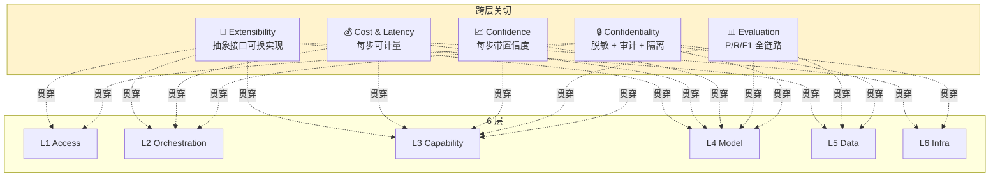
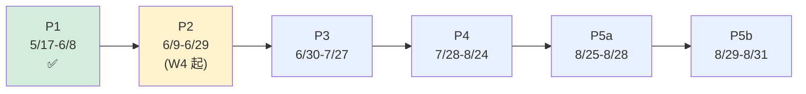
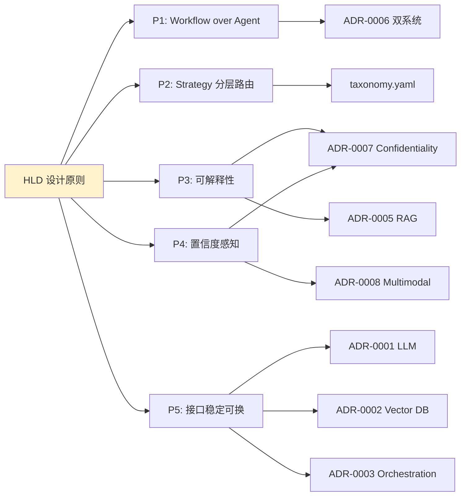
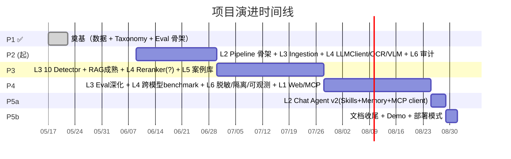

# 总体架构设计文档 (HLD)

> **范围**：从顶层视角描述系统全貌、分层职责、跨层关切、演进路线。
> **不在范围内**：各层的具体实现细节、prompt 设计、API schema、数据格式 — 这些在子文档里。
> **目标读者**：架构 reviewer / 新加入的开发者 / 演示对象
> **配套**：详细的"组件如何交互"见 [ARCHITECTURE.md](ARCHITECTURE.md)，决策记录见 [adr/](adr/)，子文档索引见末尾

---

## 1. 一句话定位

> 面向劳动者的中国劳动合同审查 AI agent — 通过 **workflow + agent loop 双系统** 协同，识别合同中违反劳动法律法规的条款，给出法条引用 + 修改建议。

**不是**：律所内部审查工具；通用法律咨询（chat agent v2 严格限定 10 个 taxonomy 类目）。

---

## 2. 五条架构原则（贯穿全栈）

| # | 原则 | 体现在哪 | 决策来源 |
|---|------|---------|---------|
| P1 | **Workflow over Agent** — 确定性任务用 pipeline，开放任务才用 agent loop | 双系统架构（System 1 pipeline + System 2 chat agent） | [ADR-0006](adr/ADR-0006-dual-system-architecture.md) |
| P2 | **Strategy 分层路由** — 10 类目按复杂度分 5 档检测策略，简单类目用便宜模型 | taxonomy.yaml 中 `detection.strategy` 字段 | [taxonomy.yaml](taxonomy.yaml) |
| P3 | **可解释性优先** — 每个违法判断必须有法条引用 + 原文位置 + 置信度，拒绝黑盒 | Clause / Prediction 数据结构强制字段 | [ADR-0007](adr/ADR-0007-confidentiality.md) |
| P4 | **置信度感知 pipeline** — 从 ingestion 到 detection 全链路 confidence，不假装"全部对" | 每个 Clause / Prediction 都带 `confidence` | (跨多 ADR) |
| P5 | **接口稳定 + 实现可换** — LLMClient / Parser / VectorStore 都做抽象层 | `src/llm/client.py` / `src/ingest/parsers/` / RAG retriever | [ADR-0001](adr/ADR-0001-llm-selection.md) / [ADR-0003](adr/ADR-0003-orchestration.md) |

---

## 3. 六层架构总览

```mermaid
flowchart TB
    User([👤 用户])
    
    subgraph L1["L1 接入层 (Access)"]
        direction LR
        Web["Web UI<br/>FastAPI + HTMX<br/>(P4 W13)"]
        CLI["CLI<br/>(P2 起)"]
        MCP["MCP Server<br/>(P4 W14)"]
    end
    
    subgraph L2["L2 Agent 编排层 (Orchestration)"]
        direction LR
        S1["System 1: Pipeline<br/>workflow 风格<br/>(P2-P4)"]
        S2["System 2: Chat Agent v2<br/>agent loop 风格<br/>(P5a)"]
        S2 -.MCP client.-> S1
    end
    
    subgraph L3["L3 能力层 (Capability)"]
        direction LR
        Ingest["Ingestion<br/>合同解析<br/>(W4-W6)"]
        Router["Router<br/>类目分发"]
        Detect["Detection × 10<br/>风险识别<br/>(P3)"]
        RAG["RAG 检索<br/>法条/判例<br/>(P3 W7+)"]
        Verify["Verifier<br/>引用校验<br/>(P2 W5)"]
        Aggr["Aggregator<br/>合并报告"]
    end
    
    subgraph L4["L4 模型层 (Model)"]
        direction LR
        LLM["LLM<br/>DeepSeek V3/R1"]
        Emb["Embedding<br/>bge-large-zh"]
        OCR["OCR<br/>PaddleOCR"]
        VLM["VLM<br/>Qwen-VL"]
        Rerank["Reranker<br/>bge-reranker (P3 W8)"]
    end
    
    subgraph L5["L5 数据与知识层 (Data & Knowledge)"]
        direction LR
        Laws["📚 法律法规<br/>data/laws/<br/>(7 部已就位)"]
        Cases["⚖️ 典型案例<br/>(P3 W8+)"]
        Vec["🔍 Qdrant 向量索引<br/>(已部署)"]
        Eval["✅ Eval Ground Truth<br/>200 条 v2"]
        Multi["🖼️ 多模态数据集<br/>(W4-W6)"]
    end
    
    subgraph L6["L6 基础设施层 (Infrastructure)"]
        direction LR
        Cloud["腾讯云<br/>+ Docker"]
        Audit["审计日志<br/>(P2 W4)"]
        Obs["可观测<br/>(P4 W12)"]
        Redact["脱敏层<br/>(P3 W8)"]
        Deploy["部署模式文档<br/>cloud/VPC/on-prem<br/>(P5b)"]
    end
    
    User --> L1
    L1 --> L2
    L2 --> L3
    L3 --> L4
    L4 --> L5
    L5 --> L6
    
    style L1 fill:#e7f1ff
    style L2 fill:#cfe2ff
    style L3 fill:#d4edda
    style L4 fill:#fff3cd
    style L5 fill:#ffe6cc
    style L6 fill:#f8d7da
```



---

## 4. 每层的角色与边界

### L1: 接入层（Access Layer）

**职责**：接收用户输入、返回结果。三种入口形态。

| 入口 | 用途 | 状态 |
|------|------|------|
| **Web UI**（FastAPI + HTMX + Tailwind）| 上传合同 → 查看审查报告 | P4 W13 实装 |
| **CLI** | 开发期调试 + 批处理 + CI 集成 | P2 起逐步 |
| **MCP Server** | 在 Claude Code / Cursor / chat agent v2 中调用 | P4 W14 实装 |

**边界**：仅做 HTTP/CLI/MCP 协议适配。**不含业务逻辑** — 收到请求后立即转给 L2 编排层。

**详细文档**：[ADR-0010 (Frontend)](adr/ADR-0010-frontend-revision.md), [ADR-0009 (MCP)](adr/ADR-0009-mcp-integration.md)

---

### L2: Agent 编排层（Orchestration Layer）

**职责**：决定"任务怎么做"。**双系统**对应两种任务性质：

```mermaid
flowchart LR
    Task{任务性质}
    Task -->|结构化、可量化<br/>(上传合同→出报告)| S1["System 1: Pipeline<br/>固定 5 步流水线"]
    Task -->|对话、开放、需上下文<br/>(用户提问→agent 回答)| S2["System 2: Chat Agent v2<br/>LLM 自主决策"]
    
    S2 -.MCP.-> S1
    
    style S1 fill:#cfe2ff
    style S2 fill:#d4edda
```

| 系统 | 风格 | 实装时机 | 特征 |
|------|------|---------|------|
| **System 1: Pipeline** | workflow | P2-P4 | 确定性、可 eval、5 步固定流程 |
| **System 2: Chat Agent v2** | agent loop | P5a | 灵活、对话式、调 Skills / 用 Memory |

**双系统通过 MCP 集成**：chat agent v2 把"合同审查"作为一个 MCP tool 调用，复用 pipeline 能力。

**详细文档**：[ADR-0006 (双系统)](adr/ADR-0006-dual-system-architecture.md), [ADR-0003 (Orchestration)](adr/ADR-0003-orchestration.md), [ARCHITECTURE.md](ARCHITECTURE.md)

---

### L3: 能力层（Capability Layer）

**职责**：把任务拆成可独立优化的能力模块。

| 模块 | 输入 | 输出 | 实装时机 | 详细文档 |
|------|------|------|---------|---------|
| **Ingestion** | 文件路径（docx/pdf/image）| `List[Clause]` + metadata | P2 W4-W6 | INGESTION_DESIGN.md (待写) |
| **Router** | Clause + taxonomy.yaml | 对应类目 detector | P2 W4 | (taxonomy.yaml 即定义) |
| **Detection × 10** | Clause + 上下文 | Prediction(violation, law, severity, ...) | P3 W7-W10 | DETECTION_DESIGN.md (待写) |
| **RAG 检索** | query | top-K 法条/判例 | P3 W7+ | [ADR-0005 (RAG Strategy)](adr/ADR-0005-rag-strategy.md) |
| **Verifier** | Prediction | 验证后的 Prediction + warning | P2 W5 | VERIFIER_DESIGN.md (待写) |
| **Aggregator** | `List[Prediction]` | ReviewReport（排序、去重、Markdown）| P2 W6 | (代码即文档) |

**关键设计选择**：
- Ingestion 是独立模块，可单独测（per 上一轮讨论）
- 10 个 detector 是 strategy 模式实例，按 taxonomy.yaml 配置路由
- Verifier 拦截幻觉法条引用 + schema 不合规输出

---

### L4: 模型层（Model Layer）

**职责**：屏蔽模型差异，提供"调用接口"。

| 角色 | 模型 | 提供方 | 用途 |
|------|------|--------|------|
| **基础 LLM (通用)** | DeepSeek V3 | API | rule_assisted / rag_light / rag_heavy 类目 |
| **基础 LLM (推理)** | DeepSeek R1 | API | multi_step_reasoning 类目（仅 wage_composition） |
| **Embedding** | bge-large-zh-v1.5 | 本地 | RAG 向量化 |
| **OCR** | PaddleOCR | 本地 | 扫描 PDF / 清晰图片 |
| **VLM** | Qwen-VL | API | 手写 / 盖章 / 低质量图片 |
| **Reranker** | bge-reranker-large | 本地（P3 W8 决策） | RAG top-K 重排 |

**明确不做的**：
- ❌ **领域微调模型**：成本/复杂度高，RAG + prompt 已能达 P/R 目标
- ❌ **小模型分类器**：Router 用 taxonomy.yaml + 规则即可
- ❌ **GPU 训练**：CPU only 部署，模型走 API 或本地 inference

**关键设计选择**：所有模型调用走 `LLMClient` 抽象层（含 cost / retry / audit / mock）。切换 provider = 改配置。

**详细文档**：[ADR-0001 (LLM)](adr/ADR-0001-llm-selection.md), [ADR-0002 (Vector DB + Embedding)](adr/ADR-0002-vector-db-embedding.md), [ADR-0008 (Multimodal)](adr/ADR-0008-multimodal-input.md), [ADR-0005 (RAG)](adr/ADR-0005-rag-strategy.md)

---

### L5: 数据与知识层（Data & Knowledge Layer）

**职责**：项目的"长期记忆"。

| 资产 | 内容 | 用途 | 状态 |
|------|------|------|------|
| **法律法规** (`data/laws/`) | 7 部 国家级 + 司法解释 | RAG 知识库源 | ✅ 已就位 |
| **典型案例** (`data/judgments/`) | （目前空）官方典型案例 30-50 份 | RAG few-shot + 引用 | ⏳ P3 W8 |
| **合同样本** (`data/contracts/`) | Tier A 官方范本 + B 网络模板 + C 脱敏真实 | 测试输入 + 多模态变体源 | ⏳ Tier A 待你下载 |
| **多模态数据集** (`data/contracts/multimodal/`) | docx/pdf/scanned/photo 5 种形态 × 各变体 | 多模态 eval | ⏳ W4-W6 生成 |
| **Eval Ground Truth** (`eval/labeled/`) | 200 条 v2 标注 | detection 评测 | ✅ 已完成 |
| **向量索引** (`/data/qdrant/`) | bge-large-zh embedding | RAG 检索 | ✅ 容器已部署，索引待 P3 W7 灌 |

**明确不做的**：
- ❌ **知识图谱**：法条结构化引用已能解决关联问题，graph DB 过度
- ❌ **历史合同库**（per-tenant 多用户）：单用户场景不需要

**详细文档**：[data/INVENTORY.md](../data/INVENTORY.md), [eval/README.md](../eval/README.md), [EVAL_GUIDE.md](EVAL_GUIDE.md)

---

### L6: 基础设施层（Infrastructure Layer）

**职责**：让上面 5 层能运行 + 可信 + 可调试。

| 子层 | 当前 | 计划 |
|------|------|------|
| **部署** | 腾讯云北京六区 / Ubuntu 22.04 / Docker | 三档部署模式文档（per [ADR-0007](adr/ADR-0007-confidentiality.md) D5） |
| **环境** | Python venv / 阿里 Docker 镜像 / hf-mirror | 不动 |
| **存储** | 系统盘 40G + 数据盘 50G (`/data`) | 不动 |
| **服务** | Qdrant 1.18 容器 (port 6333) | + Web 服务 (FastAPI, P4 W13) + MCP server (P4 W14) |
| **审计日志** | ⏳ | P2 W4 起：每次 LLM 调用记 hash + 时间 + cost |
| **脱敏层** | ⏳ | P3 W8：name/phone/ID/salary 占位符 |
| **可观测** | ⏳ | P4 W12：Langfuse 或自建（token / 延迟 / failure case） |
| **缓存** | ⏳ | P4：LLM 请求缓存（同 prompt 不重打） |
| **多租户隔离** | ⏳ | P4 W12：Qdrant per-tenant collection |
| **本地 LLM 选项** | ⏳ | P4 W12：Ollama 部署 DeepSeek 文档 |

**明确不做的**：
- ❌ **GPU 调度**：CPU only 足以演示
- ❌ **完整推理网关**：MCP server 是部分替代

**详细文档**：[ADR-0007 (Confidentiality)](adr/ADR-0007-confidentiality.md), [DISCLAIMER.md](DISCLAIMER.md)

---

## 5. 跨层关切（Cross-Cutting Concerns）

5 个不在任何单层、但**穿透所有层**的关切。



| 关切 | 在每层的表现 | 详细文档 |
|------|------------|---------|
| **Confidentiality** | L1 鉴权 / L3 脱敏入口 / L4 不裸送 LLM / L5 per-tenant / L6 审计 | [ADR-0007](adr/ADR-0007-confidentiality.md) |
| **Evaluation** | L3 eval harness / L4 跨模型 benchmark / L5 ground truth | [EVAL_GUIDE.md](EVAL_GUIDE.md) |
| **Confidence** | L3 Clause/Prediction / L4 OCR/VLM/Reranker 输出 | (跨多 ADR) |
| **Cost & Latency** | L2 路由策略 / L3 不必要时跳类目 / L4 模型分层 / L6 缓存 | [taxonomy.yaml](taxonomy.yaml) 的 `cost_per_call` |
| **Extensibility** | L1 多入口 / L2 双系统 / L3 strategy 模式 / L4 LLMClient 抽象 / L5 Qdrant 可换 | [ADR-0001/0002/0003/0006](adr/) |

---

## 6. 实施状态矩阵



| 层 | P1 (✅ 完成) | P2 | P3 | P4 | P5a/b |
|----|-----------|----|----|----|----|
| L1 接入 | - | CLI(基础) | - | Web UI + MCP server | - |
| L2 编排 | - | Pipeline 骨架 | Pipeline 10 类目 | Pipeline 优化 | Chat Agent v2 |
| L3 能力 | Taxonomy v0.2 | Ingestion 全模态 + Verifier | 10 Detection + RAG | Eval 深化 | Skills |
| L4 模型 | bge 下载 | LLMClient + OCR + VLM | Reranker | 跨模型 benchmark | - |
| L5 数据 | 200 条 eval + 7 部法律 | + 多模态数据集 | + 典型案例 | - | - |
| L6 基础设施 | Docker + Qdrant | 审计日志 | - | 脱敏 + 隔离 + 可观测 | 部署模式文档 |

---

## 7. 关键决策对照（HLD 视角）



每个原则都有对应 ADR 落地。**未来重大架构变更应先更新 HLD，再新增/Supersede ADR**。

---

## 8. 与"建议分层"的差异（透明说明）

用户最初提出的分层建议含 6 层，与本 HLD 6 层大致对齐。**保留 / 不做 / 推迟**对照：

| 建议层 | 建议元素 | 我们的对照 | 理由 |
|--------|---------|-----------|------|
| 模型层 | 领域微调模型 | ❌ 不做 | RAG + prompt 已能达 eval 目标；微调成本/数据/反馈环都重 |
| 模型层 | 小模型分类器 | ❌ 不做 | Router 用规则 + taxonomy.yaml 配置足够 |
| 模型层 | Reranker | ⏳ P3 W8 决策 | 需要先看 RAG baseline，再决定是否加 reranker |
| 数据知识层 | 知识图谱 | ❌ 不做 | 法条结构化引用 + RAG 已能处理关联；图谱 ROI 低 |
| 数据知识层 | 历史合同库 | ⚪ 部分（多模态合同样本算）| 暂无 multi-tenant 需求 |
| 基础设施层 | GPU 调度 | ❌ CPU only | 模型走 API 或 CPU 推理；GPU 增加部署复杂度 |
| 基础设施层 | 推理网关 | ⏳ MCP Server 是部分替代 | MCP 本身就是"调用网关" |

**关键判断**：建议分层的某些元素（图谱 / 微调 / 小分类器 / 推理网关）**对当前阶段过度**。等真实需求出现再补。

---

## 9. 子文档索引（深入读）

按层组织：

### L1 接入层
- [ADR-0009 MCP Integration](adr/ADR-0009-mcp-integration.md)
- [ADR-0010 Frontend Revision (FastAPI+HTMX)](adr/ADR-0010-frontend-revision.md)
- ~~[ADR-0004 Frontend Streamlit (Superseded)]~~

### L2 编排层
- [ADR-0003 Orchestration](adr/ADR-0003-orchestration.md)
- [ADR-0006 Dual System Architecture](adr/ADR-0006-dual-system-architecture.md)
- [ARCHITECTURE.md](ARCHITECTURE.md) — 详细组件交互 + 数据流 + 序列图

### L3 能力层
- [docs/taxonomy.yaml](taxonomy.yaml) — 10 类目 source of truth
- INGESTION_DESIGN.md (待写) — Ingestion 6 模块详细设计
- DETECTION_DESIGN.md (待写) — 10 detector 实现规范
- VERIFIER_DESIGN.md (待写) — 防幻觉机制
- [ADR-0005 RAG Strategy](adr/ADR-0005-rag-strategy.md) (Draft, P3 W8 finalize)

### L4 模型层
- [ADR-0001 LLM Selection](adr/ADR-0001-llm-selection.md) ✅ Accepted
- [ADR-0002 Vector DB + Embedding](adr/ADR-0002-vector-db-embedding.md)
- [ADR-0008 Multimodal Input](adr/ADR-0008-multimodal-input.md)

### L5 数据知识层
- [data/INVENTORY.md](../data/INVENTORY.md)
- [data/laws/MANIFEST.md](../data/laws/MANIFEST.md)
- [eval/README.md](../eval/README.md)
- [EVAL_GUIDE.md](EVAL_GUIDE.md) — 评测体系详解

### L6 基础设施层
- [ADR-0007 Confidentiality Architecture](adr/ADR-0007-confidentiality.md)
- [DISCLAIMER.md](DISCLAIMER.md)
- DEPLOYMENT_MODES.md (待写，P5b)

### 全局
- [README.md](../README.md) — 项目入口
- [adr/README.md](adr/README.md) — ADR 模板和索引

---

## 10. 演进路线（高层视角）



**每个 phase 末交付一个"加层"，整体从下往上"涨"**：
- P1：L5（数据）+ L3 局部（Taxonomy + Eval skeleton）
- P2：L3（Ingestion + Verifier）+ L4（LLMClient + OCR + VLM）+ L6（审计）
- P3：L3（10 Detector + RAG）+ L4（Reranker）+ L5（案例）
- P4：L3（Eval 深化）+ L4（benchmark）+ L6（脱敏 / 隔离 / 可观测）+ L1（Web + MCP）
- P5a：L2（Chat Agent v2）
- P5b：文档 + 收尾

---

## 11. 维护规则

- **本 HLD 改动 = 大事**：任何层职责变化、原则变化、不做项变化，必须走"新建 ADR + 更新 HLD"流程
- **子文档可独立演进**：各层详细文档由对应模块开发者维护，无需联动改 HLD
- **HLD 是"指北针"**：当子文档之间冲突，以 HLD + 最新 ADR 为准
- **每个 phase 末回看一次**：P2 末 / P3 末 / P4 末，由 reviewer 抽查 HLD 与代码现状是否漂移
