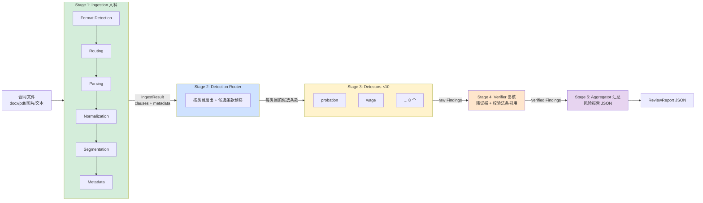

# System 1: 合同审查 Pipeline — 实现级设计文档

**Status**: Draft
**Date**: 2026-05-22
**Owner**: Dylan
**读者**: 实现者（写代码时对照本文档）、reviewer
**关联**: [HLD.md](HLD.md)（六层总览）, [ARCHITECTURE.md](ARCHITECTURE.md)（双系统交互）, [RAG_DESIGN.md](RAG_DESIGN.md)（检索层）, [EVAL_GUIDE.md](EVAL_GUIDE.md)（评测）, [taxonomy.yaml](taxonomy.yaml)（10 类目唯一真源）
**ADR 依赖**: ADR-0001(LLM), ADR-0002(向量库), ADR-0003(编排), ADR-0005(RAG), ADR-0007(脱敏), ADR-0008(多模态)

---

## 0. 文档定位

HLD 讲"系统分几层、为什么这么分"；本文档讲 **System 1（合同审查 Pipeline）从输入文件到输出 JSON 报告，每一阶段内部怎么实现**。

- 粒度：到 dataclass 字段、函数签名、决策表、伪代码。看完应能直接开写。
- 不覆盖：System 2（Chat Agent v2，见 P5a）、MCP 包装层（见 ADR-0009）、前端（见 ADR-0010）。这些消费 System 1 的输出，不属于 Pipeline 内部。
- **Ingestion 的 Format Detection 是本文档的重点章节（§3.2）**，已讨论定稿，按定稿写入。

---

## 1. System 1 总览

### 1.1 定位：它是 workflow，不是 agent

System 1 是**确定性流水线**（workflow orchestration），不是 agent loop。理由：
- 合同审查的步骤是固定的（解析→检测→复核→汇总），不需要 LLM 自主决定"下一步干啥"。
- 确定性 = 可测、可复现、可 eval（200 样本跑出稳定 P/R/F1）。
- LLM 只在**单步内**被调用（某个 detector 判一个条款），不掌控控制流。

> 对比：System 2（Chat Agent v2）才是 agent loop —— 用户多轮对话、模型自主调工具。两者通过 MCP 解耦（ADR-0006/0009）。

### 1.2 五阶段流水线



| Stage | 输入 | 输出 | 本质 |
|-------|------|------|------|
| 1 Ingestion | 文件路径 / bytes | `IngestResult`（条款列表 + 元数据） | 多模态归一为结构化条款 |
| 2 Router | `IngestResult` | `{category: [候选 Clause]}` | 扇出 + 预筛，省算力 |
| 3 Detectors | 候选条款 + 类目策略 | `list[Finding]`（原始） | 每类目独立判违法 |
| 4 Verifier | 原始 Findings | `list[Finding]`（已复核） | 降误报、校验引用、定严重度 |
| 5 Aggregator | 已复核 Findings + 元数据 | `ReviewReport` | 装配最终报告 |

### 1.3 输入 / 输出契约（System 1 对外）

```python
def run_review(
    source: str | bytes,                 # 文件路径 或 raw bytes 或 纯文本
    options: ReviewOptions = ...,        # language / detail_level / categories / redact
) -> ReviewReport:
    """System 1 唯一公开入口。MCP tool、前端、CLI、eval 都调它。"""
```

- 输入：一份劳动合同（任意支持的形态）。
- 输出：`ReviewReport`（结构化 JSON）—— 风险列表 + 法条引用 + 修改建议 + 元数据 + 免责声明。
- 这个输出契约同时是：MCP `review_labor_contract` 的返回值（ADR-0009）、前端报告页渲染源（ADR-0010）、eval 的预测对象来源。**契约稳定性优先级最高**。

### 1.4 设计原则

1. **纯函数边界**：`run_review` 无隐藏全局状态，相同输入 + 相同 options + 固定 LLM seed/temperature → 相同输出（LLM 非完全确定，但结构稳定）。便于 MCP 包装与测试。
2. **阶段间用 dataclass 传递**，不传裸 dict。契约即代码（§2）。
3. **逐阶段降级**：任何阶段失败不让整条流水线崩，产出部分结果 + 在 `warnings` 里记原因。
4. **脱敏前置**（ADR-0007）：送 LLM 前必经 redact，PII 不出本地。
5. **可观测**：每阶段记 `timing_ms`，每次 LLM 调用走 `LLMClient` 审计。
6. **策略分层省钱**（ADR-0008/taxonomy）：80% 输入走廉价路径（rule / 本地 OCR），只有必要时才付费调 LLM/VLM。

---

## 2. 端到端数据契约

贯穿 Pipeline 的核心 dataclass。完整清单见附录 A，这里给主干。

```python
from __future__ import annotations
from dataclasses import dataclass, field
from enum import Enum
from typing import Literal, Optional

# ---- Stage 1 产物 ----
class SourceFormat(str, Enum):
    DOCX        = "docx"
    PDF_TEXT    = "pdf_text"
    PDF_SCANNED = "pdf_scanned"
    PDF_MIXED   = "pdf_mixed"      # 部分页文字、部分页扫描（逐页路由）
    TEXT        = "text"
    MARKDOWN    = "markdown"
    IMAGE       = "image"
    UNKNOWN     = "unknown"

@dataclass
class Clause:
    """切分后的单个条款 —— Pipeline 后续所有阶段的最小处理单元。"""
    id: str                              # "clause_0007"，文档内稳定
    text: str                            # 规范化后的条款正文
    source_method: str                   # "python-docx" / "pypdf" / "paddleocr" / "qwen-vl"
    confidence: float = 1.0              # 该条款文本可信度（OCR/VLM < 1.0）
    # —— 结构定位 ——
    chapter: Optional[str] = None        # "第三章 工作时间和休息休假"
    article_number: Optional[int] = None # 7（第七条）
    article_label: Optional[str] = None  # "第七条"
    section: Optional[str] = None         # 条内款项 "（二）"
    parent_id: Optional[str] = None       # 嵌套款项指向父条
    # —— 字符定位（用于前端高亮、证据回溯）——
    char_start: int = 0
    char_end: int = 0
    preceding_chars: str = ""            # 上文窗口（detector 需要上下文）
    following_chars: str = ""
    # —— 多模态定位（OCR/VLM 来源才有）——
    page: Optional[int] = None
    bbox: Optional[tuple[float, float, float, float]] = None
    image_path: Optional[str] = None

@dataclass
class DocumentMetadata:
    title: str = ""
    party_a_name: str = ""               # 甲方（用人单位）
    party_b_name: str = ""               # 乙方（劳动者）—— PII，脱敏对象
    contract_type: str = ""              # 固定期限/无固定期限/以完成一定工作任务为期限
    signing_date: str = ""
    contract_start: str = ""
    contract_end: str = ""
    workplace: str = ""
    position: str = ""
    extraction_confidence: float = 0.0

@dataclass
class IngestResult:
    document_id: str
    source_path: str
    source_format: SourceFormat
    metadata: DocumentMetadata
    clauses: list[Clause]
    warnings: list[str] = field(default_factory=list)
    timing_ms: float = 0.0
    quality_score: float = 1.0           # 入料整体质量（影响最终报告可信度）
    used_ocr: bool = False
    used_vlm: bool = False
    total_pages: int = 1

# ---- Stage 3/4 产物 ----
Severity = Literal["high", "medium", "low", "none"]
RiskLevel = Literal["violation_clear", "violation_subtle", "borderline", "compliant"]

@dataclass
class Finding:
    """一个风险点。detector 产出，verifier 复核，aggregator 汇总。"""
    finding_id: str
    category: str                        # taxonomy 10 类目之一
    clause_id: str                       # 指向触发的 Clause
    risk_level: RiskLevel
    severity: Severity
    violation: bool
    violated_law: list[str] = field(default_factory=list)  # ["劳动合同法 第十九条"]
    law_quotes: list[str] = field(default_factory=list)    # 法条原文（aggregator 填充）
    reason: str = ""                     # 为什么违法/不利
    suggestion: str = ""                 # 修改建议（劳动者视角）
    evidence_quote: str = ""             # 条款里最相关的片段
    confidence: float = 0.0
    detector_strategy: str = ""          # 命中时用的策略 tier
    verifier_note: str = ""              # 复核留痕

# ---- Stage 5 产物（System 1 对外输出）----
@dataclass
class ReviewReport:
    document_id: str
    metadata: DocumentMetadata
    overall_risk_score: float            # 0-100
    summary: dict                        # {high: n, medium: n, low: n, categories_hit: [...]}
    findings: list[Finding]              # 按 severity 降序
    ingest_warnings: list[str]
    quality_score: float
    disclaimer: str
    timing_ms: dict                      # {ingest, detect, verify, aggregate, total}
    generated_at: str
```

> `Prediction`（eval 用，见 harness.py）是 `Finding` 的瘦身投影：eval 只关心 `violation/category/severity/confidence/reason/violated_law`。两者通过 §5.4 的 adapter 互转。

---

## 3. Stage 1 — Ingestion（入料）

把任意形态的合同变成**有结构定位的条款列表 + 元数据**。这是 Pipeline 里工程量最大、最脏的一段（ADR-0008：真实输入 80% 不是 clean text）。

### 3.1 六个子模块

```
文件 ─▶ ① Format Detection ─▶ ② Routing ─▶ ③ Parsing ─▶ ④ Normalization ─▶ ⑤ Segmentation ─▶ ⑥ Metadata ─▶ IngestResult
        (你是啥 + 长啥样)      (选 parser)   (抽文本)      (清洗归一)         (切条款)          (抽要素)
```

| # | 模块 | 入 | 出 | 关键依赖 |
|---|------|----|----|---------|
| ① | Format Detection | 文件 | `FormatDetectionResult` | 见 §3.2（重点） |
| ② | Routing | `FormatDetectionResult` | `parser_id` | 读 `suggested_parser` |
| ③ | Parsing | 文件 + parser_id | raw text + 布局信息 | python-docx/pypdf/PaddleOCR/Qwen-VL |
| ④ | Normalization | raw text | 干净文本 | 全半角/标点/页眉页脚/断行 |
| ⑤ | Segmentation | 干净文本 | `list[Clause]` | 第X条/第X章 标记 |
| ⑥ | Metadata | 干净文本 + clauses | `DocumentMetadata` | 规则 + LLM 兜底 |

---

### 3.2 Module ① Format Detection ★（详细，已定稿）

#### 3.2.1 为什么要"两步"

一个文件有两个正交问题，必须分开回答：

1. **Identity（身份）—— "你到底是什么文件？"**
   不能信扩展名。`合同.pdf` 可能是改了名的图片；`合同.docx` 可能是 RTF。要靠 magic bytes + 容器深检来定真身。
2. **Content Shape（内容形态）—— "你内部长什么样？"**
   即便确认是 PDF，它可能是：文字版（可直接抽）、扫描版（要 OCR）、混合版（逐页不同）、加密、损坏。形态决定**用哪个 parser**。

把两步揉在一起会得到一坨 if-else 泥潭。拆开后：Identity 失败可直接 reject（省得白跑 OCR）；Shape 只在 Identity 通过后按格式分派。

#### 3.2.2 数据结构全集

```python
@dataclass
class IdentityDetection:
    """Step 1 产物：你到底是什么文件。"""
    claimed_extension: str               # ".pdf"（来自文件名）
    claimed_mime: str                    # "application/pdf"（上传 Content-Type / python-magic）
    detected_format: SourceFormat        # 仲裁后的真身
    confidence: float                    # 四信号一致度
    safe_to_process: bool                # False = 直接拒（可执行文件伪装、未知二进制…）
    issues: list[str] = field(default_factory=list)  # ["扩展名 .docx 与 magic bytes(PDF) 冲突"]

@dataclass
class PDFShapeDetection:
    """Step 2 产物（PDF 专用）：PDF 内部长啥样。"""
    primary_type: Literal["text", "scanned", "mixed", "encrypted", "corrupted"]
    confidence: float
    page_count: int
    text_char_count: int                 # 全文档可抽字符总数
    text_chars_per_page: float
    text_coverage: float                 # 有文字层的页数 / 总页数
    image_count: int
    has_signature: bool                  # 检出签名页图像 / /Sig 域
    has_form_fields: bool                # /AcroForm
    suggested_parser: str                # "pypdf" / "paddleocr" / "pdf_per_page_hybrid"
    requires_manual_review: bool = False
    signals: dict = field(default_factory=dict)  # 原始信号留痕，便于调试

@dataclass
class DocxShapeDetection:
    primary_type: Literal["text", "table_heavy", "empty", "tracked_changes"]
    confidence: float
    paragraph_count: int
    table_count: int
    image_count: int
    has_tracked_changes: bool            # 修订痕迹（双方谈判稿）
    char_count: int
    suggested_parser: str = "python-docx"

@dataclass
class ImageShapeDetection:
    primary_type: Literal["clear_text", "low_quality", "handwritten_suspected"]
    confidence: float
    width: int
    height: int
    blur_score: float                    # Laplacian 方差，越低越糊
    estimated_rotation: float            # 度
    has_text_regions: bool               # 轻量文本检测
    suggested_parser: str                # "paddleocr"（清晰）/ "qwen-vl"（差/手写）

@dataclass
class TextShapeDetection:
    primary_type: Literal["plain", "markdown"]
    confidence: float
    encoding: str                        # "utf-8" / "gb18030" …
    char_count: int
    has_article_markers: bool            # 含"第X条"
    suggested_parser: str = "text_reader"

@dataclass
class FormatDetectionResult:
    """Module ① 总产物 —— 分层 Facade（Option C）。
    identity 必有；shape 四选一（按 detected_format 填一个）。"""
    identity: IdentityDetection
    pdf_shape:   Optional[PDFShapeDetection]   = None
    docx_shape:  Optional[DocxShapeDetection]  = None
    image_shape: Optional[ImageShapeDetection] = None
    text_shape:  Optional[TextShapeDetection]  = None

    @property
    def shape(self):
        """返回被填充的那个 shape（统一访问点）。"""
        return self.pdf_shape or self.docx_shape or self.image_shape or self.text_shape

    @property
    def primary_type(self) -> str:
        return self.shape.primary_type if self.shape else "unknown"

    @property
    def suggested_parser(self) -> str:
        return self.shape.suggested_parser if self.shape else "none"

    @property
    def overall_confidence(self) -> float:
        """关键：身份置信 × 形态置信。任一不确定都拉低整体。"""
        shape_conf = self.shape.confidence if self.shape else 0.0
        return self.identity.confidence * shape_conf

    @property
    def routing_recommendation(self) -> str:
        """供 §3.2.7 决策表 / Module ② 直接消费。"""
        c = self.overall_confidence
        if not self.identity.safe_to_process:        return "reject"
        if c >= 0.9:                                 return "proceed"
        if c >= 0.6:                                 return "proceed_with_warning"
        if c >= 0.3:                                 return "proceed_manual_review"
        return "reject"
```

> **为什么选 Option C（分层 Facade）而不是扁平大 dataclass / 继承多态**：
> - 扁平大 dataclass：把 PDF/DOCX/IMAGE 字段全塞一个类，大量字段对当前格式无意义（`page_count` 对 docx？），易误用。
> - 继承多态（`PDFResult(FormatResult)`…）：调用方要 `isinstance` 分支，且无法表达"PDF 但也想留 image 信息"。
> - **Facade**：`identity` 永远在；`shape` 是统一入口，`.primary_type/.suggested_parser/.overall_confidence` 屏蔽差异；要细节时再下钻到 `pdf_shape`。调用方 90% 只碰便捷属性。

#### 3.2.3 Step 1 — Identity Detection（四信号 + 仲裁）

四个独立信号，可信度递增：

| 信号 | 来源 | 可伪造性 | 例 |
|------|------|---------|----|
| `claimed_extension` | 文件名后缀 | 极易（改名即可） | `.pdf` |
| `claimed_mime` | 上传 Content-Type / `python-magic` | 中 | `application/pdf` |
| **magic bytes** | 文件头字节 | 难 | `%PDF-` / `PK\x03\x04` / `\x89PNG` / `\xff\xd8\xff` |
| **容器深检** | 解开容器看内部 | 最难 | docx zip 里有 `word/document.xml` |

magic / 容器签名表：

```python
MAGIC = {
    b"%PDF-":            "pdf",
    b"\x89PNG\r\n\x1a\n":"png",
    b"\xff\xd8\xff":     "jpeg",
    b"PK\x03\x04":       "zip_container",   # docx/xlsx/pptx 都是 zip，需深检区分
}

def _sniff_zip_container(raw: bytes) -> SourceFormat:
    """PK 开头 → 解 zip 看内部清单，区分 docx vs 其他 OOXML/普通 zip。"""
    names = zipfile.ZipFile(io.BytesIO(raw)).namelist()
    if "word/document.xml" in names:  return SourceFormat.DOCX
    if "xl/workbook.xml"  in names:  return SourceFormat.UNKNOWN   # xlsx：非合同，拒
    if "ppt/presentation.xml" in names: return SourceFormat.UNKNOWN
    return SourceFormat.UNKNOWN
```

**仲裁逻辑**（信任顺序：容器深检 > magic > mime > extension）：

```python
def detect_identity(path: str, raw: bytes, claimed_mime: str = "") -> IdentityDetection:
    ext = Path(path).suffix.lower()
    issues = []

    # 1) magic bytes
    magic_fmt = match_magic(raw[:16])              # → "pdf"/"png"/"jpeg"/"zip_container"/None
    # 2) zip 容器深检
    if magic_fmt == "zip_container":
        detected = _sniff_zip_container(raw)        # DOCX or UNKNOWN
    elif magic_fmt == "pdf":
        detected = SourceFormat.PDF_TEXT            # 真正 text/scanned 留给 Step 2 判
    elif magic_fmt in ("png", "jpeg"):
        detected = SourceFormat.IMAGE
    elif magic_fmt is None:
        detected = _guess_text_or_unknown(raw)      # 可 UTF-8/GB 解码 → TEXT/MARKDOWN，否则 UNKNOWN
    else:
        detected = SourceFormat.UNKNOWN

    # 3) 一致性核对 → 置信度 & issues
    conf = 1.0
    if ext and not _ext_matches(ext, detected):
        issues.append(f"扩展名 {ext} 与实际 {detected.value} 不符"); conf *= 0.75
    if claimed_mime and not _mime_matches(claimed_mime, detected):
        issues.append(f"MIME {claimed_mime} 与实际 {detected.value} 不符"); conf *= 0.85
    if detected == SourceFormat.UNKNOWN:
        conf = min(conf, 0.2)

    safe = detected != SourceFormat.UNKNOWN and not _looks_executable(raw)
    return IdentityDetection(ext, claimed_mime, detected, conf, safe, issues)
```

要点：
- magic 与 extension 冲突 **不直接拒**，而是**信 magic、降置信、记 issue**。真实场景里"图片改名成 .pdf"应当被当图片处理，而非报错。
- `UNKNOWN` 或疑似可执行 → `safe_to_process=False` → 上层 reject。
- Step 1 对 PDF 只给到 `PDF_TEXT` 占位，**text/scanned/mixed 的细分是 Step 2 的事**（Step 1 不读内容，只读文件头）。

#### 3.2.4 Step 2 — Content Shape Detection（按格式分派）

只在 `identity.safe_to_process` 时运行，按 `detected_format` 调对应探测器。

**PDF 形态判定（最复杂）**：

```python
def detect_pdf_shape(raw: bytes) -> PDFShapeDetection:
    try:
        reader = pypdf.PdfReader(io.BytesIO(raw))
    except Exception:
        return PDFShapeDetection(primary_type="corrupted", confidence=0.9, ...)
    if reader.is_encrypted and not _try_empty_password(reader):
        return PDFShapeDetection(primary_type="encrypted", confidence=0.95, ...)

    n = len(reader.pages)
    per_page_chars, per_page_imgs = [], []
    for pg in reader.pages:
        per_page_chars.append(len(pg.extract_text() or ""))
        per_page_imgs.append(_count_images(pg))

    total_chars   = sum(per_page_chars)
    pages_w_text  = sum(1 for c in per_page_chars if c > TEXT_PAGE_MIN)   # TEXT_PAGE_MIN=50
    coverage      = pages_w_text / n
    cpp           = total_chars / n

    # 决策：
    if   coverage >= 0.9 and cpp >= 100:  ptype, parser, conf = "text",    "pypdf",               0.95
    elif coverage <= 0.1:                 ptype, parser, conf = "scanned", "paddleocr",            0.90
    else:                                 ptype, parser, conf = "mixed",   "pdf_per_page_hybrid",  0.80

    return PDFShapeDetection(
        primary_type=ptype, confidence=conf, page_count=n,
        text_char_count=total_chars, text_chars_per_page=cpp, text_coverage=coverage,
        image_count=sum(per_page_imgs),
        has_signature=_detect_signature(reader),
        has_form_fields=("/AcroForm" in reader.trailer.get("/Root", {})),
        suggested_parser=parser,
        requires_manual_review=(ptype in ("mixed",) and conf < 0.85),
        signals={"per_page_chars": per_page_chars, "per_page_imgs": per_page_imgs},
    )
```

阈值（可调，进 config）：`TEXT_PAGE_MIN=50` 字/页算"有文字层"；`coverage≥0.9 & cpp≥100` → text；`coverage≤0.1` → scanned；中间 → **mixed（逐页路由，已定：完整处理）**。

> **mixed / pdf_hybrid 处理（已定稿）**：不退化成"整篇 OCR"。`pdf_per_page_hybrid` parser 逐页看 `signals.per_page_chars[i]`：该页有文字层走 pypdf，无文字层走 PaddleOCR，最后按页码拼回。Clause 的 `page` 字段保证拼回后定位正确。

**DOCX / IMAGE / TEXT 形态**（更简单）：

```python
def detect_docx_shape(raw):
    d = docx.Document(io.BytesIO(raw))
    paras  = [p for p in d.paragraphs if p.text.strip()]
    tables = d.tables
    tracked = _has_w_ins_or_del(d)               # 检 w:ins/w:del 修订标记
    if not paras and not tables: ptype = "empty"
    elif tracked:                ptype = "tracked_changes"
    elif len(tables) > len(paras): ptype = "table_heavy"   # 表格型合同
    else:                        ptype = "text"
    return DocxShapeDetection(ptype, 0.95, len(paras), len(tables),
                              _count_imgs(d), tracked, _char_count(d))

def detect_image_shape(raw):
    img = Image.open(io.BytesIO(raw))
    blur = _laplacian_var(img)                    # 越低越糊
    rot  = _estimate_rotation(img)
    has_text = _quick_text_region(img)            # 轻量检测有无文字区
    if   blur < BLUR_MIN or abs(rot) > 15: ptype, parser = "low_quality", "qwen-vl"
    elif _handwriting_hint(img):           ptype, parser = "handwritten_suspected", "qwen-vl"
    else:                                  ptype, parser = "clear_text", "paddleocr"
    return ImageShapeDetection(ptype, 0.85, img.width, img.height, blur, rot, has_text, parser)

def detect_text_shape(raw):
    enc  = _detect_encoding(raw)                  # chardet/charset-normalizer
    text = raw.decode(enc, errors="replace")
    is_md = _looks_markdown(text)                 # 有 #/```/| 等
    return TextShapeDetection("markdown" if is_md else "plain", 0.99, enc,
                              len(text), bool(re.search(r"第[一二三四…\d]+条", text)),
                              "text_reader")
```

#### 3.2.5 Facade 组装入口

```python
def detect_format(path: str, raw: bytes, claimed_mime: str = "") -> FormatDetectionResult:
    identity = detect_identity(path, raw, claimed_mime)
    res = FormatDetectionResult(identity=identity)
    if not identity.safe_to_process:
        return res                                # shape 全 None → routing_recommendation == "reject"

    f = identity.detected_format
    if   f in (SourceFormat.PDF_TEXT, SourceFormat.PDF_SCANNED, SourceFormat.PDF_MIXED):
        res.pdf_shape   = detect_pdf_shape(raw)
    elif f == SourceFormat.DOCX:
        res.docx_shape  = detect_docx_shape(raw)
    elif f == SourceFormat.IMAGE:
        res.image_shape = detect_image_shape(raw)
    elif f in (SourceFormat.TEXT, SourceFormat.MARKDOWN):
        res.text_shape  = detect_text_shape(raw)
    return res
```

#### 3.2.6 置信度模型：乘法 + 阈值带

**为什么乘法而非取最小/平均**：身份与形态是**独立的不确定来源**，要联合可信才整体可信。任一环节弱 → 整体应被拉低。乘法天然满足（`0.9 × 0.6 = 0.54`，落入强警告带），取 min 会掩盖"两个都中等"的复合风险。

```
overall_confidence = identity.confidence × shape.confidence
```

| overall | routing_recommendation | 行为 |
|---------|------------------------|------|
| ≥ 0.90 | `proceed` | 静默处理 |
| 0.60–0.90 | `proceed_with_warning` | 处理 + `IngestResult.warnings` 记一条 |
| 0.30–0.60 | `proceed_manual_review` | 处理 + 强警告 + `requires_manual_review=True`，前端标注"建议人工复核" |
| < 0.30 | `reject` | 不自动处理，回提示让用户确认/换文件 |
| `safe_to_process=False` | `reject` | 直接拒（与分数无关） |

#### 3.2.7 路由决策表（Module ① → Module ②）

Module ② 不重新判断，直接读 `result.suggested_parser` + `routing_recommendation`：

| detected_format | primary_type | suggested_parser | 下游 Parser | used_ocr/vlm |
|-----------------|--------------|------------------|-------------|--------------|
| DOCX | text / table_heavy / tracked_changes | python-docx | `DocxParser` | – |
| DOCX | empty | python-docx | `DocxParser`（产 warning） | – |
| PDF | text | pypdf | `PdfTextParser` | – |
| PDF | scanned | paddleocr | `OcrParser` | ocr |
| PDF | mixed | pdf_per_page_hybrid | `PdfHybridParser`（逐页） | ocr（部分页） |
| PDF | encrypted/corrupted | – | reject + warning | – |
| IMAGE | clear_text | paddleocr | `OcrParser` | ocr |
| IMAGE | low_quality / handwritten_suspected | qwen-vl | `VlmParser` | vlm |
| TEXT/MARKDOWN | plain/markdown | text_reader | `TextParser` | – |

> 还有一条**运行时降级边**（不在静态表里）：`OcrParser` 跑完若 PaddleOCR 置信度 < 0.85 → 自动转 `VlmParser` 兜底（ADR-0008）。这条在 Parsing 内部触发，会把 `used_vlm=True`。

#### 3.2.8 失败与降级

| 情况 | 处理 |
|------|------|
| Step 1 `UNKNOWN` / 可执行伪装 | `safe_to_process=False` → reject，不进 Step 2 |
| PDF 加密无法解 | `primary_type="encrypted"` → reject + warning「需密码」 |
| PDF 损坏 pypdf 打不开 | `primary_type="corrupted"` → reject + warning「文件损坏」 |
| mixed 但 confidence 低 | 仍处理（逐页 hybrid）+ `requires_manual_review` |
| 扩展名/MIME 冲突 | 信 magic，降置信，issue 留痕，**不报错** |

#### 3.2.9 测试要点（§10 展开）

fixture 必须含**对抗样本**：改名文件（.jpg→.pdf）、加密 PDF、损坏 PDF、空 docx、修订稿 docx、纯扫描 PDF、混合 PDF、旋转/糊图、手写批注图。每个 fixture 断言 `detected_format / primary_type / suggested_parser / routing_recommendation`。

---

### 3.3 Module ② Routing（选 parser）

极薄。读决策表，实例化对应 parser，不含判断逻辑（判断都在 Module ①）。

```python
PARSER_REGISTRY = {
    "python-docx":         DocxParser,
    "pypdf":               PdfTextParser,
    "paddleocr":           OcrParser,
    "pdf_per_page_hybrid": PdfHybridParser,
    "qwen-vl":             VlmParser,
    "text_reader":         TextParser,
}

def route_to_parser(fmt: FormatDetectionResult) -> Parser:
    if fmt.routing_recommendation == "reject":
        raise UnprocessableDocument(fmt.identity.issues or [fmt.primary_type])
    return PARSER_REGISTRY[fmt.suggested_parser](fmt)   # 把 shape 信息注入 parser（如逐页信号）
```

### 3.4 Module ③ Parsing（统一 Parser 接口）

所有 parser 实现同一接口，输出统一的 `RawParse`（文本 + 布局），屏蔽来源差异。

```python
@dataclass
class RawParse:
    text: str
    blocks: list[TextBlock]              # 带页码/bbox 的文本块（PDF/OCR/VLM 有，docx/text 退化为段）
    used_ocr: bool = False
    used_vlm: bool = False
    parse_confidence: float = 1.0
    total_pages: int = 1

class Parser(Protocol):
    def parse(self, raw: bytes) -> RawParse: ...
```

| Parser | 库 | 要点 |
|--------|----|----|
| `DocxParser` | python-docx | 段落 + 表格（表格按行展开成文本，保留单元格边界）；读修订时取最终态 |
| `PdfTextParser` | pypdf | 逐页 extract_text；记录页码用于 Clause.page |
| `OcrParser` | PaddleOCR | 中文模型；返回 bbox + 行置信度；**整体置信 < 0.85 → 抛 `LowConfidenceOCR` 触发 VLM 兜底** |
| `PdfHybridParser` | pypdf + PaddleOCR | 逐页：有文字层 pypdf，无则 OCR；按页拼接 |
| `VlmParser` | Qwen-VL（经 LLMClient） | 提示词要求"逐字转写 + 保留段落结构，不要改写"；脱敏不适用（图像内 PII 由后续文本脱敏处理） |
| `TextParser` | 内置 | 按 §3.2.4 探测的 encoding 解码 |

### 3.5 Module ④ Normalization（清洗归一）

把各 parser 的脏文本洗成统一基线，保证 Segmentation 与 Detector 看到一致输入。

处理项（顺序敏感）：
1. **Unicode NFKC** 归一。
2. **全角→半角**：仅 ASCII 区（数字、字母、`()%`），**中文标点保留**（"，。；：" 不动）。
3. **标点统一**：异体引号/破折号归一。
4. **去页眉页脚页码**：跨页重复短行 + 纯数字行（PDF/OCR 常见）。
5. **修断行**：PDF 硬换行拼回（行尾非句末标点且下行非新条目 → 合并）。
6. **空白压缩**：连续空白→单空格，连续空行→单空行。

> 风险点：过度清洗会吃掉条款编号。规则 5（修断行）要先识别"第X条/（X）/X、"行首再决定是否合并。

### 3.6 Module ⑤ Segmentation（切条款）

把全文切成 `list[Clause]`，带层级与字符定位。这是后续检测的最小单元，切错直接拖累召回。

策略（分层回退）：

```python
def segment(text: str, blocks: list[TextBlock]) -> list[Clause]:
    # 1) 首选：法条式标记
    if re.search(ARTICLE_RE, text):          # 第[一二…\d]+条
        clauses = split_by_article(text)     # 同时抓 chapter（第X章）建立层级
    # 2) 次选：编号/项目符号
    elif re.search(NUMBERED_RE, text):       # 一、 / （一） / 1.
        clauses = split_by_numbering(text)
    # 3) 兜底：按段落 + 标题启发式
    else:
        clauses = split_by_paragraph(blocks)
    # 4) 统一补：char_start/end、preceding/following 窗口、page/bbox（来自 block）、id
    return finalize(clauses, text, blocks)
```

要点：
- **层级**：第X章 → chapter；第X条 → article_number/label；条内（一）（二）→ section + parent_id，保证嵌套不丢。
- **定位**：`char_start/end` 用于前端高亮与证据回溯；OCR/VLM 来源补 `page/bbox/image_path`。
- **上下文窗口**：`preceding_chars/following_chars` 各取 ~200 字，供 detector 看上下文（很多违法判断要看相邻条款）。
- **粒度（已倾向默认）**：以"条"为基本 Clause；过长条（含多款且语义独立）二次拆为子 Clause，`parent_id` 指回。

### 3.7 Module ⑥ Metadata Extraction（抽要素）

抽 `DocumentMetadata`。规则优先，LLM 兜底。

```python
def extract_metadata(text: str, clauses: list[Clause]) -> DocumentMetadata:
    md = DocumentMetadata()
    # 1) 规则层：合同首部高度结构化，正则可拿大部分
    md.party_a_name = first_match([r"甲方[（(]?[^）)]*[）)]?[:：]\s*(.+)", ...])
    md.party_b_name = first_match([r"乙方.*?[:：]\s*(.+)", ...])
    md.contract_type = match_contract_type(text)     # 固定期限/无固定期限/…
    md.signing_date  = match_date_near(text, "签订")
    # … workplace / position / start / end 同理
    # 2) LLM 兜底：规则缺失字段 → 一次性 LLM 抽取（脱敏后），低频
    missing = [f for f in REQUIRED_FIELDS if not getattr(md, f)]
    if missing:
        md = llm_fill_metadata(text[:CTX], md, missing)   # 走 LLMClient
    md.extraction_confidence = score(md)
    return md
```

- `party_b_name`（劳动者姓名）是 **PII**，进入脱敏对象集合（ADR-0007）：抽出来用于报告展示（本地），但**进 LLM 前替换为占位符**。

### 3.8 Ingestion 汇总

```python
def ingest(source, document_id) -> IngestResult:
    raw, path, mime = load_bytes(source)
    fmt = detect_format(path, raw, mime)                 # ①
    parser = route_to_parser(fmt)                        # ②
    raw_parse = parser.parse(raw)                        # ③（含 OCR→VLM 运行时降级）
    clean = normalize(raw_parse.text)                    # ④
    clauses = segment(clean, raw_parse.blocks)           # ⑤
    metadata = extract_metadata(clean, clauses)          # ⑥
    return IngestResult(
        document_id=document_id, source_path=path,
        source_format=fmt.identity.detected_format, metadata=metadata, clauses=clauses,
        warnings=collect_warnings(fmt, raw_parse),
        quality_score=fmt.overall_confidence * raw_parse.parse_confidence,
        used_ocr=raw_parse.used_ocr, used_vlm=raw_parse.used_vlm,
        total_pages=raw_parse.total_pages, timing_ms=...,
    )
```

---

## 4. Stage 2 — Detection Router（策略路由）

把 `IngestResult` 扇出给 10 个 detector，并**预筛候选条款**（不是每条都喂给每个 detector，省 LLM 调用）。

```python
def route_detection(ing: IngestResult, options: ReviewOptions) -> dict[str, list[Clause]]:
    cats = options.categories or ALL_CATEGORIES         # 默认全 10 类（taxonomy）
    plan = {}
    for cat in cats:
        plan[cat] = prefilter(ing.clauses, cat)         # 候选条款
    return plan

def prefilter(clauses, category) -> list[Clause]:
    """两道筛：关键词命中 ∪ 语义相似。宁可多召回（后面 detector 会精判）。"""
    kw = TAXONOMY[category]["keywords"]                  # 来自 taxonomy.yaml
    by_kw  = [c for c in clauses if any(k in c.text for k in kw)]
    by_emb = embed_topk(clauses, category_anchor(category), k=K_PREFILTER)
    return dedup(by_kw + by_emb)
```

- 预筛用**召回优先**（关键词 ∪ 语义），漏检代价 > 多算代价。
- 输出 `{category: [候选 Clause]}`，交给对应 detector。

---

## 5. Stage 3 — Detectors ×10

### 5.1 接口

```python
@dataclass
class DetectContext:
    clause: Clause
    siblings: list[Clause]               # 同文档相关条款（如合同期限影响试用期判定）
    metadata: DocumentMetadata
    options: ReviewOptions

class Detector(Protocol):
    category: str
    strategy: str                        # taxonomy 的 detection.strategy
    def detect(self, ctx: DetectContext) -> list[Finding]: ...
```

### 5.2 五级策略（taxonomy → 实现）

| strategy tier | 用到的类目 | 实现机制 | LLM | RAG |
|---------------|-----------|---------|-----|-----|
| `rule_only` | （目前无纯规则类目，预留） | 正则 + 阈值表 | – | – |
| `rule_assisted_llm` | probation_period / penalty_clause / service_period | 规则抽结构化事实 → LLM 判 | ✓ | – |
| `rag_light_llm` | working_hours / social_insurance / job_change_rights | 检索 top-k 法条 → LLM 带引用判 | ✓ | 轻 |
| `rag_heavy_llm` | non_compete / confidentiality_ip / termination | 混合检索 + rerank → 多片段推理 | ✓ | 重 |
| `multi_step_reasoning` | wage_composition | 多步分解（拆构成→比最低工资→查加班基数→判结构） | ✓×N | 视步 |

### 5.3 单 detector 内部结构（以 probation_period 为例，`rule_assisted_llm`）

```python
class ProbationDetector:
    category = "probation_period"
    strategy = "rule_assisted_llm"

    def detect(self, ctx) -> list[Finding]:
        # 1) 规则抽事实
        term   = parse_contract_term(ctx.metadata)      # 合同期限（月）
        probation = parse_probation_len(ctx.clause.text)# 试用期（月）
        if probation is None:
            return []                                   # 该条不涉试用期
        # 2) 规则硬判（劳动合同法 19 条期限对照表）—— 能规则定的不浪费 LLM
        legal_max = probation_cap(term)                 # 3年以上→6月；1-3年→2月；…
        clearly_illegal = probation > legal_max
        # 3) LLM 判语义边界 + 生成理由/建议（仅 borderline 或需措辞时）
        if clearly_illegal:
            verdict = build_finding(violation=True, severity="high",
                law=["劳动合同法 第十九条"], reason=..., suggestion=...)
        else:
            verdict = self._llm_judge(ctx, facts={"term": term, "probation": probation})
        return [verdict] if verdict else []
```

- **规则先行**：能规则确定的（试用期明显超期）不调 LLM，省钱 + 确定。
- **LLM 只做规则做不了的**：语义模糊、措辞、边界（如"试用期工资低于约定 80%"需读多处）。
- `rag_*` detector 多一步检索（调 RAG_DESIGN.md 的检索接口）；`multi_step_reasoning` 把 detect 拆成多个 LLM 调用，中间结果串联。

### 5.4 eval adapter（对接 harness）

harness 的 detector 签名是 `Callable[[str], Prediction]`（只吃 clause 文本）。真实 detector 吃 `DetectContext`、吐 `list[Finding]`。用 adapter 桥接：

```python
def as_eval_detector(detector: Detector) -> Callable[[str], Prediction]:
    def _fn(clause_text: str) -> Prediction:
        ctx = DetectContext(clause=Clause(id="eval", text=clause_text),
                            siblings=[], metadata=DocumentMetadata(), options=DEFAULT)
        findings = detector.detect(ctx)
        if not findings:
            return Prediction(violation=False, category=detector.category, severity="none")
        f = max(findings, key=lambda x: x.confidence)
        return Prediction(violation=f.violation, category=f.category, severity=f.severity,
                          confidence=f.confidence, reason=f.reason, violated_law=f.violated_law)
    return _fn
```

> 这样 200 样本 eval（EVAL_GUIDE.md）跑的就是真实 detector，baseline 要超 violation 检测 F1=0.689。

---

## 6. Stage 4 — Verifier（复核）

降误报、保证可信。Detector 偏召回，Verifier 偏精确。

```python
def verify(findings: list[Finding], ing: IngestResult, options) -> list[Finding]:
    out = []
    for f in findings:
        f = validate_law_citation(f)        # 1) 引用的法条真的存在且确实这么规定？（查 data/laws/）
        if f.confidence < CONF_DROP and f.risk_level == "borderline":
            continue                        # 2) 低置信 borderline 丢弃
        if needs_second_pass(f):            # 3) 高严重度 / 边界 → 二次 LLM 复核（self-consistency）
            f = second_pass_llm(f, ing)
        f = calibrate_severity(f)           # 4) 严重度校准（统一口径）
        out.append(f)
    out = dedup_and_resolve_conflicts(out)  # 5) 跨 detector 去重 / 冲突消解（同条款多命中）
    return out
```

复核五招：
1. **法条引用校验**：`violated_law` 里的条文必须能在 `data/laws/` 命中，且语义吻合（防 LLM 编法条 / 张冠李戴）。
2. **低置信丢弃**：borderline 且 confidence < 阈值 → 不入报告（降误报）。
3. **二次复核**：高 severity 或边界样本，独立再判一次，不一致则降置信/标注。
4. **严重度校准**：统一 high/medium/low 口径（避免不同 detector 各说各话）。
5. **去重消解**：同一条款被多个 detector 命中时合并/择优。

---

## 7. Stage 5 — Aggregator（汇总报告）

装配 `ReviewReport`（System 1 对外输出契约）。

```python
def aggregate(findings, ing, options, timings) -> ReviewReport:
    findings = sort_by_severity(findings)               # high→low
    for f in findings:
        f.law_quotes = fetch_law_text(f.violated_law)   # 填法条原文（报告可读性）
    return ReviewReport(
        document_id=ing.document_id, metadata=ing.metadata,
        overall_risk_score=risk_score(findings, ing.quality_score),
        summary=summarize(findings),                    # {high:n, medium:n, low:n, categories_hit:[...]}
        findings=findings if options.detail_level=="full" else top_findings(findings),
        ingest_warnings=ing.warnings, quality_score=ing.quality_score,
        disclaimer=DISCLAIMER_TEXT,                     # 见 DISCLAIMER.md，法律免责必带
        timing_ms=timings, generated_at=now_iso(),
    )
```

- `overall_risk_score`：按 findings 严重度加权 × 入料质量（OCR 质量差则下调可信度）。
- `summary`：给前端/MCP 调用方一眼看懂的概览。
- `disclaimer`：**必带**（DISCLAIMER.md）——「本报告由 AI 生成，不构成法律意见」。
- `detail_level=summary` 时只回 top findings（MCP/移动端省带宽）。

---

## 8. Pipeline 编排（run_review 入口）

```python
def run_review(source, options: ReviewOptions = DEFAULT) -> ReviewReport:
    t = Timer()
    doc_id = new_doc_id()
    try:
        ing = ingest(source, doc_id)                        # Stage 1
        if options.redact:
            ing = redact_pii(ing)                           # ADR-0007：送 LLM 前脱敏
        plan = route_detection(ing, options)                # Stage 2
        raw_findings = run_detectors(plan, ing, options)    # Stage 3（asyncio 并发 10 detector）
        verified = verify(raw_findings, ing, options)       # Stage 4
        report = aggregate(verified, ing, options, t.split())# Stage 5
        audit_log(doc_id, report, t.total())                # 可观测/合规留痕
        return report
    except UnprocessableDocument as e:
        return error_report(doc_id, e, t.total())           # 优雅降级：返回带 warning 的空报告
```

- **并发**：10 个 detector 相互独立，`asyncio.gather` 并发跑；OCR 多页也并行（多核）。
- **脱敏位置**：ingest 之后、任何 LLM 调用之前。`party_b_name` 等 PII → 占位符，报告阶段再用本地映射还原展示。
- **审计**：每次 LLM 调用经 `LLMClient`（记 provider/token/cost）；整次审查记 `audit_log`。

---

## 9. 横切关注点

| 关注点 | 做法 |
|--------|------|
| **错误处理** | 每 Stage try/except，失败记 warning 并产出部分结果；只有"无法解析"才整体降级为 error_report |
| **可观测** | 每 Stage `timing_ms`；结构化日志；LLM 调用审计（token/cost/provider/重试） |
| **性能** | detector 并发；OCR 多页并行；检索/embedding 缓存；mixed PDF 逐页只 OCR 无文字层的页 |
| **成本**（ADR-0008） | 80% 输入走免费路径（rule/本地 OCR/pypdf）；规则先行少调 LLM；预筛减少喂给 LLM 的条款数 |
| **保密**（ADR-0007） | redact 前置；PII 不出本地；audit log；本地 LLM 可选 |
| **确定性** | 阶段间 dataclass 契约稳定；LLM 固定低温度；结构稳定即便文字微变 |

---

## 10. 测试策略

| 层 | 方法 | 通过线 |
|----|------|--------|
| Format Detection | fixture（含对抗样本，§3.2.9）单测 | 每 fixture 断言 4 字段正确 |
| 各 Parser | golden file（已知输入→已知文本） | 文本/页码/bbox 匹配 |
| Normalization | 用例对（脏→净） | 不吃条款编号、不破坏中文标点 |
| Segmentation | 已知合同→预期条款数/层级 | 条款数 ±0，层级正确 |
| Detectors | eval harness 200 样本（EVAL_GUIDE.md） | 超 baseline（violation F1>0.689），逼近 taxonomy 各类 target_recall |
| Verifier | 注入假 finding（编造法条/低置信） | 被正确拦截 |
| Pipeline e2e | 完整合同（Tier A/B/C + 多模态） | 报告结构合法 + 关键违法点召回 |

---

## 11. 实现顺序（映射 P2–P4）

| 阶段 | 内容 | 对应 Pipeline 模块 |
|------|------|-------------------|
| **P2 W4–6** | Ingestion（docx/pdf-text 优先）+ Format Detection + Segmentation + 3 个 `rule_assisted_llm` detector + Verifier 骨架 + Aggregator + 接 eval | §3（除多模态）、§4、§5(部分)、§6、§7 |
| **P3 W7–10** | 多模态（PaddleOCR/Qwen-VL，ADR-0008）+ `rag_light/heavy` detector（接 RAG_DESIGN.md）+ 补齐类目 | §3.2 IMAGE/scanned 路径、§3.4 OCR/VLM parser、§5 rag tier |
| **P4 W11–14** | `multi_step_reasoning`（wage_composition）+ Verifier 加固 + 全 10 类目 + MCP 包装（ADR-0009）+ 前端（ADR-0010） | §5 multi_step、§6、§8 |

---

## 附录 A：完整 dataclass 清单（实现时以此为准）

§2（`SourceFormat / Clause / DocumentMetadata / IngestResult / Finding / ReviewReport`）+ §3.2.2（`IdentityDetection / *ShapeDetection / FormatDetectionResult`）+ §3.4（`RawParse / TextBlock`）+ §5.1（`DetectContext`）+ `ReviewOptions`：

```python
@dataclass
class ReviewOptions:
    language: Literal["zh", "en"] = "zh"
    detail_level: Literal["summary", "full"] = "full"
    categories: Optional[list[str]] = None      # None = 全 10 类
    redact: bool = True                          # ADR-0007 默认脱敏
```

> 真源约束：10 类目的 `keywords / legal_anchors / detection.strategy / eval.target_*` 全部读 `taxonomy.yaml`，**不在代码里硬编码类目清单**。
