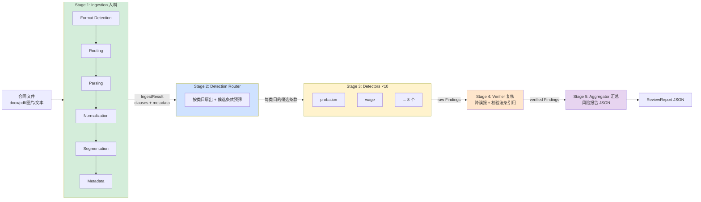

# System 1: 合同审查 Pipeline — 实现级设计文档

**Status**: Draft
**Date**: 2026-05-22
**Owner**: Dylan
**读者**: 实现者（写代码时对照本文档）、reviewer
**关联**: [HLD.md](HLD.md)（六层总览）, [ARCHITECTURE.md](ARCHITECTURE.md)（双系统交互）, [RAG_DESIGN.md](RAG_DESIGN.md)（检索层）, [EVAL_GUIDE.md](EVAL_GUIDE.md)（评测）, [taxonomy.yaml](taxonomy.yaml)（10 类目唯一真源）
**ADR 依赖**: ADR-0001(LLM), ADR-0002(向量库), ADR-0003(编排), ADR-0005(RAG), ADR-0007(脱敏), ADR-0008(多模态)

---

## 0. 文档定位

HLD 讲"系统分几层、为什么这么分"；本文档讲 **System 1（合同审查 Pipeline）从输入文件到输出 JSON 报告，每一阶段内部怎么实现**。

- 粒度：到 dataclass 字段、函数签名、决策表、伪代码。看完应能直接开写。
- 不覆盖：System 2（Chat Agent v2，见 P5a）、MCP 包装层（见 ADR-0009）、前端（见 ADR-0010）。这些消费 System 1 的输出，不属于 Pipeline 内部。
- **Ingestion 的 Format Detection 是本文档的重点章节（§3.2）**，已讨论定稿，按定稿写入。

---

## 1. System 1 总览

### 1.1 定位：它是 workflow，不是 agent

System 1 是**确定性流水线**（workflow orchestration），不是 agent loop。理由：
- 合同审查的步骤是固定的（解析→检测→复核→汇总），不需要 LLM 自主决定"下一步干啥"。
- 确定性 = 可测、可复现、可 eval（200 样本跑出稳定 P/R/F1）。
- LLM 只在**单步内**被调用（某个 detector 判一个条款），不掌控控制流。

> 对比：System 2（Chat Agent v2）才是 agent loop —— 用户多轮对话、模型自主调工具。两者通过 MCP 解耦（ADR-0006/0009）。

### 1.2 五阶段流水线



| Stage | 输入 | 输出 | 本质 |
|-------|------|------|------|
| 1 Ingestion | 文件路径 / bytes | `IngestResult`（条款列表 + 元数据） | 多模态归一为结构化条款 |
| 2 Router | `IngestResult` | `{category: [候选条 LegalNode]}` | 扇出 + 预筛，省算力 |
| 3 Detectors | 候选条款 + 类目策略 | `list[Finding]`（原始） | 每类目独立判违法 |
| 4 Verifier | 原始 Findings | `list[Finding]`（已复核） | 降误报、校验引用、定严重度 |
| 5 Aggregator | 已复核 Findings + 元数据 | `ReviewReport` | 装配最终报告 |

### 1.3 输入 / 输出契约（System 1 对外）

```python
def run_review(
    source: str | bytes,                 # 文件路径 或 raw bytes 或 纯文本
    options: ReviewOptions = ...,        # language / detail_level / categories / redact
) -> ReviewReport:
    """System 1 唯一公开入口。MCP tool、前端、CLI、eval 都调它。"""
```

- 输入：一份劳动合同（任意支持的形态）。
- 输出：`ReviewReport`（结构化 JSON）—— 风险列表 + 法条引用 + 修改建议 + 元数据 + 免责声明。
- 这个输出契约同时是：MCP `review_labor_contract` 的返回值（ADR-0009）、前端报告页渲染源（ADR-0010）、eval 的预测对象来源。**契约稳定性优先级最高**。

### 1.4 设计原则

1. **纯函数边界**：`run_review` 无隐藏全局状态，相同输入 + 相同 options + 固定 LLM seed/temperature → 相同输出（LLM 非完全确定，但结构稳定）。便于 MCP 包装与测试。
2. **阶段间用 dataclass 传递**，不传裸 dict。契约即代码（§2）。
3. **逐阶段降级**：任何阶段失败不让整条流水线崩，产出部分结果 + 在 `warnings` 里记原因。
4. **脱敏前置**（ADR-0007）：送 LLM 前必经 redact，PII 不出本地。
5. **可观测**：每阶段记 `timing_ms`，每次 LLM 调用走 `LLMClient` 审计。
6. **策略分层省钱**（ADR-0008/taxonomy）：80% 输入走廉价路径（rule / 本地 OCR），只有必要时才付费调 LLM/VLM。

---

## 2. 端到端数据契约

贯穿 Pipeline 的核心 dataclass。完整清单见附录 A，这里给主干。

```python
from __future__ import annotations
from dataclasses import dataclass, field
from enum import Enum
from typing import Literal, Optional

# ---- Stage 1 产物 ----
class SourceFormat(str, Enum):
    DOCX        = "docx"
    PDF_TEXT    = "pdf_text"
    PDF_SCANNED = "pdf_scanned"
    PDF_MIXED   = "pdf_mixed"      # 部分页文字、部分页扫描（逐页路由）
    TEXT        = "text"
    MARKDOWN    = "markdown"
    IMAGE       = "image"
    UNKNOWN     = "unknown"

# 条款的结构表示 = LegalNode（Legal AST 的节点，定义见 §3.6），取代了早期的 Clause
# （更全：树 / 祖先路径 / 引用 / 来源块）。检测的主单元 = type=article 的节点。

@dataclass
class FieldProvenance:                    # 每个要素从哪来（可追溯，§3.7）
    method: Literal["rule", "llm", "derived", "missing"]
    source_node_id: str | None = None    # 抽自哪个 AST 节点

@dataclass
class DocumentMetadata:
    title: str = ""
    party_a_name: str = ""               # 甲方（用人单位）
    party_b_name: str = ""               # 乙方（劳动者）—— PII，只规则抽、绝不送 LLM
    contract_type: str = ""              # 固定期限/无固定期限/以完成一定工作任务为期限
    signing_date: str = ""
    contract_start: str = ""
    contract_end: str = ""
    workplace: str = ""
    position: str = ""
    # —— 派生字段（算出来的，喂检测）——
    region: str = ""                              # 从 workplace 取省市 → 最低工资按地区检测
    contract_duration_months: int | None = None  # 起止算时长 → 试用期上限检测
    # —— 质量 / 可追溯 ——
    extraction_confidence: float = 0.0
    provenance: dict[str, FieldProvenance] = field(default_factory=dict)

@dataclass
class IngestResult:
    document_id: str
    source_path: str
    source_format: SourceFormat
    metadata: DocumentMetadata
    ast: "LegalAST"                      # ⑤ 产物：法律结构树（§3.6），取代旧 clauses: list[Clause]
    warnings: list[str] = field(default_factory=list)
    timing_ms: float = 0.0
    quality_score: float = 1.0           # 入料整体质量（影响最终报告可信度）
    used_ocr: bool = False
    used_vlm: bool = False
    total_pages: int = 1
    content_gate: "ContentGateResult | None" = None     # §3.3：合同类型+语言，交下游 Router B
    routing_decision: "RoutingDecision | None" = None   # §3.3：路由留痕，端到端可观测

# ---- Stage 3/4 产物 ----
Severity = Literal["high", "medium", "low", "none"]
RiskLevel = Literal["violation_clear", "violation_subtle", "borderline", "compliant"]

@dataclass
class Finding:
    """一个风险点。detector 产出，verifier 复核，aggregator 汇总。"""
    finding_id: str
    category: str                        # taxonomy 10 类目之一
    clause_id: str                       # 指向触发的条（LegalNode.node_id）
    risk_level: RiskLevel
    severity: Severity
    violation: bool
    violated_law: list[str] = field(default_factory=list)  # ["劳动合同法 第十九条"]
    law_quotes: list[str] = field(default_factory=list)    # 法条原文（aggregator 填充）
    reason: str = ""                     # 为什么违法/不利
    suggestion: str = ""                 # 客观建议（依法：合规基准 + 差距 + 救济方向）
    evidence_quote: str = ""             # 条款里最相关的片段
    confidence: float = 0.0
    detector_strategy: str = ""          # 命中时用的策略 tier
    verifier_note: str = ""              # 复核留痕

# ---- Stage 5 产物（System 1 对外输出）----
@dataclass
class ReviewReport:
    document_id: str
    metadata: DocumentMetadata
    overall_risk_score: float            # 0-100
    summary: dict                        # {high: n, medium: n, low: n, categories_hit: [...]}
    findings: list[Finding]              # 按 severity 降序
    ingest_warnings: list[str]
    quality_score: float
    disclaimer: str
    timing_ms: dict                      # {ingest, detect, verify, aggregate, total}
    generated_at: str
```

> `Prediction`（eval 用，见 harness.py）是 `Finding` 的瘦身投影：eval 只关心 `violation/category/severity/confidence/reason/violated_law`。两者通过 §5.4 的 adapter 互转。

---

## 3. Stage 1 — Ingestion（入料）

把任意形态的合同变成**有结构定位的条款列表 + 元数据**。这是 Pipeline 里工程量最大、最脏的一段（ADR-0008：真实输入 80% 不是 clean text）。

### 3.1 六个子模块

```
文件 ─▶ ① Format Detection ─▶ ② Routing ─▶ ③ Parsing ─▶ ④ Normalization ─▶ ⑤ Segmentation ─▶ ⑥ Metadata ─▶ IngestResult
        (你是啥 + 长啥样)      (选 parser)   (抽文本)      (清洗归一)         (切条款)          (抽要素)
```

| # | 模块 | 入 | 出 | 关键依赖 |
|---|------|----|----|---------|
| ① | Format Detection | 文件 | `FormatDetectionResult` | 见 §3.2（重点） |
| ② | Routing | `FormatDetectionResult` + 配置 | `ProcessingPlan` | 决策逻辑见 §3.3 |
| ③ | Parsing | `ProcessingPlan` + 文件 | `RawParse`（块） | python-docx/pdfplumber/PaddleOCR/Qwen-VL |
| ④ | Normalization | `RawParse` 块 | 干净的块 | 全半角/标点/页眉页脚/断行 |
| ⑤ | Segmentation | 干净的块 | Legal AST（§3.6 待细化） | 第X条/第X章 标记 |
| ⑥ | Metadata | 干净文本 + clauses | `DocumentMetadata` | 规则 + LLM 兜底 |

---

### 3.2 Module ① Format Detection ★（详细，已定稿）

#### 3.2.1 为什么要"两步"

一个文件有两个正交问题，必须分开回答：

1. **Identity（身份）—— "你到底是什么文件？"**
   不能信扩展名。`合同.pdf` 可能是改了名的图片；`合同.docx` 可能是 RTF。要靠 magic bytes + 容器深检来定真身。
2. **Content Shape（内容形态）—— "你内部长什么样？"**
   即便确认是 PDF，它可能是：文字版（可直接抽）、扫描版（要 OCR）、混合版（逐页不同）、加密、损坏。形态决定**用哪个 parser**。

把两步揉在一起会得到一坨 if-else 泥潭。拆开后：Identity 失败可直接 reject（省得白跑 OCR）；Shape 只在 Identity 通过后按格式分派。

**走一遍例子：一个伪装的文件**

有人上传一个叫 `合同.pdf` 的文件，其实是把一张照片改了名。Format Detection 怎么识破？

1. **看真身（第一步 Identity）**：扩展名说 `.pdf`，但文件头前几个字节是 `FF D8 FF`——那是 JPEG 照片的标志。**信文件头、不信扩展名** → 真身是图片。因为扩展名骗了人，置信度打个折（比如 0.75），并记一条"扩展名与实际不符"。
2. **看长相（第二步 Shape）**：既然是图片，就看清不清楚、有没有歪。假设拍得清楚 → 形态 = "清晰文档照片"，置信 0.85。
3. **产物**：一个 `FormatDetectionResult`——身份=图片(0.75)、形态=清晰(0.85)、整体可信 = 0.75 × 0.85 ≈ 0.64。
4. **它不决定"用哪个工具去抽"**——那是下一步 Routing 的事。① 只回答"是什么、长什么样、多确定"。

> 正常情况对比：真的 `合同.docx` → 第一步解压看到里面有 `word/document.xml`，确认是 docx（置信 1.0）；第二步看它正文为主还是表格为主。两步都顺，整体≈1.0。

#### 3.2.2 数据结构全集

下面每个结构按 **用途 → 字段表（带例子）→ 精简代码** 讲（与 §3.3 同风格）。① 的所有产物都是**纯描述**，不含决策。

**IdentityDetection —— Step 1 产物："你到底是什么文件"**

用途：靠四个信号仲裁出文件真身（别信扩展名），并判断是否安全到值得处理。

| 字段 | 含义（举例） |
|------|-------------|
| `claimed_extension` | 文件名后缀（易伪造）。`.pdf` |
| `claimed_mime` | 上传 Content-Type / `python-magic` 给的 MIME。`application/pdf` |
| `detected_format` | **仲裁后的真身**（`SourceFormat` 枚举）。改名的图片 → `IMAGE` 而非 `PDF` |
| `confidence` | 四信号一致度（机制 A，§3.3.5）。全一致≈1.0，打架则降 |
| `safe_to_process` | False = 直接拒（可执行文件伪装、未知二进制） |
| `issues` | 冲突/异常留痕。`["扩展名 .docx 与 magic(PDF) 冲突"]` |

```python
@dataclass
class IdentityDetection:
    claimed_extension: str
    claimed_mime: str
    detected_format: SourceFormat
    confidence: float
    safe_to_process: bool
    issues: list[str] = field(default_factory=list)
```

**四个 ShapeDetection —— Step 2 产物："你内部长什么样"**

每种格式一个 shape，只在 Identity 通过后填一个。**只描述形态，不选 parser**（选 parser 是 Routing 的事）。

**① PDFShapeDetection（最复杂）** —— 回答"文字版/扫描/混合/加密/损坏"：

| 字段 | 含义（举例） |
|------|-------------|
| `primary_type` | `text` / `scanned` / `mixed` / `encrypted` / `corrupted` |
| `confidence` | 形态判定有多干脆（覆盖≥0.9 → 0.95） |
| `page_count` | 总页数 |
| `text_char_count` / `text_chars_per_page` | 可抽字符总数 / 每页均值 |
| `text_coverage` | 有文字层的页数 ÷ 总页数（判 text vs scanned 的关键） |
| `image_count` | 图像数 |
| `has_signature` | 检出签名页图像 / `/Sig` 域 |
| `has_form_fields` | 是否含 `/AcroForm` 表单域 |
| `signals` | **原始信号**，必含 `per_page_chars: list[int]` —— Routing 据此排逐页 `ParseStep`（§3.3），勿删 |

```python
@dataclass
class PDFShapeDetection:
    primary_type: Literal["text", "scanned", "mixed", "encrypted", "corrupted"]
    confidence: float
    page_count: int
    text_char_count: int
    text_chars_per_page: float
    text_coverage: float
    image_count: int
    has_signature: bool
    has_form_fields: bool
    signals: dict = field(default_factory=dict)   # 必含 per_page_chars
```

**② DocxShapeDetection** —— docx 是结构化的，重点是"正常文本 / 表格型 / 空 / 带修订"：

| 字段 | 含义 |
|------|------|
| `primary_type` | `text` / `table_heavy` / `empty` / `tracked_changes` |
| `confidence` | 形态置信 |
| `paragraph_count` / `table_count` / `image_count` | 段落 / 表格 / 图片数 |
| `has_tracked_changes` | 修订痕迹（双方谈判稿，解析时取最终态） |
| `char_count` | 总字数 |

```python
@dataclass
class DocxShapeDetection:
    primary_type: Literal["text", "table_heavy", "empty", "tracked_changes"]
    confidence: float
    paragraph_count: int
    table_count: int
    image_count: int
    has_tracked_changes: bool
    char_count: int
```

**③ ImageShapeDetection** —— 图片重点是"清晰 / 低质量 / 疑似手写"，决定后续走 OCR 还是 VLM：

| 字段 | 含义 |
|------|------|
| `primary_type` | `clear_text` / `low_quality` / `handwritten_suspected` |
| `confidence` | 形态置信 |
| `width` / `height` | 像素尺寸 |
| `blur_score` | Laplacian 方差，越低越糊 |
| `estimated_rotation` | 估计旋转角（度） |
| `has_text_regions` | 轻量文本检测：图里有没有文字区 |

```python
@dataclass
class ImageShapeDetection:
    primary_type: Literal["clear_text", "low_quality", "handwritten_suspected"]
    confidence: float
    width: int
    height: int
    blur_score: float
    estimated_rotation: float
    has_text_regions: bool
```

**④ TextShapeDetection** —— 纯文本/markdown，最简单：

| 字段 | 含义 |
|------|------|
| `primary_type` | `plain` / `markdown` |
| `confidence` | 形态置信 |
| `encoding` | 探测到的编码。`utf-8` / `gb18030` |
| `char_count` | 字数 |
| `has_article_markers` | 是否含"第X条"（给 Segmentation 的提示信号） |

```python
@dataclass
class TextShapeDetection:
    primary_type: Literal["plain", "markdown"]
    confidence: float
    encoding: str
    char_count: int
    has_article_markers: bool
```

**FormatDetectionResult —— Module ① 总产物（分层 Facade）**

用途：把 identity（必有）+ 四选一的 shape 包成一个对象；上层 90% 只用便捷属性，要细节再下钻。**纯描述，不做决策。**

| 成员 | 含义 |
|------|------|
| `identity` | `IdentityDetection`，永远有 |
| `pdf_shape` / `docx_shape` / `image_shape` / `text_shape` | 四选一，按 `detected_format` 填一个 |
| `.shape`（属性） | 返回被填充的那个 shape，统一访问点 |
| `.primary_type`（属性） | shape 的 primary_type，无 shape 则 `unknown` |
| `.overall_confidence`（属性） | `identity.confidence × shape.confidence`，纯指标（机制 C） |

```python
@dataclass
class FormatDetectionResult:
    identity: IdentityDetection
    pdf_shape:   Optional[PDFShapeDetection]   = None
    docx_shape:  Optional[DocxShapeDetection]  = None
    image_shape: Optional[ImageShapeDetection] = None
    text_shape:  Optional[TextShapeDetection]  = None

    @property
    def shape(self):
        return self.pdf_shape or self.docx_shape or self.image_shape or self.text_shape

    @property
    def primary_type(self) -> str:
        return self.shape.primary_type if self.shape else "unknown"

    @property
    def overall_confidence(self) -> float:        # identity.conf × shape.conf（纯指标，非决策）
        return self.identity.confidence * (self.shape.confidence if self.shape else 0.0)

    # 选 parser、proceed/reject 等决策不在这里，由 Routing 负责（§3.3）；① 只描述
```

> **为什么选 Option C（分层 Facade）而不是扁平大 dataclass / 继承多态**：
> - 扁平大 dataclass：把 PDF/DOCX/IMAGE 字段全塞一个类，大量字段对当前格式无意义（`page_count` 对 docx？），易误用。
> - 继承多态（`PDFResult(FormatResult)`…）：调用方要 `isinstance` 分支，且无法表达"PDF 但也想留 image 信息"。
> - **Facade**：`identity` 永远在；`shape` 是统一入口，`.primary_type/.overall_confidence` 屏蔽差异；要细节时再下钻到 `pdf_shape`。调用方 90% 只碰便捷属性。

#### 3.2.3 Step 1 — Identity Detection（四信号 + 仲裁）

四个独立信号，可信度递增：

| 信号 | 来源 | 可伪造性 | 例 |
|------|------|---------|----|
| `claimed_extension` | 文件名后缀 | 极易（改名即可） | `.pdf` |
| `claimed_mime` | 上传 Content-Type / `python-magic` | 中 | `application/pdf` |
| **magic bytes** | 文件头字节 | 难 | `%PDF-` / `PK\x03\x04` / `\x89PNG` / `\xff\xd8\xff` |
| **容器深检** | 解开容器看内部 | 最难 | docx zip 里有 `word/document.xml` |

magic / 容器签名表：

```python
MAGIC = {
    b"%PDF-":            "pdf",
    b"\x89PNG\r\n\x1a\n":"png",
    b"\xff\xd8\xff":     "jpeg",
    b"PK\x03\x04":       "zip_container",   # docx/xlsx/pptx 都是 zip，需深检区分
}

def _sniff_zip_container(raw: bytes) -> SourceFormat:
    """PK 开头 → 解 zip 看内部清单，区分 docx vs 其他 OOXML/普通 zip。"""
    names = zipfile.ZipFile(io.BytesIO(raw)).namelist()
    if "word/document.xml" in names:  return SourceFormat.DOCX
    if "xl/workbook.xml"  in names:  return SourceFormat.UNKNOWN   # xlsx：非合同，拒
    if "ppt/presentation.xml" in names: return SourceFormat.UNKNOWN
    return SourceFormat.UNKNOWN
```

**仲裁逻辑**（信任顺序：容器深检 > magic > mime > extension）：

```python
def detect_identity(path: str, raw: bytes, claimed_mime: str = "") -> IdentityDetection:
    ext = Path(path).suffix.lower()
    issues = []

    # 1) magic bytes
    magic_fmt = match_magic(raw[:16])              # → "pdf"/"png"/"jpeg"/"zip_container"/None
    # 2) zip 容器深检
    if magic_fmt == "zip_container":
        detected = _sniff_zip_container(raw)        # DOCX or UNKNOWN
    elif magic_fmt == "pdf":
        detected = SourceFormat.PDF_TEXT            # 真正 text/scanned 留给 Step 2 判
    elif magic_fmt in ("png", "jpeg"):
        detected = SourceFormat.IMAGE
    elif magic_fmt is None:
        detected = _guess_text_or_unknown(raw)      # 可 UTF-8/GB 解码 → TEXT/MARKDOWN，否则 UNKNOWN
    else:
        detected = SourceFormat.UNKNOWN

    # 3) 一致性核对 → 置信度 & issues
    conf = 1.0
    if ext and not _ext_matches(ext, detected):
        issues.append(f"扩展名 {ext} 与实际 {detected.value} 不符"); conf *= 0.75
    if claimed_mime and not _mime_matches(claimed_mime, detected):
        issues.append(f"MIME {claimed_mime} 与实际 {detected.value} 不符"); conf *= 0.85
    if detected == SourceFormat.UNKNOWN:
        conf = min(conf, 0.2)

    safe = detected != SourceFormat.UNKNOWN and not _looks_executable(raw)
    return IdentityDetection(ext, claimed_mime, detected, conf, safe, issues)
```

要点：
- magic 与 extension 冲突 **不直接拒**，而是**信 magic、降置信、记 issue**。真实场景里"图片改名成 .pdf"应当被当图片处理，而非报错。
- `UNKNOWN` 或疑似可执行 → `safe_to_process=False` → 上层 reject。
- Step 1 对 PDF 只给到 `PDF_TEXT` 占位，**text/scanned/mixed 的细分是 Step 2 的事**（Step 1 不读内容，只读文件头）。

#### 3.2.4 Step 2 — Content Shape Detection（按格式分派）

只在 `identity.safe_to_process` 时运行，按 `detected_format` 调对应探测器。

**PDF 形态判定（最复杂）**：

```python
def detect_pdf_shape(raw: bytes) -> PDFShapeDetection:
    try:
        reader = pypdf.PdfReader(io.BytesIO(raw))
    except Exception:
        return PDFShapeDetection(primary_type="corrupted", confidence=0.9, ...)
    if reader.is_encrypted and not _try_empty_password(reader):
        return PDFShapeDetection(primary_type="encrypted", confidence=0.95, ...)

    n = len(reader.pages)
    per_page_chars, per_page_imgs = [], []
    for pg in reader.pages:
        per_page_chars.append(len(pg.extract_text() or ""))
        per_page_imgs.append(_count_images(pg))

    total_chars   = sum(per_page_chars)
    pages_w_text  = sum(1 for c in per_page_chars if c > TEXT_PAGE_MIN)   # TEXT_PAGE_MIN=50
    coverage      = pages_w_text / n
    cpp           = total_chars / n

    # 形态判定（只描述，不选 parser —— 那是 Routing 的事）：
    if   coverage >= 0.9 and cpp >= 100:  ptype, conf = "text",    0.95
    elif coverage <= 0.1:                 ptype, conf = "scanned", 0.90
    else:                                 ptype, conf = "mixed",   0.80

    return PDFShapeDetection(
        primary_type=ptype, confidence=conf, page_count=n,
        text_char_count=total_chars, text_chars_per_page=cpp, text_coverage=coverage,
        image_count=sum(per_page_imgs),
        has_signature=_detect_signature(reader),
        has_form_fields=("/AcroForm" in reader.trailer.get("/Root", {})),
        signals={"per_page_chars": per_page_chars, "per_page_imgs": per_page_imgs},
    )
```

阈值（可调，进 config）：`TEXT_PAGE_MIN=50` 字/页算"有文字层"；`coverage≥0.9 & cpp≥100` → text；`coverage≤0.1` → scanned；中间 → **mixed（逐页路由，已定：完整处理）**。

> **mixed PDF 怎么处理**：① 在 `signals.per_page_chars` 记录每页字符数；Routing 据此排出逐页 `ParseStep`（有文字层的页 → pdfplumber，无的 → OCR），③ `execute_plan` 执行后按页码拼回，`page` 字段保证定位正确。

**DOCX / IMAGE / TEXT 形态**（更简单）：

```python
def detect_docx_shape(raw):
    d = docx.Document(io.BytesIO(raw))
    paras  = [p for p in d.paragraphs if p.text.strip()]
    tables = d.tables
    tracked = _has_w_ins_or_del(d)               # 检 w:ins/w:del 修订标记
    if not paras and not tables: ptype = "empty"
    elif tracked:                ptype = "tracked_changes"
    elif len(tables) > len(paras): ptype = "table_heavy"   # 表格型合同
    else:                        ptype = "text"
    return DocxShapeDetection(ptype, 0.95, len(paras), len(tables),
                              _count_imgs(d), tracked, _char_count(d))

def detect_image_shape(raw):
    img = Image.open(io.BytesIO(raw))
    blur = _laplacian_var(img)                    # 越低越糊
    rot  = _estimate_rotation(img)
    has_text = _quick_text_region(img)            # 轻量检测有无文字区
    if   blur < BLUR_MIN or abs(rot) > 15: ptype, parser = "low_quality", "qwen-vl"
    elif _handwriting_hint(img):           ptype, parser = "handwritten_suspected", "qwen-vl"
    else:                                  ptype, parser = "clear_text", "paddleocr"
    return ImageShapeDetection(ptype, 0.85, img.width, img.height, blur, rot, has_text, parser)

def detect_text_shape(raw):
    enc  = _detect_encoding(raw)                  # chardet/charset-normalizer
    text = raw.decode(enc, errors="replace")
    is_md = _looks_markdown(text)                 # 有 #/```/| 等
    return TextShapeDetection("markdown" if is_md else "plain", 0.99, enc,
                              len(text), bool(re.search(r"第[一二三四…\d]+条", text)),
                              "text_reader")
```

#### 3.2.5 Facade 组装入口

```python
def detect_format(path: str, raw: bytes, claimed_mime: str = "") -> FormatDetectionResult:
    identity = detect_identity(path, raw, claimed_mime)
    res = FormatDetectionResult(identity=identity)
    if not identity.safe_to_process:
        return res                                # shape 全 None → Routing 判 reject（§3.3）

    f = identity.detected_format
    if   f in (SourceFormat.PDF_TEXT, SourceFormat.PDF_SCANNED, SourceFormat.PDF_MIXED):
        res.pdf_shape   = detect_pdf_shape(raw)
    elif f == SourceFormat.DOCX:
        res.docx_shape  = detect_docx_shape(raw)
    elif f == SourceFormat.IMAGE:
        res.image_shape = detect_image_shape(raw)
    elif f in (SourceFormat.TEXT, SourceFormat.MARKDOWN):
        res.text_shape  = detect_text_shape(raw)
    return res
```

#### 3.2.6 置信度模型：为什么用乘法

**为什么乘法而非取最小/平均**：身份与形态是**独立的不确定来源**，要联合可信才整体可信。任一环节弱 → 整体应被拉低。乘法天然满足（`0.9 × 0.6 = 0.54`，明显偏低），取 min 会掩盖"两个都中等"的复合风险。

```
overall_confidence = identity.confidence × shape.confidence
```

这是一个**纯指标（事实）**。如何用这个分数做 proceed / manual_review / reject 的判定，见 §3.3 的 `RoutingThresholds` 与置信度分档。

#### 3.2.7 形态如何映射到处理策略

① 只输出**描述**（`FormatDetectionResult`），不决定怎么处理。形态 → 选哪个 parser、逐页计划、proceed/reject，全部由 Routing 决定（§3.3）。其中 `pdf_shape.signals.per_page_chars` 是 Routing 排逐页计划的关键输入。

#### 3.2.8 失败与降级

| 情况 | 处理 |
|------|------|
| Step 1 `UNKNOWN` / 可执行伪装 | `safe_to_process=False` → reject，不进 Step 2 |
| PDF 加密无法解 | `primary_type="encrypted"` → reject + warning「需密码」 |
| PDF 损坏 pypdf 打不开 | `primary_type="corrupted"` → reject + warning「文件损坏」 |
| mixed 但 confidence 低 | 仍处理（Routing 排逐页计划）→ Routing 判 manual_review（§3.3） |
| 扩展名/MIME 冲突 | 信 magic，降置信，issue 留痕，**不报错** |

#### 3.2.9 测试要点（§10 展开）

fixture 必须含**对抗样本**：改名文件（.jpg→.pdf）、加密 PDF、损坏 PDF、空 docx、修订稿 docx、纯扫描 PDF、混合 PDF、旋转/糊图、手写批注图。每个 fixture 断言 `detected_format / primary_type / overall_confidence`；"选 parser / proceed-reject" 的断言归到 Routing 测试（§3.3）。

---

### 3.3 Module ② Routing（决策层）

> 与 Format Detection 同等深度的核心章节。**Routing 不是查表**，是 Ingestion 的决策大脑。
> 本节每个数据结构都按 **用途 → 字段表（带例子）→ 精简代码** 的顺序讲，确保非作者也读得懂。

#### 3.3.1 定位：sense → decide → act

Ingestion 里三件事是不同职责，分开才清楚、可测、可审计：

| 职责 | 模块 | 干什么 | 性质 |
|------|------|--------|------|
| Sense 感知 | ① Format Detection | 文件是什么、什么形态、多确定 | 纯描述 |
| **Decide 决策** | ② **Routing** | 用哪个 parser、逐页怎么排、能否进入、质量够不够 | 纯策略（无 I/O） |
| Act 执行 | ③ Parsing | 按计划抽文本 | 纯 I/O |

还要分清**两个不同时机的 Router**（别合并）：

| | Router A = Ingestion Routing（本节） | Router B = Detection Router（Stage 2, §4） |
|--|--|--|
| 输入 | 原始文件 + 廉价分析 | 已解析的干净条款 |
| 决策 | 选 parser、能否进入、质量 | 选类目/detector、检索哪条法条、风险分级 |

"风险等级、检索需求"属于 Router B，**不在这里**——否则要在脏文本上重造 detector，把两层耦死。

#### 3.3.2 组件：分析器 → 规划器

```
        sense（分析）                 decide（规划）
  ┌─ PhysicalAnalyzer ＝ ① 复用 ─┐
  ├─ QualityAssessor ───────────┤
  └─ ContentGate ───────────────┴─▶ StrategyPlanner ─┬─▶ ProcessingPlan（给 ③）
                                                      └─▶ RoutingDecision（给审计）
```
- **PhysicalAnalyzer** = Format Detection（①），直接复用，不重造。
- **QualityAssessor** = 给文本可信度打分（§3.3.4）。
- **ContentGate** = 判"是不是劳动合同 + 什么语言"（§3.3.4）。
- **StrategyPlanner** = 把以上揉成一个 `ProcessingPlan`（§3.3.6），同时吐一条 `RoutingDecision` 留痕（§3.3.8）。

Routing 是纯函数：`route(detection, capability, thresholds, options) -> ProcessingPlan`。下面分输入 / 内部分析 / 输出三组讲。

**走一遍例子：同一张糊照片，两个部署，两套安排**

接上面那个例子——① 说"这是张照片"。假设它拍得又糊又歪（低质量）。Routing 怎么排活？

- 糊照片最好用 VLM（看图认字的大模型）来认。但"能不能用 VLM"取决于这台机器装没装。
- **云端部署**（装了 Qwen-VL）→ 计划：用 qwen-vl 抽，正常放行。
- **律所内网**（断网、没 VLM）→ 用不了 qwen-vl → 退而用本地 OCR，并**标记"质量低、建议人工复核"**。

**同一份文件、两个部署、两套计划**——这就是 Routing 要先看"部署能力"再决定的意义（① 只描述文件，管不了这个）。

#### 3.3.3 输入契约（来自部署 / 配置 / 用户）

**(a) CapabilityProfile —— "这台部署能用哪些工具、能用多狠"**

用途：让**同一套代码**在云端 / 律所内网自动适配，不改代码只换 profile。

| 字段 | 含义（举例） |
|------|-------------|
| `profile_id` | 这套配置的名字。`cloud_full`（云端全能力）/ `onprem_lawfirm`（律所内网，断外网） |
| `available_parsers` | 本机**实际可用**的 parser 集合。内网没 `qwen-vl` → 同一张糊照片：云端走 VLM，内网只能 OCR + 标低质 |
| `max_pages` | 处理页数上限。200 页扫描件在 3.6G 内存上会撑爆 → 设 50，超出只处理前 N 页 + 警告 |
| `max_concurrent_ocr` | 同时并行 OCR 的页数。每个 OCR 实例吃内存，3.6G 上开太多会 OOM → 信号量限到如 2 |

```python
@dataclass
class CapabilityProfile:
    profile_id: str
    available_parsers: set[str]      # ⊆ {"python-docx","pdfplumber","paddleocr","qwen-vl","text_reader"}
    max_pages: int
    max_concurrent_ocr: int
```

**(b) RoutingThresholds —— "所有判定数字集中放这，能调，不写死"**

用途：把"放行还是拒、要不要兜底"的阈值从代码抽出来进配置，便于按 eval 数据校准（§3.3.5）。

置信度分档（用 ① 的 `overall_confidence`）：
```
   reject        manual_review        proceed+警告         proceed
 ──────────┼──────────────────┼──────────────────┼──────────▶
 0        0.30              0.60              0.90        1.0
```
| 字段（默认值） | 含义 |
|--------------|------|
| `proceed_min_conf = 0.90` | ≥ 此值：直接放行 |
| `manual_min_conf = 0.60` | 落 [0.60, 0.90)：放行但加一条警告 |
| `reject_min_conf = 0.30` | 落 [0.30, 0.60)：转人工复核；< 0.30：拒 |
| `quality_detect_min = 0.50` | 文本质量低于此：连检测都不靠谱 |
| `quality_rag_min = 0.80` | 低于此：够"看大概做检测"，但不够"逐字引证 + 检索法条" |
| `ocr_fallback_conf = 0.85` | 某页 OCR 自报置信低于此 → 升级调 VLM 兜底 |
| `contract_gate_min = 0.60` | 判"是劳动合同"的置信下限 |

```python
@dataclass
class RoutingThresholds:
    proceed_min_conf: float = 0.90
    manual_min_conf:  float = 0.60
    reject_min_conf:  float = 0.30
    quality_detect_min: float = 0.50
    quality_rag_min:    float = 0.80
    ocr_fallback_conf:  float = 0.85
    contract_gate_min:  float = 0.60
```

**(c) ReviewOptions（用户侧，§1.3）补三项**：`password`（解密）/ `force_ocr` / `skip_vlm`（省钱）。
**(d) FormatDetectionResult**：① 的输出，主要读 `identity / shape / overall_confidence` 与 `pdf_shape.signals.per_page_chars`。

#### 3.3.4 内部分析产物

**ContentGateResult —— "是不是劳动合同 + 什么语言"**

用途：把非劳动合同（简历/发票/租房合同）和非中文文件挡在门外，省下后续解析与检测。

| 字段 | 含义（举例） |
|------|-------------|
| `verdict` | `yes` / `borderline` / `no`——是不是劳动合同 |
| `doc_type_guess` | 猜的类型：`labor_contract` / `resume` / `other_contract` / `unknown` |
| `gate_confidence` | 判定置信（与 `contract_gate_min` 比） |
| `method` | 判定手段：`keyword` / `classifier` / `llm`（先用便宜的，LLM 兜底） |
| `language` | 语言信息（见下） |

```python
@dataclass
class LanguageInfo:
    primary: str            # "zh" / "en" / ...
    is_bilingual: bool      # 中英对照？
    secondary: str | None
    in_scope: bool          # primary == "zh"

@dataclass
class ContentGateResult:
    verdict: Literal["yes", "borderline", "no"]
    doc_type_guess: str
    gate_confidence: float
    method: Literal["keyword", "classifier", "llm"]
    language: LanguageInfo
```
处置：`verdict=no` 且非中文 → reject（友好提示）；`borderline` → 警告 + 尽力；双语 → flag，用中文部分（中国法下通常中文版为准），MVP 先尽力不重投入。

**QualityAssessment —— "这份文字有多可信，能走到哪一步"**

用途：OCR 出的文字可能 90% 准——够检测违法点，却不够逐字引用当证据。用两条阈值线区分能走多远。

| 字段 | 含义（举例） |
|------|-------------|
| `doc_quality` | 0–1 综合分。0.95=很干净，0.4=很烂。由 OCR 置信、模糊度、分辨率、文字覆盖率揉成 |
| `detection_safe` | `doc_quality ≥ quality_detect_min`？——够不够做检测 |
| `rag_safe` | `doc_quality ≥ quality_rag_min`（更高）？——够不够检索法条 + 逐字引证 |
| `basis` | 这分**何时/靠什么**算的：`shape_signals`=路由时靠①信号**预估**（猜）；`post_parse`=解析后靠真实 OCR 置信**实测**（量） |
| `per_page_quality` | 逐页分。10 页里第 7 页糊 → 只对第 7 页提示/送 VLM |
| `reasons` | 人能看懂的原因（"第 7 页模糊度过低"、"旋转 12°"），喂警告与审计 |

```python
@dataclass
class QualityAssessment:
    doc_quality: float
    detection_safe: bool
    rag_safe: bool
    basis: Literal["shape_signals", "post_parse"]
    per_page_quality: dict[int, float] | None
    reasons: list[str]
```
**为什么两条线**：检测"试用期 6 个月违法"只要数字大致对；但把这条**原文逐字引出来当证据**、并精确检索到对应法条，需要更高保真。中间地带（0.50–0.80）→ 按规则检测，但把 LLM/RAG 结论标低置信。

#### 3.3.5 这些分数从哪来（计算机制）

所有置信/质量分来自**三种机制**，别混：

- **机制 A：规则一致性（自己算，确定性）**——`identity.confidence`、`shape.confidence`。从 1.0 起步，信号打架就乘惩罚因子（扩展名与 magic 矛盾 ×0.75…）；形态越"干脆"分越高（覆盖≥0.9 → 0.95）。可复现、无模型。
- **机制 B：工具/模型自报**——OCR 每行返回置信；数字文本（docx/pdfplumber）无识别不确定性 → 质量≈1.0；ContentGate 的 keyword=命中锚词比例、classifier=概率、llm=自报。
- **机制 C：派生/组合**——`overall_confidence = identity × shape`（乘法：两个独立不确定来源，任一弱则整体弱）；`doc_quality` 按来源聚合；`detection_safe / rag_safe` 是分数与阈值比大小的布尔。

**诚实的难点**：VLM/LLM 自报置信**校准差**（说 0.9 不代表真 90% 准）→ 不盲信，靠交叉校验/保守先验，且优先用 keyword/小模型、LLM 仅兜底。

**关键观念**：上面的常数（0.85、0.90、权重）**不是拍脑袋，是初始猜测 → 用 eval 数据校准**（路由准确度、CER，多模态 eval set，ADR-0008）。结构讲道理（A/B/C），数字靠数据调，所以全进 `RoutingThresholds` 配置。

#### 3.3.6 输出契约（ProcessingPlan）

Routing 的产物就是一份 `ProcessingPlan`——告诉 ③ 怎么解析这份文件。

**ParseStep —— "一段范围 → 用哪个 parser"**

把"哪些页、用哪个 parser、不行怎么兜底"写成明文一条。

| 字段 | 含义（举例） |
|------|-------------|
| `pages` | 处理哪些页，如 `[4,5]`；`None` = 整篇 |
| `primary_parser` | 主用 parser（5 个原子 parser 之一） |
| `fallback_chain` | 主 parser 不行时依次尝试，如 `["qwen-vl"]`；空 = 无兜底 |
| `fallback_threshold` | 主 parser 置信低于此就触发兜底，如 `0.85`；`None` = 不兜底 |
| `reason` | 为何这么排（给人看："第4-5页无文字层"） |

**ProcessingPlan —— Routing 的主输出**

| 字段 | 含义 |
|------|------|
| `action` | `proceed` / `manual_review` / `reject` |
| `reject_reason` | 拒的原因（加密/损坏/非合同/质量过低），其余为 None |
| `steps` | `ParseStep` 列表；reject 时为空；混合 PDF = 多 step |
| `content` | `ContentGateResult`（合同类型 + 语言），带给下游 Router B |
| `warnings` | 警告列表 |
| `decision` | `RoutingDecision`，审计（始终产出，含 reject 时） |

```python
@dataclass
class ParseStep:
    pages: list[int] | None          # None = 整篇
    primary_parser: str
    fallback_chain: list[str]
    fallback_threshold: float | None # 主 parser 置信低于此 → 触发兜底
    reason: str

@dataclass
class ProcessingPlan:
    action: Literal["proceed", "manual_review", "reject"]
    reject_reason: str | None
    steps: list[ParseStep]
    content: ContentGateResult
    warnings: list[str]
    decision: "RoutingDecision"
```

> 质量分不放进 plan：Routing 算的是**解析前估计**（用于定 action，并存进 `RoutingDecision` 审计）；下游要用的是 ③ 解析后的**实测**质量（来自 `RawParse`，§3.4）。

**例子：5 页混合 PDF**。第 1–3 页有文字层、第 4–5 页是扫描签字页。① 给出 `signals.per_page_chars=[1200,1500,1300,8,0]`，Routing 排出：

| ParseStep | pages | primary_parser | fallback_chain | fallback_threshold |
|-----------|-------|----------------|----------------|--------------------|
| step 1 | [1,2,3] | pdfplumber | — | — |
| step 2 | [4,5] | paddleocr | ["qwen-vl"] | 0.85 |

→ `action=proceed`，③ 执行：pdfplumber 抽 1–3、OCR 抽 4–5（置信不足升 VLM），按页码拼回。

> `PARSER_REGISTRY` = 5 个原子 parser：`python-docx / pdfplumber / paddleocr / qwen-vl / text_reader`。逐页不同策略由"含多个 `ParseStep` 的 plan"表达，组合复杂度都在 plan 层。

#### 3.3.7 可扩展性

三个注册表 + 一个稳定契约：
- `ParserRegistry`：加一个新 parser（如更好的 OCR）→ 注册即用，不动 Routing 逻辑；
- `AnalyzerPipeline`：加一个分析器（如版面分析）→ 插入即用；
- `CapabilityProfile`：每个部署一套能力，新环境只配 profile；
- `ProcessingPlan` 作稳定契约，把"决策"与"执行"解耦；`StrategyPlanner` 是纯函数，加规则不动执行层。

#### 3.3.8 两层审计（原则见 §9.1）

Routing 是纯函数，审计 = 把它**已算出的**决策痕迹返回，几乎零成本。

- **运维审计 `RoutingDecision`**：为什么这么路由，便于调试 / 调参 / 向用户解释。

| 字段 | 含义 |
|------|------|
| `inputs` | 输入快照：format **及其原始信号**（per_page_chars 等）/ quality / language / content / profile_id / 生效阈值 |
| `chosen_action` | 选了 proceed / manual / reject |
| `chosen_steps` | 每 step 的 parser 摘要 |
| `alternatives` | 候选及淘汰原因，如 `("qwen-vl","本部署无 VLM")` |
| `overall_confidence` | 综合置信 |
| `timing_ms` / `timestamp` | 计时 / 时间戳 |

```python
@dataclass
class RoutingDecision:
    inputs: dict
    chosen_action: str
    chosen_steps: list[str]
    alternatives: list[tuple[str, str]]
    overall_confidence: float
    timing_ms: float
    timestamp: str
```
> `inputs` **必须带 ① 的原始信号**，否则 ① 误判（如把文字版误判扫描版）时，无法定位是感知错还是路由错。

- **合规审计**：不在 Routing 内，而在**入料边界**记一笔（收到/拒绝文档：哈希/格式/时间，PIPL 来源凭证）。见 §9.1。

### 3.4 Module ③ Parsing（解析：把文件拆成块）

Parsing 干一件事：**把文件里每样东西拆下来、贴上标签**——忠实还原内容和位置；不清洗（那是 ④）、不切条款（那是 ⑤）。

用一份合同 PDF 第 1 页举例，上面有四样东西：

```
┌──────────────────────────┐
│         劳动合同           │  ← 标题
│  甲方：北京 XX 公司         │  ← 一段话
│  ┌──────────┬────────┐    │
│  │ 基本工资  │ 5000   │    │  ← 一个表格
│  │ 绩效工资  │ 2000   │    │
│  └──────────┴────────┘    │
│               [公章图]     │  ← 一张图
└──────────────────────────┘
```

拆出来的**每一样 = 一个 TextBlock**（这页 → 4 个）。所有块装进一个 `RawParse`，就是 ③ 交给下一步的东西。

#### TextBlock —— 一块内容 + 标签

| 字段 | 回答什么 | 例子 |
|------|---------|------|
| `block_id` | 这块的编号（报告能跳回原文） | "blk_003" |
| `text` | 文字（③ 出=原文；④ 出=洗净后） | 段落文字 / 表格转成的 markdown / 图没文字→空 |
| `raw_text` | 抽取原文，**永不改**（指回原文/高亮用） | 同抽取时 |
| `block_type` | 哪种块 | `paragraph` / `table` / `image` / `unknown` |
| `page` | 第几页 | 1 |
| `bbox` | 在页面哪个位置 | (x0,y0,x1,y1)；纯 docx 可空 |
| `order` | 阅读顺序第几个 | 1,2,3,4 |
| `confidence` | 这块多可信 | 数字 PDF=1.0；表格重建/图→低 |
| `source_parser` | 谁抽的 | "pdfplumber" |
| `emphasized` | 被加粗/下划线/着重？（判"提示义务"用） | true/false；OCR 来源测不准则 false |
| `table` | 表格结构（**仅表格块有**） | 见下面 Table |

```python
@dataclass
class TextBlock:
    block_id: str
    text: str                 # ③ 出=抽取原文；④ 出=洗净后
    raw_text: str             # 抽取原文，永不改（指回原文/高亮用）
    block_type: Literal["paragraph", "table", "image", "unknown"]
    page: int
    order: int
    bbox: tuple[float, float, float, float] | None = None
    confidence: float = 1.0
    source_parser: str = ""
    emphasized: bool = False  # 被加粗/下划线/着重？判"提示义务"用
    table: "Table | None" = None
```

#### Table —— 表格结构（"基本工资 ↔ 5000"不能丢）

表格块除了把内容转成 markdown 放进 `text`（给 LLM 读），还多带一个 `table` 记住行列结构（给精确判定）。一处块，两种读法。

| 字段 | 含义 |
|------|------|
| `n_rows` / `n_cols` | 几行几列 |
| `cells` | 每个单元格：文字 + 在第几行第几列（+ 合并跨度） |

```python
@dataclass
class TableCell:
    text: str
    row: int
    col: int
    row_span: int = 1
    col_span: int = 1

@dataclass
class Table:
    n_rows: int
    n_cols: int
    cells: list[TableCell]
```

#### RawParse —— 装所有块的袋子（③ 的最终产物）

| 字段 | 含义 |
|------|------|
| `blocks` | 全文档所有 TextBlock，按 (页, order) 排好 |
| `total_pages` | 一共几页 |
| `parse_confidence` | 整体抽得多干净（→ 回填 IngestResult 的质量分） |
| `per_page_confidence` | 每页的可信度 |
| `used_ocr` / `used_vlm` | 有没有用到（P2 都 False） |
| `warnings` | 警告，含 QC 发现（如"第7页是图，没抽到字"） |

```python
@dataclass
class RawParse:
    blocks: list[TextBlock]
    total_pages: int
    parse_confidence: float
    per_page_confidence: dict[int, float]
    used_ocr: bool = False
    used_vlm: bool = False
    warnings: list[str] = field(default_factory=list)

    @property
    def full_text(self) -> str:          # 便捷：按序拼接所有块文本
        ...
```

#### 用什么工具抽（P2，不含 OCR）

| 目标 | 格式 | 工具 | 许可证 |
|------|------|------|--------|
| 文本 + 表格 | docx | python-docx | MIT |
| 文本 + 表格 | 数字 PDF | **pdfplumber** | MIT |
| 文本 | txt/md | charset-normalizer（探编码）+ 内置 | MIT |
| 图片（嵌入） | docx/PDF | 只编目（记位置），不抽文本 | — |

为什么 PDF 用 pdfplumber 而不是更快的 PyMuPDF：**PyMuPDF 是 AGPL**，和本项目 Apache-2.0 + 可能私有部署冲突；pdfplumber 是 MIT，一个库给齐"文本 + 坐标 + 表格"。pypdf 只在 ① 数页/数字符时用，不参与正式解析。

#### 各 parser 的注意点

- **docx（python-docx）**：段落和表格是两个分离列表，**直接读会丢交错顺序**——必须遍历 `document.element.body` 保序。修订稿取最终态。
- **数字 PDF（pdfplumber）**：有线框的表格好抽；**无线框表格是难点**（靠文字对齐猜，易错）→ 靠 QC 的表格完整性检查兜，错了就降级成纯文本块 + 标低置信。多栏排版要按 x 坐标自己分栏、重建阅读顺序。
- **OCR / VLM**：P3 才做。VLM（Qwen-VL）的红线是**逐字转写、不许改写**（改写会变法律含义），输出标低置信交 Verifier 复核。
- **txt**：按探测到的编码解码，防乱码。

#### execute_plan —— 把 plan 变成 RawParse

```python
@dataclass
class ParseContext:                      # parser 按需取用
    fmt: FormatDetectionResult
    options: ReviewOptions

class Parser(Protocol):
    parser_id: str
    def parse(self, raw: bytes, pages: list[int] | None,
              ctx: ParseContext) -> list[TextBlock]: ...   # pages=None 表示整篇

def execute_plan(plan: ProcessingPlan, raw: bytes, ctx: ParseContext) -> RawParse:
    """逐个 ParseStep：用 primary_parser 解析它负责的页；若该步置信 < fallback_threshold，
       依次试 fallback_chain；把所有步的块按 (页, order) 合并；算质量；返回 RawParse。
       OCR 并发受 CapabilityProfile.max_concurrent_ocr 约束。"""
```

#### 失败了怎么办

| 失败形态 | 处理 |
|---------|------|
| 抽出近乎空 / 字符覆盖率太低 | 多半是被 ① 误判的扫描件 → 标记 + manual_review/reject（真解走 P3 OCR） |
| 表格重建不完整 | 降级：表格区当纯文本块输出（丢结构、留内容）+ 标低置信 |
| 跨校验对不上 | pdfplumber 抽的字符数 vs ① 数的 `per_page_chars` 不符 → 报警 |

> P2 只实现 `python-docx` + `pdfplumber` 两个 parser；接口、`execute_plan`、`fallback_chain` 全建好，OCR/VLM 到 P3 作为兜底槽接入，不改结构。

#### ③ 不做的事

字段精确提取（日期/金额/甲乙方）、风险词、实体标注、条款类型分类——这些是"义"不是"形"，分别归 ⑥ Metadata / Router B / Detection / 脱敏。**③ 只提取"形"。**

### 3.5 Module ④ Normalization（清洗：把脏文本洗干净）

**它干嘛**：③ 抽出来的块往往脏——夹着看不见的怪字符、PDF 把一句话拆成几行、全半角混着、有页眉页脚。④ 洗干净给 ⑤ 用。**核心原则一句话：只洗"形"，绝不碰"义"**——纯规则、不调 AI、每次结果一样。更狠的自检："这步会不会改动法律内容的意思？"会，就不做。

**举例**（一个从 PDF 抽出来的脏块）：

```
洗之前：  第 七 条　 劳动者每月工资为￥８０００
          元，工资构成...
          —— 第 3 页 ——
洗之后：  第七条 劳动者每月工资为¥8000元，工资构成...
```

**怎么洗（6 步，按顺序）**：

**1. 字符规整（含全角→半角）**——把全角数字/字母变半角、花式空格变普通空格、删看不见的怪字符。
- 例：`８０００`→`8000`、`Ａ`→`A`、全角空格/不间断空格→普通空格、删零宽字符和 BOM。
- 实现：查一张**字符映射表**（全角和半角差一个固定偏移，可批量生成）+ 一份删除清单，扫一遍替换。
- ⚠️ **不用 NFKC**——它会把中文标点也折成英文（"，"→","），违反红线。所以**只定点折数字/字母/空格**；中文标点和序号 `①②`/`Ⅰ`/`（一）` 原样保留（序号是 ⑤ 认层级的信号，折成"1"会跟正文数字混）。

**2. 标点统一（保守）**——同一个标点的不同写法归成一个。
- 例：各种破折号 `— ― － –` → 统一一个；`。。。` / `...` → `…`。
- 实现：一张小映射表 + 两三条正则。**不做中↔英标点互转**，引号先不动。

**3. OCR 修复**（只对 OCR/VLM 来的块，黑白名单见下）。
- 例：`劳幼合同`→`劳动合同`（"幼"是"动"的误认）；但 `试用期3个月` 里的 `3` **绝不动**。
- 实现两层：① 删明显垃圾（孤立控制字符、乱码）——规则即可；② 形近字纠错——靠"**形近字典 + 中文词频 + 在普通叙述里 + 高置信**"四条全中才改。建议 v1 先只做第 ① 层 + 一份很小的高置信形近表，可开关、默认保守。

**4. 删页眉页脚页码（双信号）**——同一行字，又在页边、又每页都出现 → 删。
- 例：每页底部 `甲方（盖章）___ 第3页 共8页` → 删。
- 实现：用 bbox 判"在不在页面上/下边缘"（位置）+ 把边缘块按文本分组、抹掉里面页码后数"出现在几页"（重复），超阈值就删；纯页码行直接删。**只删"短+重复"的，长的、唯一的不删**。删掉的 id 进 `dropped_blocks`。

**5. 修断行（最危险的一步）**——PDF 把一句话拆成几行的拼回去，但绝不把两条条款粘一起。
- 例：`工资为8000` + 换行 + `元，…` → `工资为8000元，…`；但 `第八条 …` 开头的行 **绝不**接到上一行。
- 实现：块内逐行看，备两条正则——"行尾是不是句末标点（。！？；）""下行是不是编号开头（第X条/（一）/1./①）"；上行非句末 **且** 下行非编号 才拼。中文直接接、英文连字符断词去连字符接，表格跳过。
- ⚠️ 那条"编号开头"正则和 ⑤ 切条款用的是**同一套**，做成共享常量、两边复用，别各写各的。

**6. 压缩空白**——多余空格/空行收一收。
- 例：`第七条   劳动者` → `第七条 劳动者`；连续空行并成一个。
- 实现：三条正则（连续空格→1、连续空行→1、行首尾去空格）。英文词间空格留着，表格分隔不动。

**整体怎么跑**：每块**先存好 `raw_text`、再在 `text` 上洗**。块内的（1/2/3/5/6）每块独立、可并行；删页眉页脚（4）要看全部块，放在"字符洗完之后、断行之前"做（用规整过的文本比对重复更准）。全程纯规则、不调 AI、可重复；唯一要外部数据的是第 3 步（且可关）。

**三条红线（别洗过头）**：① 留中文标点；② **不跨条款合并行**（行首有"第X条/（一）/1."的，绝不往上一块粘）；③ 不动表格结构（只洗单元格里的字）。

**OCR 修复的黑白名单**（仅作用于 OCR/VLM 来源的块）：

| 🚫 坚决不改 | ✅ 可以改（带护栏） |
|------------|---------------------|
| 数字、日期、金额、法条号 | 明显乱码 / 控制字符 / 重复字符 |
| 否定/情态词（不/未/得/不得/应当） | 普通叙述里高置信形近字误认（"劳幼合同"→"劳动合同"，词典强支持） |
| 人名 / 公司名 / 专有名词 | —— |

护栏：改了什么靠 `raw_text` 对比 `text` 即知；被改的块 `confidence` 调低、改动记进 `warnings`；OCR 修复**可开关**，没把握就关。

**几个易踩的边界**：待填空白（`____`、`【 】`）→ 归一成 `[待填]` 但**不删**（空白=未约定，交 Detection 判）；千分位逗号 `8,000` → 不动（交下游数字解析）；中文大写金额（"壹仟元"）、繁体字 → 不转（可能是权威写法 / 会动文本）。一律"形可洗、义不动，拿不准就留着 + 标记"。

**可追溯**：④ 按块洗，删一个页眉块不影响别块坐标；块内改字则 `raw_text` 留原文、`text` 存洗后——报告"跳回原文高亮"用 `raw_text`。

**输出 NormalizedDoc**：

| 字段 | 含义 |
|------|------|
| `blocks` | 洗净的块（`text`=洗后、`raw_text`=原文）；页眉页脚已删 |
| `total_pages` | 一共几页 |
| `dropped_blocks` | 被删块的 id（页眉/页脚/页码），审计可查 |
| `warnings` | 清洗提示（如"第7页疑似乱码已标低置信"） |

```python
@dataclass
class NormalizedDoc:
    blocks: list[TextBlock]      # 洗净；页眉页脚已删
    total_pages: int
    dropped_blocks: list[str]    # 被删块 id（审计）
    warnings: list[str] = field(default_factory=list)

def normalize(parsed: RawParse) -> NormalizedDoc:
    """逐块洗（上面 7 步）；跨页检测删页眉页脚；保留 raw_text；纯规则、可重复。"""
```

**④ 不做的事**：认实体、归术语、连引用、建条款层级——那些要"懂法律"，是 ⑤/⑥/Detection 的活。④ 只做安全的"形"清洗。

### 3.6 Module ⑤ Segmentation（切条款：拼成法律结构树 Legal AST）

**它干嘛**：④ 给的是一串洗净的"块"（版面段落）。⑤ 把它们**按法律结构拼成一棵树**（Legal AST）——从"物理段落"升级到"逻辑条款"。这一步要懂法律文件套路（第X章/第X条/（一）），属逻辑层。**只建结构，不判风险、不抽字段。**

**输入** `NormalizedDoc`（④ 的洗净块）→ **输出** `LegalAST`（树）。

**例子**——这段合同：
```
第二章 劳动报酬
  第七条 乙方月工资为8000元，包括：
    （一）基本工资5000元
    （二）绩效工资3000元
```
拼成树（每个框 = 一个 LegalNode）：
```
chapter 第二章「劳动报酬」
 └ article 第七条  text="乙方月工资为8000元，包括："
     ├ item（一）text="基本工资5000元"
     └ item（二）text="绩效工资3000元"
```
检测在"第七条"上做（看它的 `full_text` = 自己 + 两个款），引用能精确到"第七条第（一）项"。

#### LegalNode —— 一个节点（树的基本单位）

| 字段 | 含义 | 例子 |
|------|------|------|
| `node_id` | 文档内唯一编号 | "art_007" / "item_007_1" |
| `type` | 节点类型 | document/preamble/chapter/article/item/table/signature/paragraph |
| `text` | **本节点自己的正文**（不含子节点） | "乙方月工资为8000元，包括：" |
| `number` / `label` | 数字编号 / 原文标签 | 7 / "第七条"、"（一）" |
| `title` | 标题（一般只有章有） | "劳动报酬" |
| `parent_id` / `children` | 父 / 子节点 | — |
| `path` | 祖先标签链（给检测做上下文） | ["第二章 劳动报酬","第七条"] |
| `references` | 本节点出现的引用 | 见下面 Reference |
| `source_block_ids` | 来自哪些 ④ 的块（可追溯/跳原文） | ["blk_021","blk_022"] |
| `page` | 起始页 | 2 |
| `confidence` | 结构识别多确定（编号乱/OCR歪→低） | 0.6 |

```python
class NodeType(str, Enum):
    DOCUMENT="document"; PREAMBLE="preamble"; CHAPTER="chapter"
    ARTICLE="article"; ITEM="item"; TABLE="table"
    SIGNATURE="signature"; PARAGRAPH="paragraph"

@dataclass
class LegalNode:
    node_id: str
    type: NodeType
    text: str                                  # 本节点正文（不含子）
    number: int | None = None
    label: str | None = None
    title: str | None = None
    parent_id: str | None = None
    children: list["LegalNode"] = field(default_factory=list)
    path: list[str] = field(default_factory=list)
    references: list["Reference"] = field(default_factory=list)
    source_block_ids: list[str] = field(default_factory=list)
    page: int | None = None
    confidence: float = 1.0

    @property
    def full_text(self) -> str:                # 自己 + 所有子节点正文（检测"条"时用）
        ...
```

#### Reference —— 一条引用

| 字段 | 含义 | 例子 |
|------|------|------|
| `raw` | 引用原文 | "本合同第八条" / "《劳动合同法》第十九条" |
| `kind` | 内部 or 外部 | internal / external |
| `target_node_id` | 内部引用指向的节点（⑤ 连） | "art_008" |
| `target_law` | 外部法条（**只标不查**，留 Detection/RAG） | "劳动合同法 第十九条" |

```python
@dataclass
class Reference:
    raw: str
    kind: Literal["internal", "external"]
    target_node_id: str | None = None
    target_law: str | None = None
```

#### LegalAST —— 整棵树（⑤ 的最终产物）

```python
@dataclass
class LegalAST:
    root: LegalNode                            # type=document
    nodes_by_id: dict[str, LegalNode]          # id→节点（连引用、检测查节点）
    has_structure: bool                        # True=有编号建了树；False=平铺兜底
    warnings: list[str] = field(default_factory=list)

    def articles(self) -> list["LegalNode"]: ...   # 所有"条"——检测主单元
    def preamble_text(self) -> str: ...            # 首部文本（给 ⑥ 抽要素）
```

#### 怎么建（算法）

扫一遍块 → 认编号标记（**和 ④ 修断行共享那套"编号正则"**）→ 栈式拼树：
- 配 `第X章` → 压一个 chapter；`第X条` → 挂当前 chapter 下的 article；`（一）/1.` → 挂当前 article 下的 item；③ 的表格块 → 挂当前 article 下的 table 节点。
- 第一条之前的内容 → **preamble（首部）**；末尾"甲方（盖章）/乙方（签字）"→ **signature（尾部）**。
- 啥都不配（无编号的简易合同）→ **平铺兜底**：每段当一个 article、无层级、`has_structure=False`。
- 每个节点补：来源块 id（可追溯）、祖先 `path`、结构 `confidence`（编号乱/缺/OCR歪 → 降级 + 记 warnings）。
- 引用：内部"本合同第X条"→ 连到对应节点；外部"《劳动合同法》第X条"→ 只标、不查原文。

#### ⑤ 不做的事

判风险/类目（→ Detection）、抽元数据字段（→ ⑥，⑤ 只圈出 preamble 给它）、切检索块/生成检索对象（→ RAG）。**⑤ 只认结构。**

### 3.7 Module ⑥ Metadata Extraction（抽要素：填合同的"基本信息卡"）

**它干嘛**：从合同抽**文档级要素**（甲乙方/类型/期限/地点/岗位/日期）填进 `DocumentMetadata`，给报告头部用；期限、地区还会喂检测。**只抽描述性事实，不判违法。**

**输入** `LegalAST`（⑤ 的树）→ **输出** `DocumentMetadata`。

**例子**：
```
劳动合同书                                        ← 标题
甲方（用人单位）：北京XX科技有限公司                ← 甲方
乙方（劳动者）：张三                               ← 乙方（PII）
第一条 本合同为固定期限合同，自2024年3月1日起至2026年2月28日止。  ← 类型 + 起止
第二条 乙方担任「软件工程师」，工作地点为北京市海淀区。            ← 岗位 + 地点
甲方（盖章）：__ 乙方（签字）：__ 签订日期：2024年2月20日           ← 签订日期
```
抽出：标题=劳动合同书｜甲方=北京XX科技｜乙方=张三｜类型=固定期限｜起=2024-03-01 止=2026-02-28｜岗位=软件工程师｜地点=北京市海淀区｜签订日期=2024-02-20。
再**派生**：region=北京（喂最低工资检测）、contract_duration_months=24（喂试用期检测）。

#### 字段来源表（去 AST 哪找）

| 字段 | 在哪 | 怎么拿 |
|------|------|--------|
| title | 文档最前 | 取首个标题块 |
| party_a / party_b | preamble（首部） | 正则 `甲方…：(...)` / `乙方…：(...)` |
| contract_type | 首部或"期限条" | 关键词（固定期限/无固定期限/以完成一定工作任务） |
| contract_start / end | "合同期限"条 | 正则日期区间"自…至…" |
| workplace / position | "工作内容/地点"条 | 正则 + 兜底 LLM |
| signing_date | signature（尾部）/首部 | 正则"签订日期…" |
| region（派生） | 由 workplace 算 | 取省市 |
| contract_duration（派生） | 由起止算 | end − start（缺则 None） |

#### 方法：规则优先 + LLM 兜底

```python
def extract_metadata(ast: "LegalAST") -> DocumentMetadata:
    md = DocumentMetadata()
    pre = ast.preamble_text()                       # 首部：甲乙方/标题
    # 1) 规则层（首部 + 定位到的条 + 尾部）
    md.party_a_name = rule_party(pre, "甲方")        # PII 字段
    md.party_b_name = rule_party(pre, "乙方")        # 只走规则、绝不送 LLM
    md.contract_type, md.contract_start, md.contract_end = rule_period(ast)  # 期限条
    md.workplace, md.position = rule_work(ast)       # 工作内容条
    md.signing_date = rule_signing(ast)             # 尾部
    # 2) LLM 兜底：仅【非 PII】缺失字段，且【脱敏后】才送
    missing = [f for f in NON_PII_FIELDS if not getattr(md, f)]
    if missing:
        md = llm_fill(redact(ast), md, missing)     # 见下"PII 时序"
    # 3) 派生
    md.region = region_of(md.workplace)             # 省市
    md.contract_duration_months = months_between(md.contract_start, md.contract_end)
    # 4) 记 provenance + 置信
    md.extraction_confidence = score(md)
    return md
```

#### PII 时序（关键）

`party_b_name`（劳动者姓名）等 PII：**只用规则抽、绝不送 LLM**。⑥ 的 LLM 兜底只补**非 PII** 字段，且**送 LLM 前必先脱敏**。
> ⚠️ 管线级脱敏在 §8 是"ingest 之后"，但 ⑥ 在 ingest 内部就调 LLM。所以规则收紧成：**任何 LLM 调用前都先脱敏（最好在 LLMClient 层强制）**，⑥ 兜底不例外。PII 永不进 LLM。

#### 可追溯 + 缺字段 + 边界

- **provenance**：每个字段记一条 `FieldProvenance`（method=rule/llm/derived/missing + 抽自哪个节点）。报告里"工作地点=北京"能说清从哪条、用什么方法拿的。
- **缺字段不报错**：取不到留空 + 记 `missing`。"该写没写"（如未约定工作地点/期限）本身可能违法 → 交 **Detection** 判，⑥ 只如实记录有/无。
- **边界**：⑥ 抽**文档级描述事实**，不抽条款级事实（"试用期6个月"是检测的活）、不判违法、不碰风险/检索。

### 3.8 Ingestion 汇总

```python
def ingest(source, document_id) -> IngestResult:
    raw, path, mime = load_bytes(source)
    fmt = detect_format(path, raw, mime)                 # ① 感知（纯描述）
    plan = route(fmt, capability, thresholds, options)   # ② 决策 → ProcessingPlan（§3.3）
    if plan.action == "reject":
        raise UnprocessableDocument(plan.reject_reason)
    ctx = ParseContext(fmt=fmt, options=options)
    raw_parse = execute_plan(plan, raw, ctx)             # ③ 执行计划（逐 ParseStep + 兜底）
    normalized = normalize(raw_parse)                    # ④ 清洗 → NormalizedDoc（§3.5）
    ast = segment(normalized)                            # ⑤ 建 Legal AST（§3.6）
    metadata = extract_metadata(ast)                     # ⑥ 从首部抽要素
    return IngestResult(
        document_id=document_id, source_path=path,
        source_format=fmt.identity.detected_format, metadata=metadata, ast=ast,
        warnings=collect_warnings(fmt, raw_parse),
        quality_score=raw_parse.parse_confidence,
        used_ocr=raw_parse.used_ocr, used_vlm=raw_parse.used_vlm,
        total_pages=raw_parse.total_pages, timing_ms=...,
        content_gate=plan.content, routing_decision=plan.decision,
    )
```

---

## 4. Stage 2 — Detection Router（策略路由）

把 `IngestResult` 扇出给 10 个 detector，并**预筛候选条款**（不是每条都喂给每个 detector，省 LLM 调用）。

```python
def route_detection(ing: IngestResult, options: ReviewOptions) -> dict[str, list[LegalNode]]:
    cats = options.categories or ALL_CATEGORIES         # 默认全 10 类（taxonomy）
    articles = ing.ast.articles()                       # 检测主单元 = 所有"条"
    plan = {}
    for cat in cats:
        plan[cat] = prefilter(articles, cat)            # 候选条
    return plan

def prefilter(articles, category) -> list[LegalNode]:
    """两道筛：关键词命中 ∪ 语义相似。宁可多召回（后面 detector 会精判）。"""
    kw = TAXONOMY[category]["keywords"]                  # 来自 taxonomy.yaml
    by_kw  = [a for a in articles if any(k in a.full_text for k in kw)]
    by_emb = embed_topk(articles, category_anchor(category), k=K_PREFILTER)
    return dedup(by_kw + by_emb)
```

- 预筛用**召回优先**（关键词 ∪ 语义），漏检代价 > 多算代价。
- 输出 `{category: [候选条（LegalNode）]}`，交给对应 detector。

---

## 5. Stage 3 — Detectors ×10

### 5.1 接口

```python
@dataclass
class DetectContext:
    clause: LegalNode                    # 待检测的"条"节点
    siblings: list[LegalNode]            # 同文档相关条（如合同期限影响试用期判定）
    metadata: DocumentMetadata
    options: ReviewOptions

class Detector(Protocol):
    category: str
    strategy: str                        # taxonomy 的 detection.strategy
    def detect(self, ctx: DetectContext) -> list[Finding]: ...
```

### 5.2 五级策略（taxonomy → 实现）

| strategy tier | 用到的类目 | 实现机制 | LLM | RAG |
|---------------|-----------|---------|-----|-----|
| `rule_only` | （目前无纯规则类目，预留） | 正则 + 阈值表 | – | – |
| `rule_assisted_llm` | probation_period / penalty_clause / service_period | 规则抽结构化事实 → LLM 判 | ✓ | – |
| `rag_light_llm` | working_hours / social_insurance / job_change_rights | 检索 top-k 法条 → LLM 带引用判 | ✓ | 轻 |
| `rag_heavy_llm` | non_compete / confidentiality_ip / termination | 混合检索 + rerank → 多片段推理 | ✓ | 重 |
| `multi_step_reasoning` | wage_composition | 多步分解（拆构成→比最低工资→查加班基数→判结构） | ✓×N | 视步 |

### 5.3 单 detector 内部结构（以 probation_period 为例，`rule_assisted_llm`）

```python
class ProbationDetector:
    category = "probation_period"
    strategy = "rule_assisted_llm"

    def detect(self, ctx) -> list[Finding]:
        # 1) 规则抽事实
        term   = parse_contract_term(ctx.metadata)      # 合同期限（月）
        probation = parse_probation_len(ctx.clause.text)# 试用期（月）
        if probation is None:
            return []                                   # 该条不涉试用期
        # 2) 规则硬判（劳动合同法 19 条期限对照表）—— 能规则定的不浪费 LLM
        legal_max = probation_cap(term)                 # 3年以上→6月；1-3年→2月；…
        clearly_illegal = probation > legal_max
        # 3) LLM 判语义边界 + 生成理由/建议（仅 borderline 或需措辞时）
        if clearly_illegal:
            verdict = build_finding(violation=True, severity="high",
                law=["劳动合同法 第十九条"], reason=..., suggestion=...)
        else:
            verdict = self._llm_judge(ctx, facts={"term": term, "probation": probation})
        return [verdict] if verdict else []
```

- **规则先行**：能规则确定的（试用期明显超期）不调 LLM，省钱 + 确定。
- **LLM 只做规则做不了的**：语义模糊、措辞、边界（如"试用期工资低于约定 80%"需读多处）。
- `rag_*` detector 多一步检索（调 RAG_DESIGN.md 的检索接口）；`multi_step_reasoning` 把 detect 拆成多个 LLM 调用，中间结果串联。

### 5.4 eval adapter（对接 harness）

harness 的 detector 签名是 `Callable[[str], Prediction]`（只吃 clause 文本）。真实 detector 吃 `DetectContext`、吐 `list[Finding]`。用 adapter 桥接：

```python
def as_eval_detector(detector: Detector) -> Callable[[str], Prediction]:
    def _fn(clause_text: str) -> Prediction:
        ctx = DetectContext(clause=LegalNode(node_id="eval", type=NodeType.ARTICLE, text=clause_text),
                            siblings=[], metadata=DocumentMetadata(), options=DEFAULT)
        findings = detector.detect(ctx)
        if not findings:
            return Prediction(violation=False, category=detector.category, severity="none")
        f = max(findings, key=lambda x: x.confidence)
        return Prediction(violation=f.violation, category=f.category, severity=f.severity,
                          confidence=f.confidence, reason=f.reason, violated_law=f.violated_law)
    return _fn
```

> 这样 200 样本 eval（EVAL_GUIDE.md）跑的就是真实 detector，baseline 要超 violation 检测 F1=0.689。

---

## 6. Stage 4 — Verifier（复核）

降误报、保证可信。Detector 偏召回，Verifier 偏精确。

```python
def verify(findings: list[Finding], ing: IngestResult, options) -> list[Finding]:
    out = []
    for f in findings:
        f = validate_law_citation(f)        # 1) 引用的法条真的存在且确实这么规定？（查 data/laws/）
        if f.confidence < CONF_DROP and f.risk_level == "borderline":
            continue                        # 2) 低置信 borderline 丢弃
        if needs_second_pass(f):            # 3) 高严重度 / 边界 → 二次 LLM 复核（self-consistency）
            f = second_pass_llm(f, ing)
        f = calibrate_severity(f)           # 4) 严重度校准（统一口径）
        out.append(f)
    out = dedup_and_resolve_conflicts(out)  # 5) 跨 detector 去重 / 冲突消解（同条款多命中）
    return out
```

复核五招：
1. **法条引用校验**：`violated_law` 里的条文必须能在 `data/laws/` 命中，且语义吻合（防 LLM 编法条 / 张冠李戴）。
2. **低置信丢弃**：borderline 且 confidence < 阈值 → 不入报告（降误报）。
3. **二次复核**：高 severity 或边界样本，独立再判一次，不一致则降置信/标注。
4. **严重度校准**：统一 high/medium/low 口径（避免不同 detector 各说各话）。
5. **去重消解**：同一条款被多个 detector 命中时合并/择优。

---

## 7. Stage 5 — Aggregator（汇总报告）

装配 `ReviewReport`（System 1 对外输出契约）。

```python
def aggregate(findings, ing, options, timings) -> ReviewReport:
    findings = sort_by_severity(findings)               # high→low
    for f in findings:
        f.law_quotes = fetch_law_text(f.violated_law)   # 填法条原文（报告可读性）
    return ReviewReport(
        document_id=ing.document_id, metadata=ing.metadata,
        overall_risk_score=risk_score(findings, ing.quality_score),
        summary=summarize(findings),                    # {high:n, medium:n, low:n, categories_hit:[...]}
        findings=findings if options.detail_level=="full" else top_findings(findings),
        ingest_warnings=ing.warnings, quality_score=ing.quality_score,
        disclaimer=DISCLAIMER_TEXT,                     # 见 DISCLAIMER.md，法律免责必带
        timing_ms=timings, generated_at=now_iso(),
    )
```

- `overall_risk_score`：按 findings 严重度加权 × 入料质量（OCR 质量差则下调可信度）。
- `summary`：给前端/MCP 调用方一眼看懂的概览。
- `disclaimer`：**必带**（DISCLAIMER.md）——「本报告由 AI 生成，不构成法律意见」。
- `detail_level=summary` 时只回 top findings（MCP/移动端省带宽）。

---

## 8. Pipeline 编排（run_review 入口）

```python
def run_review(source, options: ReviewOptions = DEFAULT) -> ReviewReport:
    t = Timer()
    doc_id = new_doc_id()
    try:
        ing = ingest(source, doc_id)                        # Stage 1
        if options.redact:
            ing = redact_pii(ing)                           # ADR-0007：送 LLM 前脱敏
        plan = route_detection(ing, options)                # Stage 2
        raw_findings = run_detectors(plan, ing, options)    # Stage 3（asyncio 并发 10 detector）
        verified = verify(raw_findings, ing, options)       # Stage 4
        report = aggregate(verified, ing, options, t.split())# Stage 5
        audit_log(doc_id, report, t.total())                # 可观测/合规留痕
        return report
    except UnprocessableDocument as e:
        return error_report(doc_id, e, t.total())           # 优雅降级：返回带 warning 的空报告
```

- **并发**：10 个 detector 相互独立，`asyncio.gather` 并发跑；OCR 多页也并行（多核）。
- **脱敏位置**：ingest 之后、任何 LLM 调用之前。`party_b_name` 等 PII → 占位符，报告阶段再用本地映射还原展示。
- **审计**：每次 LLM 调用经 `LLMClient`（记 provider/token/cost）；整次审查记 `audit_log`。

---

## 9. 横切关注点

| 关注点 | 做法 |
|--------|------|
| **错误处理** | 每 Stage try/except，失败记 warning 并产出部分结果；只有"无法解析"才整体降级为 error_report |
| **可观测** | 每 Stage `timing_ms`；结构化日志；LLM 调用审计（token/cost/provider/重试） |
| **性能** | detector 并发；OCR 多页并行；检索/embedding 缓存；mixed PDF 逐页只 OCR 无文字层的页 |
| **成本**（ADR-0008） | 80% 输入走免费路径（rule/本地 OCR/pdfplumber）；规则先行少调 LLM；预筛减少喂给 LLM 的条款数 |
| **保密**（ADR-0007） | redact 前置；PII 不出本地；audit log；本地 LLM 可选 |
| **确定性** | 阶段间 dataclass 契约稳定；LLM 固定低温度；结构稳定即便文字微变 |

### 9.1 审计挂载原则（哪些模块需要审计）

不是每个模块都要审计。**审计挂在三种东西上**，三样都不沾的模块不需要单独审计：

1. **做决策的**——选了 A 没选 B，要留"为什么"。
2. **跨边界 / 有外部副作用的**——数据出本机（送 LLM / 调外部 API）、文件落盘、对外可见动作。
3. **不可复现的**——同样输入下次结果可能不同（LLM 调用是典型）。

> 一条经验：**越可复现的步骤，单独审计价值越低**（拿原输入重跑即可）。纯感知 + 确定性的模块（如 Format Detection）输出已被其消费者的审计捕获，无需自建审计。

两类审计，用途不同别混：**运维审计**（决策痕迹，调试/调参/解释，如 `RoutingDecision`）｜**合规审计**（PIPL：什么数据送了哪、是否脱敏、谁何时访问，ADR-0007，出纠纷时即证据）。

各模块 / 边界审计需求（未讨论的先占位 🚧）：

| 模块 / 边界 | 要审计？ | 类型 | 状态 |
|------------|---------|------|------|
| 入料边界（收到/拒绝文档） | ✅ | 合规(来源凭证)+安全 | 🚧 待细化 |
| ① Format Detection | ❌ | — | 已定：纯感知/可复现，输出已被 RoutingDecision 捕获 |
| ② Routing | ✅ | 运维(`RoutingDecision`) | 已定（§3.3.8） |
| ③ Parsing | ⚠️ 部分 | 运维(OCR/VLM 置信、兜底触发) | 🚧 占位 |
| ④ Normalization | ❌ | — | 🚧 占位（确定性，价值低） |
| ⑤ Segmentation | ⚠️ 可选 | 运维(切分异常) | 🚧 占位 |
| ⑥ Metadata | ⚠️ 若用 LLM | 运维 + 合规(LLM 调用) | 🚧 占位 |
| Stage 2 Router B（Detection） | 🚧 | — | 🚧 占位（未讨论） |
| Stage 3 Detectors | ✅ | 运维 + 合规(LLM 调用) | 🚧 占位（LLM 调用必审） |
| Stage 4 Verifier | 🚧 | — | 🚧 占位 |
| Stage 5 Aggregator | 🚧 | — | 🚧 占位 |
| LLMClient（贯穿各阶段） | ✅ | 运维 + 合规(token/cost/脱敏) | 已定（ADR-0007/§9） |

---

## 10. 测试策略

| 层 | 方法 | 通过线 |
|----|------|--------|
| Format Detection | fixture（含对抗样本，§3.2.9）单测 | 断言 detected_format/primary_type/置信；路由断言见 Routing |
| 各 Parser | golden file（已知输入→已知文本） | 文本/页码/bbox 匹配 |
| Normalization | 用例对（脏→净） | 不吃条款编号、不破坏中文标点 |
| Segmentation | 已知合同→预期条款数/层级 | 条款数 ±0，层级正确 |
| Detectors | eval harness 200 样本（EVAL_GUIDE.md） | 超 baseline（violation F1>0.689），逼近 taxonomy 各类 target_recall |
| Verifier | 注入假 finding（编造法条/低置信） | 被正确拦截 |
| Pipeline e2e | 完整合同（Tier A/B/C + 多模态） | 报告结构合法 + 关键违法点召回 |

---

## 11. 实现顺序（映射 P2–P4）

| 阶段 | 内容 | 对应 Pipeline 模块 |
|------|------|-------------------|
| **P2 W4–6** | Ingestion（docx/pdf-text 优先）+ Format Detection + Segmentation + 3 个 `rule_assisted_llm` detector + Verifier 骨架 + Aggregator + 接 eval | §3（除多模态）、§4、§5(部分)、§6、§7 |
| **P3 W7–10** | 多模态（PaddleOCR/Qwen-VL，ADR-0008）+ `rag_light/heavy` detector（接 RAG_DESIGN.md）+ 补齐类目 | §3.2 IMAGE/scanned 路径、§3.4 OCR/VLM parser、§5 rag tier |
| **P4 W11–14** | `multi_step_reasoning`（wage_composition）+ Verifier 加固 + 全 10 类目 + MCP 包装（ADR-0009）+ 前端（ADR-0010） | §5 multi_step、§6、§8 |

---

## 附录 A：完整 dataclass 清单（实现时以此为准）

§2（`SourceFormat / DocumentMetadata / IngestResult / Finding / ReviewReport`）+ §3.2.2（`IdentityDetection / *ShapeDetection / FormatDetectionResult`）+ §3.3（`ProcessingPlan / ParseStep / ContentGateResult / QualityAssessment / RoutingDecision`）+ §3.4（`RawParse / TextBlock / Table`）+ §3.5（`NormalizedDoc`）+ §3.6（`LegalNode / Reference / LegalAST`，取代旧 Clause）+ §5.1（`DetectContext`）+ `ReviewOptions`：

```python
@dataclass
class ReviewOptions:
    language: Literal["zh", "en"] = "zh"
    detail_level: Literal["summary", "full"] = "full"
    categories: Optional[list[str]] = None      # None = 全 10 类
    redact: bool = True                          # ADR-0007 默认脱敏
```

> 真源约束：10 类目的 `keywords / legal_anchors / detection.strategy / eval.target_*` 全部读 `taxonomy.yaml`，**不在代码里硬编码类目清单**。
