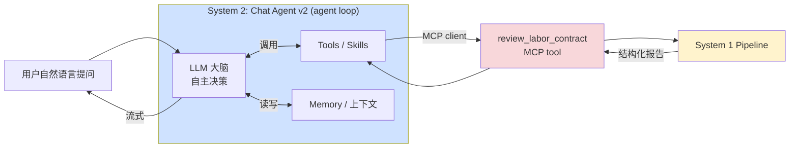
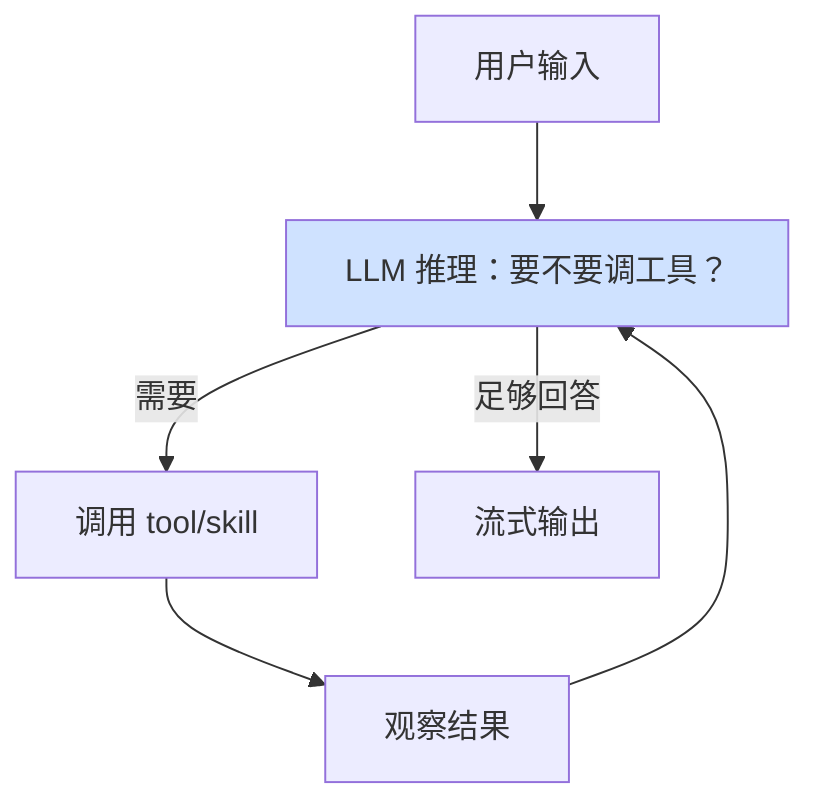

# System 2: Chat Agent v2 — 设计文档（骨架 / SKELETON）

**Status**: 🚧 Skeleton — 大纲先行，多数实现细节待 P5a 讨论
**Date**: 2026-05-22
**Owner**: Dylan
**读者**: 后续设计 System 2 时在此填充；想理解双系统第二极的人
**文档层级**: [PRD.md](PRD.md) → [HLD.md](HLD.md) → [SYSTEM1_PIPELINE.md](SYSTEM1_PIPELINE.md)（第一极）‖ **本文档（第二极）** → [adr/](adr/)
**关联 ADR**: ADR-0006(双系统), ADR-0009(MCP), ADR-0001(LLM), ADR-0007(保密), ADR-0010(前端), ADR-0005(RAG)

> **定位**：System 2 尚未进入实现（**P5a 才动**）。本稿只确立**结构（从顶到底的章节骨架）**与**已锚定的少数决策**，其余为占位，避免在 Pipeline 接口稳定前过早设计而返工。
> **标记约定**：✅ 已定（有 ADR/既往决策支撑）｜🚧 待讨论（占位，尚无决策）｜❓ Open Question（P5a 需拍板的关键问题，汇总见 §12）

---

## 0. 为什么现在只写骨架

1. System 1（Pipeline）是 System 2 的**能力底座**：要先 freeze（P4 末）并包成 MCP server，System 2 才能作为 client 复用（ADR-0009 实现注记：MCP 包装须在 pipeline freeze 之后）。
2. agent loop 的关键设计（记忆、skill、sub-agent）依赖 System 1 稳定后的**真实工具接口**；过早定细节会返工。
3. 先有骨架 = 后续讨论有归属章节，决策不零散。

---

## 1. 总览

### 1.1 定位：agent loop ≠ workflow ✅

这是 ADR-0006 的核心：双系统是两种**根本不同的控制范式**。

| 维度 | System 1 Pipeline | System 2 Chat Agent |
|------|-------------------|---------------------|
| 风格 | workflow（固定五步） | **agent loop**（LLM 自主循环） |
| 控制流 | 代码决定 | **LLM 决定**：调哪个 skill、要什么上下文、何时停 |
| 输入 | 一份合同 | 自然语言提问（多轮对话） |
| 输出 | 结构化 JSON 报告 | 流式对话回复 + 过程工具调用 |
| 确定性 | 高，可回归 eval | 低，开放式难 eval |
| LLM 角色 | 组件（抽取/判断/生成解释） | **大脑**，工具是它的手脚 |
| 启动阶段 | P2 | P5a |

### 1.2 与 System 1 的关系 ✅

System 2 **复用、不重写** System 1 的审查逻辑——经 MCP 调用。

### 1.3 输入 / 输出契约 ✅轮廓 / 🚧细节

- **输入**：用户自然语言（多轮会话）。
- **输出**：流式回复 + 过程中的工具调用结果。
- 🚧 具体的 message / turn / session schema 待定（§6）。

### 1.4 启动时机 ✅

**P5a**，P4 末之后才动。原因（既往决策）：避免"把所有现代 agent 技术学一遍但每个都浅"。策略是先把 Pipeline 做精（P2-P4），再用 System 2 作为**集中练兵场**，把 harness / skill / memory / sub-agent 一次性深用（§10）。

### 1.5 设计原则

- ✅ **复用不重写**：经 MCP 调 System 1，不复制审查逻辑。
- ✅ **范围限定 10 taxonomy 类目**：可控、可评、防跑题（越界问答礼貌拒答/引导回主题）。
- ✅ **继承全局原则**：依法中立立场、强免责、送 LLM 前脱敏（ADR-0007）。
- 🚧 其余原则待补。

---

## 2. Agent Loop 架构 🚧

> 上图是 agent loop 的**通用形态**（已知：LLM 自主决定调用与终止）；下列具体机制均 🚧 占位。

本节将覆盖：
- 🚧 循环结构与状态机（step 表示、中间态）
- 🚧 终止条件（何时停止调工具、最大步数/预算）
- 🚧 错误恢复（工具失败、超时、模型跑偏）
- ❓ **框架选型**：自研 harness vs 现成 SDK（如 Anthropic Agent SDK）vs 轻量自建
- ❓ **控制流范式**：ReAct（边想边做）vs plan-then-act（先规划再执行）

---

## 3. 能力层：Tools / Skills 🚧

- ✅ **已知工具**：`review_labor_contract`（经 MCP，复用 System 1 全部审查能力）。
- 🚧 **候选其他能力**（均待定）：法条检索（复用 RAG）、单条款解释、赔偿/工资计算器、案例查询……
- ❓ **Skill 粒度**：粗粒度（一个"劳动合同问答"大 skill）vs 细粒度（每类目/每能力一个 skill）。
- 🚧 tool / skill schema 占位（定义、入参、触发描述）。

---

## 4. 上下文与记忆 Memory 🚧

> 这正是之前担心的"上下文窗口满了怎么办"的归属章节。

本节将覆盖：
- 🚧 会话内上下文（当前对话历史的组织与裁剪）
- 🚧 跨会话记忆（用户/合同的长期记忆）
- 🚧 上下文窗口管理（压缩、摘要、检索式记忆）
- ❓ **记忆范围**：仅会话内 vs 跨会话用户画像（**隐私敏感，须结合 ADR-0007 脱敏/合规**）
- ❓ **存储**：内存 / 文件 / 向量库（复用 Qdrant？）

---

## 5. Sub-agents 🚧

本节将覆盖：是否引入子 agent 分解复杂问答、子 agent 的边界与通信。
- ❓ **是否需要**：10 类目限定场景下，sub-agent 是否过度设计？还是用于"逐类目并行分析"？待讨论。

---

## 6. 对话状态与流式输出 🚧

本节将覆盖：
- 🚧 会话状态管理（session 生命周期、持久化）
- 🚧 流式协议（SSE）与前端对接（HTMX，ADR-0010）
- 🚧 工具调用过程对用户的可视化（"正在审查合同…"）

---

## 7. 检索与知识 🚧

- ✅ 大概率**复用 System 1 的 RAG**（[RAG_DESIGN.md](RAG_DESIGN.md)）作为法条知识来源。
- 🚧 agent 何时**主动**检索、检索结果如何融入多轮对话——待定。

---

## 8. 护栏与安全 Guardrails 🚧

- ✅ **继承**：脱敏（ADR-0007）、强免责声明、范围限定 10 类目（越界引导回主题）。
- 🚧 **待补**：prompt 注入防护、越权/异常工具调用拦截、幻觉法条防护（复用 System 1 的 Verifier 校验法条引用？）。

---

## 9. 评测 🚧

- ✅ **已知**：开放式 Q&A 难评测，但**限定在 10 taxonomy 类目相关问题**使其可控。
- ❓ **方法候选**（待选）：黄金问答对、LLM-as-judge、工具调用正确率、法条事实性核查、对话任务完成率。
- 🚧 具体方案与数据集待定（与 [EVAL_GUIDE.md](EVAL_GUIDE.md) 体系如何衔接亦待定）。

---

## 10. 现代 agent 技术映射

把既往"引入所有现代 agent 技术"的决策落到 System 2 的具体角色（状态多为占位）。

| 技术 | 在 System 2 的预期角色 | 状态 |
|------|----------------------|------|
| **MCP** | System 1 是 MCP server；System 2 是 client，经它复用 Pipeline | ✅ 角色已定（ADR-0009） |
| **Harness / agent loop** | System 2 的运行时主体 | 🚧 实现/选型待定（§2） |
| **Skill** | 封装可调用能力（审查、检索、解释…） | 🚧 粒度/清单待定（§3） |
| **Memory** | 会话内 + 可能跨会话 | 🚧 架构待定（§4） |
| **Sub-agents** | 复杂问答分解（是否需要存疑） | 🚧 是否采用待定（§5） |

---

## 11. 实现计划（P5a）🚧

占位。前置条件：P4 末 System 1 freeze + MCP 包装完成。届时再把 §2–§9 的 ❓ 逐一拍板，并排具体 D1-Dn 计划。

---

## 12. 待决问题清单 Open Questions ❓

P5a 讨论 agenda（本骨架的核心产出——明确"还需要决定什么"）：

1. **框架选型**：自研 harness / Anthropic Agent SDK / 其他轻量方案？
2. **控制流范式**：ReAct vs plan-then-act vs 混合？
3. **Skill 粒度**：一个大 skill vs 每能力一个 skill？
4. **记忆范围与存储**：仅会话内还是跨会话？存哪里？如何满足 ADR-0007 隐私？
5. **Sub-agents**：是否引入？用在哪个环节？
6. **评测方法**：选哪种（或组合）来量化对话质量？
7. **LLM 选型**：沿用 DeepSeek-V3，还是 agent 主循环用 R1（reasoning）以增强自主决策？（ADR-0001 当时针对 Pipeline 选型，agent 场景需复审）
8. **越界问答处理**：超出 10 类目时的拒答/引导话术与判定。
9. **流式 + 工具调用的前端呈现**：与 HTMX 如何配合（ADR-0010）。

---

## 附录：术语

| 术语 | 含义 |
|------|------|
| agent loop | LLM 自主"思考→调工具→观察→再思考→输出"的循环 |
| skill | 封装给 agent 调用的一项能力 |
| MCP | Model Context Protocol；System 1 暴露为 MCP server，System 2 作 client |
| ReAct | Reasoning+Acting 交错的 agent 控制范式 |
| sub-agent | 由主 agent 派生、负责子任务的子 agent |
| 第一极 / 第二极 | System 1（Pipeline）/ System 2（Chat Agent），ADR-0006 双系统 |
