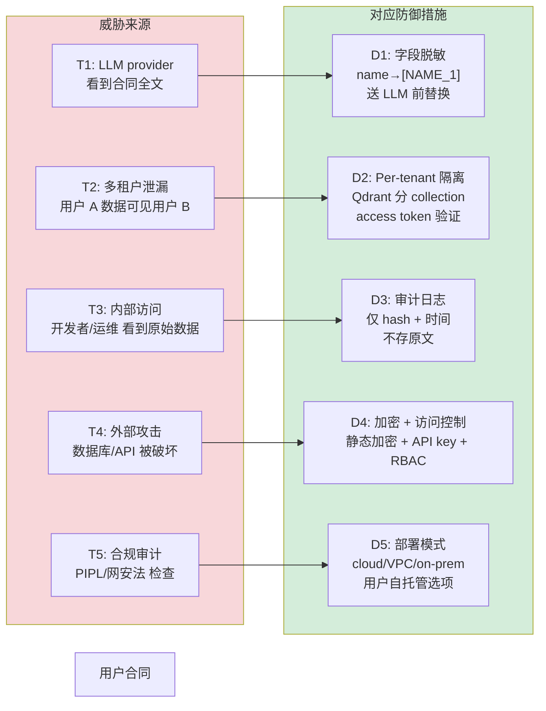

# ADR-0007: Confidentiality Architecture

**Status**: Proposed
**Date**: 2026-05-20
**Deciders**: Dylan
**Related**: ADR-0001 (LLM Selection), ADR-0006 (Dual System)

## Context

法律合同含**多重敏感信息**：

- **个人敏感数据**：姓名、身份证号、电话、家庭住址、银行账号、薪资
- **商业敏感数据**：公司名、客户名单、定价策略、商业秘密
- **合规约束**：
  - 《中华人民共和国个人信息保护法》（PIPL，2021）
  - 《中华人民共和国网络安全法》（2017）
  - 《数据出境安全评估办法》（2022）— 涉及跨境时

**裸送 LLM** 意味着合同全文被发送至 LLM provider（DeepSeek、Claude 等），这在 PIPL 框架下涉及个人信息处理 + 可能的跨境传输，**未经设计直接上生产 = 违法风险**。

本 ADR 定义系统的 confidentiality 架构 + 分阶段执行计划。

## Decision Drivers

按优先级：

1. **PIPL 合规**：处理个人信息需"合法、正当、必要"原则 + 用户告知同意 + 最小化处理
2. **用户信任**：合同含极敏感信息，用户对"我的合同会被送到哪、被谁看到"有强诉求
3. **多租户场景准备**：未来如有多用户/多企业部署，数据隔离不能事后补
4. **可审计**：监管要求 + 内部审计需要每次推理可追溯
5. **不阻塞主线 P2-P4 进度**：confidential 措施必须能**分阶段**引入，不集中堆在某一周

## Threat Model



## Considered Options

1. **不做 confidential 设计**（裸送 LLM）— 违法风险、上不了生产
2. **仅做最关键的（脱敏 + 审计日志）** — 部分缓解但 PIPL 不够
3. **本 ADR 提出的 5 措施分阶段**（D1-D5）— 全面覆盖威胁模型
4. **大爆炸式重构**（停下 pipeline 主线，整周做 confidentiality） — 阻塞 P2-P4

## Decision

**Chosen: Option 3 — 5 措施分阶段引入**

按 phase 执行，每项独立，不互相阻塞：

| # | 措施 | Phase | 用时 | 阻塞威胁 |
|---|------|-------|------|---------|
| D3 | **审计日志**（每次 LLM 调用记 hash + timestamp + cost） | **P2 W4** | 1 天 | T3 |
| D1 | **字段脱敏层**（name/phone/ID/salary 占位符替换） | **P3 W8** | 5 天 | T1 |
| D2 | **Per-tenant Qdrant collection + access control** | **P4 W12** | 2 天 | T2 |
| D4 + 本地 LLM 文档 | **DeepSeek 自部署模式**（Ollama / vLLM） | **P4 W12** | 1 天 | T1 + T4 |
| D5 | **三种部署模式文档**（cloud / VPC / on-prem） | **P5b** | 1 天 | T5 |

**Total: ~10 天，分散到 5 个周次**。

### 各措施技术决策细节

#### D3 审计日志（P2 W4）

```python
# src/audit/logger.py
@dataclass
class AuditEntry:
    timestamp: datetime
    request_id: str            # UUID 关联请求
    operation: str             # "llm_call" / "rag_retrieve" / ...
    model: str                 # e.g. "deepseek-v3"
    input_hash: str            # sha256(input)
    output_hash: str           # sha256(output)
    latency_ms: int
    cost_cny: float
    user_id: Optional[str]     # 多租户后启用
    # NOT stored: 原始 input / output 文本

# 用法：装饰 LLMClient.complete
@audit_log
def complete(self, prompt: str, ...): ...
```

文件：`audit_log/YYYY-MM-DD.jsonl`，每日切分，30 天滚动。

#### D1 字段脱敏（P3 W8）

```python
# src/redact/redactor.py
class Redactor:
    """脱敏 → LLM → 回填，保证 LLM 永远见不到敏感数据。"""
    
    PATTERNS = {
        "phone": (r"1[3-9]\d{9}", "[PHONE_{}]"),
        "id_card": (r"\d{17}[\dX]", "[ID_{}]"),
        "salary_num": (r"[\d,]+\s*元", "[SALARY_{}]"),
        "bank_account": (r"\d{16,19}", "[BANK_{}]"),
        # 姓名 / 公司名 用 NER 模型 or LLM 抽取
    }
    
    def redact(self, text: str) -> Tuple[str, dict]:
        """返回 (脱敏文本, {占位符: 原值}) 映射"""
    
    def reinject(self, llm_output: str, mapping: dict) -> str:
        """LLM 输出后用映射回填，呈现给用户原值"""

# Pipeline 集成
clause = "张三月薪 15000 元"
redacted, mapping = redactor.redact(clause)
# redacted = "[NAME_1] 月薪 [SALARY_1]"
# mapping = {"[NAME_1]": "张三", "[SALARY_1]": "15000 元"}

llm_result = llm.analyze(redacted)
# LLM 永远只见占位符

final = redactor.reinject(llm_result, mapping)
# 给用户的输出含真实姓名薪资
```

**关键决策**：脱敏在**送 LLM 之前**完成 + 回填在 LLM 之后。用户最终看到的是原值，但 LLM 全程只见占位符。

#### D2 Per-tenant Qdrant（P4 W12）

```python
# 每个 tenant 一个独立 collection
qdrant.create_collection(
    collection_name=f"laws_{tenant_id}",
    vectors_config=...
)

# 检索时强制 collection 隔离
results = qdrant.search(
    collection_name=f"laws_{tenant_id}",
    query_vector=embedding,
    query_filter=Filter(...),
)
```

单用户 demo 时 tenant_id = "default"。多用户场景 P5 之后再决定。

#### D4 本地 LLM 部署文档（P4 W12）

写 `docs/SELF_HOSTED_LLM.md`：
- DeepSeek-V3 通过 Ollama 本地部署（成本：~$15k 服务器）
- 通过 vLLM 部署（更高吞吐，更复杂）
- 何时该考虑：客户在金融/政府/医疗 → 必须本地 LLM
- 性能权衡：本地推理慢 5-10x，但合规 + 长期成本可控

#### D5 部署模式文档（P5b）

写 `docs/DEPLOYMENT_MODES.md`，三档：

| 模式 | 适用客户 | 数据流向 | 实施成本 |
|------|---------|---------|---------|
| **Cloud SaaS** | 个人 / 小企业 | 客户合同 → 我们的服务器 → DeepSeek API | 低 |
| **客户 VPC** | 中型企业 | 部署在客户自己的 VPC 内，LLM 走 API 但脱敏 | 中 |
| **On-prem 全私有** | 大企业 / 律所 / 政府 | 全部署在客户内网 + 本地 LLM | 高 |

### Why this option

- **分阶段**避免阻塞 P2-P4 主线
- 每个措施独立有价值，不需要全部完成才生效
- 优先级排序对应威胁严重度（D3 审计先做因为最容易，D1 脱敏对应最大威胁 T1）
- 部署模式文档放最后 (P5b)，因为前面措施全做完才能描述完整

### Why not the others

| Option | Reason rejected |
|--------|-----------------|
| 1 (不做) | PIPL 不允许，违法 |
| 2 (仅最关键) | 多租户 + 部署模式 缺失，无法说服企业客户 |
| 4 (大爆炸重构) | P2-P4 主线本就紧，再腾整周做 confidential 会延期 |

## Consequences

### Positive

- PIPL 合规基础完备（脱敏 + 审计 + 隔离）
- 用户可以放心上传真实合同（送 LLM 前已脱敏）
- 长期支持企业客户的 on-prem 部署
- 审计日志支持调试 + 内审 + 监管检查

### Negative / Accepted Tradeoffs

- **脱敏层 latency**：每次推理多 50-150ms（NER 模型推理 + 字符串替换）
- **脱敏失败**导致 LLM 输出错乱 → 必须有 fallback（脱敏失败时拒答，记 audit）
- **本地 LLM** 性能比云 API 慢 5-10×，需告知客户
- **多租户** 增加 Qdrant 运维复杂度（collection 数量管理）

### Mitigations

- 脱敏层 P3 W8 实现后**强制 unit test**：100% 关键字段（name/phone/ID/salary）召回
- 脱敏失败 → 走 "I don't know" 路径，**绝不裸送 LLM**
- 本地 LLM 仅对部分客户启用（cloud 客户走快路径）
- Qdrant collection 命名规范化 + 自动化脚本管理

## Confirmation

- **D3 审计日志**：P2 W4 末 — `audit_log/` 目录有当日条目
- **D1 脱敏**：P3 W8 末 — 100 条测试样本 100% 脱敏成功，0 泄漏
- **D2 隔离**：P4 W12 末 — 跨 tenant 查询返回空（不能查到他人数据）
- **D4 本地 LLM 文档**：P4 W12 末 — 文档完整 + 至少 1 个测试部署
- **D5 部署模式**：P5b 末 — 三档文档完整 + 至少 1 张架构图

**回头改的条件**：
- PIPL 修订 → 重新对标
- 实际多租户需求出现 → 升级隔离方案（per-database vs per-collection）
- 客户要求"零数据出域" → 强制 on-prem + 本地 LLM

## References

- 内部：[ADR-0001](ADR-0001-llm-selection.md), [ADR-0006](ADR-0006-dual-system-architecture.md)
- 外部：
  - 《个人信息保护法》（PIPL）原文
  - 《网络安全法》原文
  - PaddlePaddle PaddleNLP NER 模型（用于姓名识别）
  - Ollama / vLLM 文档（本地 LLM 部署）
