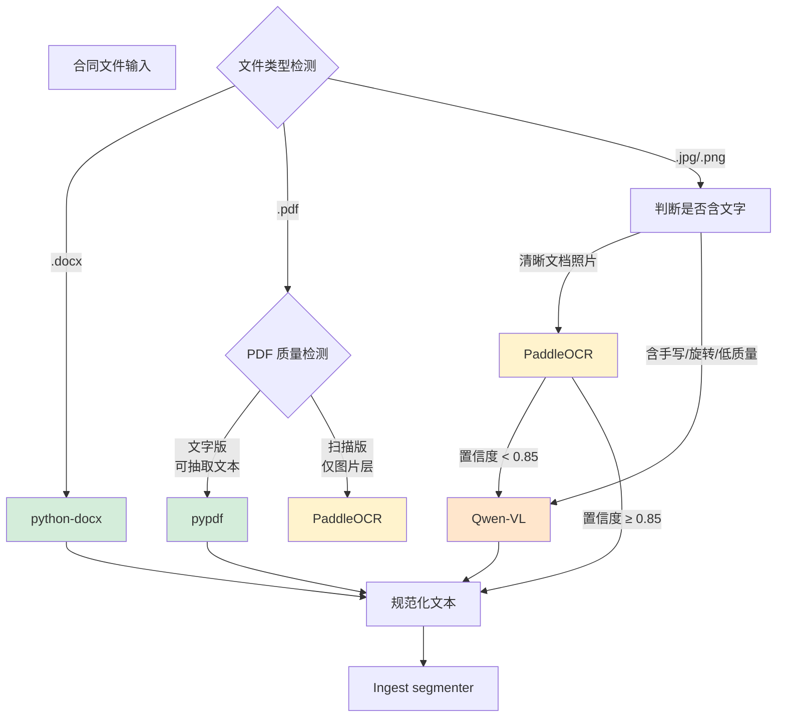

# ADR-0008: Multimodal Input Strategy

**Status**: Proposed
**Date**: 2026-05-20
**Deciders**: Dylan
**Related**: ADR-0001 (LLM Selection), ADR-0007 (Confidentiality)

## Context

真实劳动合同 **80% 不是 clean text**：

| 输入形态 | 实际频率（估算） | 当前支持 |
|---------|-----------------|---------|
| docx | ~10% | ✅ 已支持（python-docx） |
| 文字版 PDF | ~25% | ✅ 已支持（pypdf） |
| 扫描版 PDF | ~30% | ❌ 必须加 OCR |
| 手机拍照（清晰）| ~15% | ❌ OCR + 排版理解 |
| 手机拍照（含旋转/阴影/光线差）| ~10% | ❌ VLM |
| 含签字盖章 / 手写批注 | ~10% | ❌ VLM |

**不解决多模态 = 系统只能处理约 1/3 的真实输入 = 产品价值打折**。

## Decision Drivers

按优先级：

1. **输入覆盖率**：目标 P3 末覆盖 70% 真实输入形态，P4 末覆盖 95%
2. **成本可控**：OCR 应该比 VLM 便宜 100×，正确路由意味着 80% 输入走廉价路径
3. **中文质量**：中文 OCR 选型必须考虑中文（PaddleOCR > tesseract）
4. **国内可达性**：模型/API 必须从国内云服务器可访问
5. **延迟可控**：P95 添加 ≤ 3s（OCR 1-3s/页 + VLM 仅在必要时调用）

## Considered Options

### A. 输入处理策略

1. **纯 OCR**（所有输入 → OCR → text → pipeline） — 简单但损失图片信息
2. **纯 VLM**（所有输入 → VLM → 结构化输出） — 贵且慢
3. **混合：OCR 主力 + VLM 兜底** — 简单的级联（OCR 失败再 VLM）
4. **智能路由**（按输入类型 + 质量动态选） — 最优但实现复杂 ⭐

### B. OCR 选型

1. **PaddleOCR**（百度开源） — 中文 SOTA，CPU 可跑，1-3s/页 ⭐
2. **tesseract** — 老牌但中文相对弱
3. **EasyOCR** — 多语言，中文可用但不如 PaddleOCR
4. **阿里云 OCR API** — 商业，按量付费，无需本地资源
5. **CnOCR** — 中文专项轻量

### C. VLM 选型

1. **Qwen-VL（通义千问 VL）** — 国内、便宜（~0.05 元/调用）、中文好 ⭐
2. **Claude Vision** — 海外贵 5-10×、需代理、中文略弱
3. **GPT-4V** — 同 Claude，海外
4. **MiniCPM-V** — 开源、本地部署、中文中等
5. **InternVL** — 上海 AI 实验室开源、可本地

## Decision

**Chosen**:
- **A4 智能路由**
- **B1 PaddleOCR**（OCR 主力）
- **C1 Qwen-VL**（VLM 兜底）

### 智能路由架构



### 各路径成本/延迟（估算）

| 路径 | 触发条件 | 成本/调用 | 延迟 | 占比 |
|------|---------|---------|------|------|
| docx → python-docx | .docx 上传 | 0 元 | <100ms | ~10% |
| pypdf | 文字版 PDF | 0 元 | <200ms | ~25% |
| PaddleOCR（CPU 本地） | 扫描 PDF / 清晰图片 | 0 元 | 1-3s/页 | ~50% |
| Qwen-VL API | 低质量图片 / 手写 / OCR 兜底 | ~0.05 元 | 3-5s | ~15% |

**关键**：80% 输入走免费路径，仅 15% 触发 VLM 付费调用 → 单次成本可控。

> **注（2026-05）**：文字版 PDF 的正式解析工具后续细化为 **pdfplumber**（MIT 许可，自带表格与坐标抽取）；pypdf 仅保留用于成本极低的格式/形态探测。详见 [SYSTEM1_PIPELINE.md](SYSTEM1_PIPELINE.md) §3.4。本 ADR 的路由策略与成本结论不变。

### Why this option

- **覆盖率**：4 条路径覆盖所有真实形态
- **成本**：智能路由让 85% 输入零边际成本
- **延迟**：标准路径 <3s，最差路径 <8s
- **国内可达**：PaddleOCR 本地 + Qwen-VL 国内 API（阿里云）
- **可扩展**：将来加 InternVL 本地部署只需改 router

### Why not the others

| Option | Reason rejected |
|--------|-----------------|
| A1 纯 OCR | 手写/旋转图片识别差 → 用户体验割裂 |
| A2 纯 VLM | 成本/延迟过高，docx 都走 VLM 浪费 |
| A3 OCR + VLM 级联 | 比智能路由 dumber，不能避免明显 docx 路径浪费 |
| B2 tesseract | 中文质量不如 PaddleOCR |
| B4 阿里云 OCR API | 增加成本 + vendor lock-in，PaddleOCR 本地够用 |
| C2 Claude Vision | 国内访问难 + 贵 |
| C4 MiniCPM-V 本地 | 服务器 RAM 紧（3.6G），跑本地 VLM 不现实 |

## Multimodal Dataset Plan

数据集是多模态 detection 的关键 — 没数据无法 eval。

### 阶段 A: P2 末（基线收集）

**目标**：30 份多模态样本，覆盖 5 种输入形态。

| 类型 | 数量 | 来源 |
|------|------|------|
| 干净 docx | 5 | 已有 Tier A 范本 |
| 文字版 PDF | 5 | 已有 Tier A 范本（导出 PDF）|
| 扫描版 PDF | 8 | docx → 打印 → 扫描 ；或下载政府公开扫描件 |
| 清晰拍照 | 8 | 用手机拍摄 docx 打印件 |
| 拍照含问题 | 4 | 旋转 5-15° / 阴影 / 光线差 / 含手写批注 |

**用途**：开发期手动调试 + 验证路由逻辑。

### 阶段 B: P3 W7（多模态 eval set）

**目标**：50 份带 ground truth 的多模态样本。

| 类型 | 数量 | Ground truth |
|------|------|--------------|
| 各类输入 × 5 | 50 | 原始 docx 文本（已知正确，作为 OCR/VLM 输出对比基准）|

**评测指标**：
- **Character Error Rate (CER)**：OCR/VLM 输出 vs ground truth 字符级错误率
- **End-to-end accuracy**：经过多模态后能否被现有 detector 正确识别违法条款
- **路由准确度**：智能路由是否正确选择了路径

**生成方法**：
1. 已有 50 份 docx 合同
2. 对每份 docx：
   - 渲染为 PNG（用 LibreOffice headless 或 docx2pdf + pdf2image）
   - 添加噪声（旋转、模糊、阴影模拟）→ 5 个变体
3. 每个变体的 ground truth = docx 原始文本

**示例脚本结构（P3 W7 实现）**：

```python
# scripts/generate_multimodal_dataset.py
from PIL import Image
import random

def generate_variants(docx_path: str, output_dir: str):
    """生成 5 个变体 + ground truth"""
    text = extract_docx_text(docx_path)  # ground truth
    image = render_docx_to_image(docx_path)
    
    variants = {
        "clean": image,
        "rotated": rotate(image, random.uniform(-15, 15)),
        "shadow": add_shadow(image),
        "lowlight": adjust_brightness(image, 0.4),
        "blurred": gaussian_blur(image, radius=2),
    }
    
    for name, img in variants.items():
        img.save(f"{output_dir}/{docx_id}_{name}.png")
        save_ground_truth(f"{output_dir}/{docx_id}_{name}.txt", text)
```

### 阶段 C: P4 W11（VLM 专项扩展）

**目标**：20 份"必须用 VLM"的样本。

| 类型 | 数量 | 特点 |
|------|------|------|
| 含手写批注 | 8 | OCR 难识别手写 |
| 含签字 / 盖章 | 5 | 需识别签字位置 |
| 极差质量 | 4 | 强阴影、严重旋转、低分辨率 |
| 混合内容 | 3 | 印刷 + 手写 + 表格 |

**评测指标**：
- OCR 失败率（OCR confidence < 0.85 的占比）
- VLM 兜底成功率（OCR 失败后 VLM 是否能拯救）
- 端到端识别准确率

### Dataset 存储

```
data/contracts/
├── tier_a_official/          # 现有：clean docx
├── tier_b_template/          # 现有：网络模板
├── tier_c_anonymized/        # 现有：脱敏真实合同（.gitignore）
└── multimodal/               # 新增（本 ADR）
    ├── README.md             # 生成说明 + ground truth 格式
    ├── stage_a_baseline/     # 30 份开发样本
    ├── stage_b_eval/         # 50 份 eval 样本 + ground truth
    └── stage_c_vlm_extension/ # 20 份 VLM 专项
```

## Phased Execution

| Phase | 任务 | 用时 |
|-------|------|------|
| P2 末 | 收集 stage_a baseline 数据（30 份） | 0.5 天（脚本生成）|
| **P3 W7 D1-D4** | 实现智能路由 + PaddleOCR 集成 + stage_b eval set | 4 天 |
| P3 W7 D5 | 多模态 baseline eval（路由准确度 + CER） | 0.5 天 |
| **P4 W11 D1-D3** | 接入 Qwen-VL + stage_c 数据 | 3 天 |
| P4 W11 D4 | 端到端 eval：multimodal pipeline 完整流程 | 1 天 |

**总投入约 8 天**。

## Consequences

### Positive

- 真实输入覆盖率从 35% → 95%
- 成本可控（80% 输入零边际成本）
- 路由层清晰，可扩展（未来加 InternVL 本地 VLM 简单）
- multimodal eval set 也是 portfolio 加分

### Negative / Accepted Tradeoffs

- PaddleOCR 在 CPU 上的延迟（1-3s/页）— 大合同（10+ 页）总延迟 30s+
- Qwen-VL 调用是 vendor 依赖（同 LLMClient 抽象）
- 多模态数据生成脚本本身是不小的工作量（stage_b 50 份变体）
- 服务器 RAM 紧（3.6G）→ PaddleOCR 模型加载可能挤压其他

### Mitigations

- 大合同分页 + 并行 OCR（多核 CPU 利用）
- Qwen-VL 调用走 LLMClient 抽象，可切 Claude Vision / 本地 InternVL
- 数据生成脚本可重用（投入一次产出 50+ 样本）
- PaddleOCR 用 mobile 版（更小）+ 仅加载一次

## Confirmation

- **P3 W7 末**：智能路由跑通 4 条路径 + stage_b 上 CER ≤ 5%
- **P4 W11 末**：multimodal 端到端 pipeline 在 stage_c 上 violation 识别 R ≥ 0.80
- **回头看**：如果 Qwen-VL 成本超 0.5 元/审查 → 评估 InternVL 本地部署

## References

- 内部：[ADR-0001](ADR-0001-llm-selection.md), [ADR-0007](ADR-0007-confidentiality.md)
- 外部：
  - [PaddleOCR](https://github.com/PaddlePaddle/PaddleOCR) — 中文 OCR 主力
  - [Qwen-VL](https://help.aliyun.com/document_detail/2780978.html) — 阿里云通义千问 VL API
  - PIPL：脱敏后再送 VLM（同 ADR-0007 D1）
