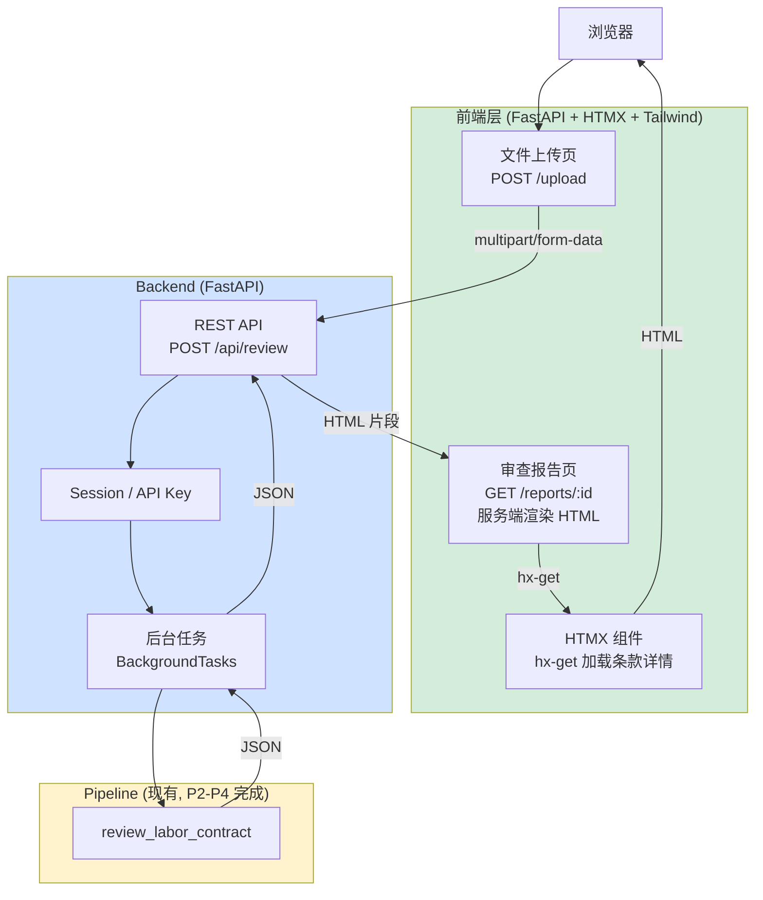

# ADR-0010: Frontend Revision — FastAPI + HTMX + Tailwind

**Status**: Proposed
**Date**: 2026-05-20
**Deciders**: Dylan
**Supersedes**: [ADR-0004](ADR-0004-frontend.md)（Streamlit 决策）
**Related**: ADR-0007 (Confidentiality), ADR-0009 (MCP)

## Context

[ADR-0004](ADR-0004-frontend.md) 选择了 Streamlit 作为前端方案，理由是开发快（1 天）+ 时间投入 ROI 高。

但在 2026-05-19 的项目评审中，明确指出：

> "Streamlit 适合 internal demo / data science 原型，不适合卖给律所。律所看到 Streamlit 界面会觉得'这是学生作业'。对 confidential 定位，更合适：CLI / FastAPI + HTMX。"

加上：
- 项目要支持 confidential 部署（per ADR-0007 D5）— 需要可 on-prem 的轻量前端
- 项目要支持远程访问（per ADR-0009 MCP HTTP/SSE 模式）— 需要标准 HTTP 接口
- 项目要演示价值（demo 录制 + screenshots）— 视觉感不能像 demo 工具

**Streamlit 的局限性已无法回避**，本 ADR 推翻并替代 ADR-0004。

## Decision Drivers

按优先级：

1. **视觉感产品级**：跨过"学生作业 / ML demo"门槛，能给客户/律所看
2. **轻量可部署**：on-prem / VPC / 客户内网 部署不增加复杂依赖
3. **Confidential 友好**：服务端渲染 = 无前端状态泄漏 + 易加 auth
4. **开发投入合理**：4-5 天（vs Streamlit 1 天 / vs Next.js 2-3 周）

## Considered Options

1. **维持 Streamlit**（status quo from ADR-0004） — 时间最省但视觉感差
2. **Gradio** — 类 Streamlit，同问题
3. **FastAPI + HTMX + Tailwind** — 服务端渲染 + 异步组件 ⭐
4. **FastAPI + React/Next.js** — 最 polished 但 2-3 周
5. **CLI + Markdown 报告**（无 web UI）— 极简但 demo 弱
6. **Django + Bootstrap** — 重型，过度

## Decision

**Chosen: Option 3 — FastAPI + HTMX + Tailwind**

### 架构

### 技术栈

| 层 | 工具 | 用途 |
|----|------|------|
| 后端框架 | **FastAPI** | REST + 异步 |
| 模板引擎 | **Jinja2** | 服务端 HTML 渲染 |
| 前端交互 | **HTMX** | hx-get / hx-post 局部刷新，无 JS framework |
| 样式 | **Tailwind CSS** | 工具优先 CSS，无定制样式表 |
| 图标 | **Heroicons / Lucide** | 开源 SVG |

**总代码量预估**：~500-700 行 Python + ~200 行 HTML 模板。

### 关键页面

| 页面 | 路由 | 内容 |
|------|------|------|
| 首页 | `GET /` | 项目介绍 + 上传入口 + 免责声明 |
| 上传 | `POST /upload` | multipart 文件上传，进度反馈 |
| 处理中 | `GET /reports/:id` | HTMX 轮询，显示进度 |
| 报告页 | `GET /reports/:id`（完成后） | 风险列表 + 法条引用 + 修改建议 |
| 详情 | `GET /reports/:id/clause/:c` (hx-get) | 单条款详情弹层 |
| 设置 | `GET /settings` | API key / 选项 |

### Tailwind 主题

- 配色：中性灰 + 警示色（red-500 violation_clear / yellow-500 borderline / green-500 compliant）
- 字体：默认中文系统字体（PingFang / Noto Sans CJK），不引入 web font 减少加载
- 响应式：mobile-first（劳动者很可能用手机看）

### Why this option

- **生产感视觉** ≥ Streamlit 1.5× ≤ Next.js 0.7×（折中合适）
- **服务端渲染** = 无前端 state，所有数据在后端处理（confidential 友好）
- **HTMX 5KB** = 无需 React/Vue framework，性能优 + 部署轻
- **Tailwind** = 类名即样式，无需大量自定义 CSS
- **FastAPI** = 现代 Python + 异步 + 自动 OpenAPI 文档，与 MCP Server 共享栈

### Why not the others

| Option | Reason rejected |
|--------|-----------------|
| 1 Streamlit | 视觉感"学生作业"，已被审查者点名 |
| 2 Gradio | 同 Streamlit，且更 ML demo 味 |
| 4 Next.js | 2-3 周过重，前端不是项目核心 |
| 5 仅 CLI | demo 视觉力弱，无法面向终端用户 |
| 6 Django | 框架过重，FastAPI 已足够 |

## Implementation Plan

**P4 W13（5 天）**：

| Day | 任务 |
|-----|------|
| D1 | FastAPI 框架 + Jinja2 模板基础 + 项目结构 |
| D2 | 上传页 + 处理中状态 + HTMX 轮询 |
| D3 | 报告页（风险列表 + 详情弹层） |
| D4 | Tailwind 样式 + 移动端适配 + Logo/Brand |
| D5 | API Key 鉴权 + 部署文档 + demo 录制准备 |

**降级方案**：
- 若 W13 末未完成报告页详情弹层 → 简化为单页全展开（多滚动但仍可用）
- 若 W13 全周完不成 → 用 CLI + Markdown 输出作 fallback demo

## Consequences

### Positive

- 视觉感能给非技术受众看（律师、HR、普通用户）
- 适合 on-prem 部署（仅 Python + HTML，无 npm/build）
- 与 confidential 设计天然契合（服务端渲染 + API Key）
- 复用 MCP server 的 FastAPI 框架（双系统协同）

### Negative / Accepted Tradeoffs

- 比 Streamlit 多 4 天开发
- HTMX 有 1 天学习成本（如不熟）
- Tailwind class 较冗长（HTML 可读性下降）
- 移动端 + 桌面端测试都要做

### Mitigations

- HTMX 学习曲线短（核心就 4-5 个 hx-* 属性），D1 投入半天即可上手
- Tailwind 学习配 cheatsheet 即可
- 移动端测试用 Chrome DevTools 设备模拟器

## Confirmation

- **P4 W13 D5**：本地能跑通完整流程：上传 → 审查 → 报告
- **P4 W14 D4**：demo 视频录制完成，前端视觉感能给非技术人看
- **P5b**：截图 + GIF 入 README（per 之前评审建议）
- **回头改**：
  - 如 P5b 反馈视觉感仍弱 → 加 Next.js + shadcn/ui 升级（投入更多前端时间）
  - 如客户要求"必须 Next.js" → 重新评估（但当前判断 FastAPI+HTMX 已够）

## References

- 内部：[ADR-0004](ADR-0004-frontend.md)（被 supersede），[ADR-0007](ADR-0007-confidentiality.md), [ADR-0009](ADR-0009-mcp-integration.md)
- 外部：
  - [FastAPI](https://fastapi.tiangolo.com/)
  - [HTMX](https://htmx.org/) — "high power tools for HTML"
  - [Tailwind CSS](https://tailwindcss.com/)
  - [Jinja2](https://jinja.palletsprojects.com/)
